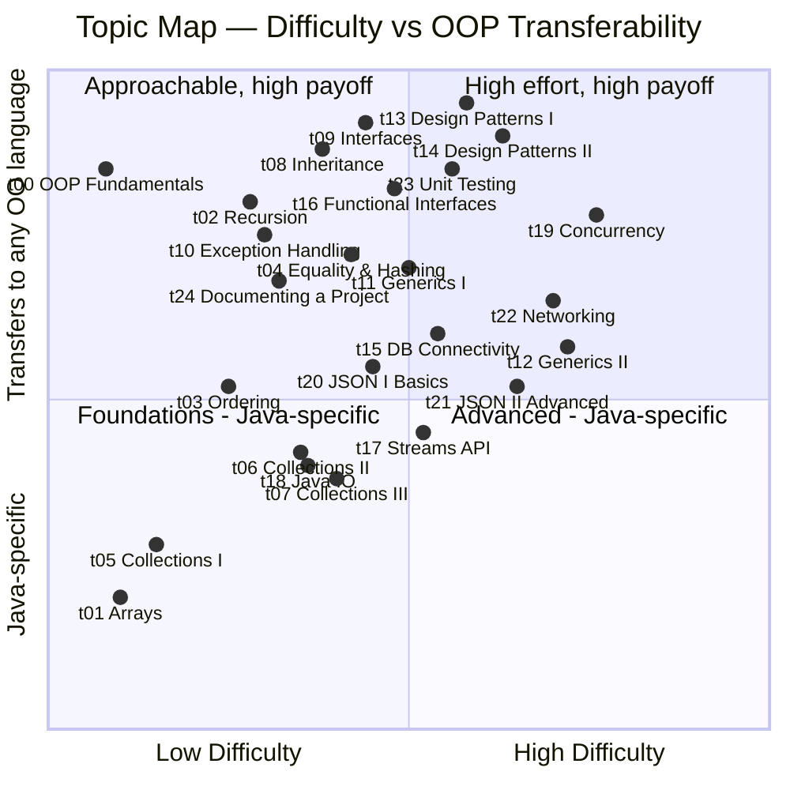

# COMP C8Z03 — Object-Oriented Programming

This space holds your weekly topics, exercises, shared resources, and assessment briefs. Use it
alongside Moodle and the official [module
descriptor](https://courses.dkit.ie/index.cfm/page/module/moduleId/55497/deliveryperiodid/1066).

---

## Contents

- [COMP C8Z03 — Object-Oriented Programming](#comp-c8z03--object-oriented-programming)
  - [Contents](#contents)
  - [1. Module Content](#1-module-content)
  - [2. Topic Map — Difficulty vs OOP Transferability](#2-topic-map--difficulty-vs-oop-transferability)
  - [3. Continuous Assessment Briefs](#3-continuous-assessment-briefs)
  - [4. Getting Started](#4-getting-started)
  - [5. How to Use This Repo](#5-how-to-use-this-repo)
  - [6. Running Exercises from `Main`](#6-running-exercises-from-main)
  - [7. Folder Map](#7-folder-map)
  - [8. Cheatsheets](#8-cheatsheets)
  - [9. Mindmaps](#9-mindmaps)
  - [10. Self-Assessment Quizzes](#10-self-assessment-quizzes)
  - [11. General Directions to Improve as a Programmer](#11-general-directions-to-improve-as-a-programmer)
    - [Practise in the way that actually builds skill](#practise-in-the-way-that-actually-builds-skill)
    - [Get unstuck without losing a day](#get-unstuck-without-losing-a-day)
    - [Write code someone else can read](#write-code-someone-else-can-read)
    - [Sustain it](#sustain-it)

---

## 1. Module Content

| Topic | Description | Requires | Notes | Exercises | Challenge Exercises |
|:--|:--|:--|:--|:--|:--|
| t00 | **OOP Fundamentals** — class anatomy, fields, constructors, access modifiers, guard clauses, object creation | — | [Notes](notes/topics/t00_oop_fundamentals/t00_oop_fundamentals_notes.md) | [Exercises](notes/topics/t00_oop_fundamentals/exercises/t00_oop_fundamentals_exercises.md) | — |
| t01 | **Arrays** — create, fill, iterate, and debug fixed-size 1D and 2D arrays | t00 | [Notes](notes/topics/t01_arrays/t01_arrays_notes.md) | [Exercises](notes/topics/t01_arrays/exercises/t01_arrays_exercises.md) | [Array of Suspects](notes/topics/t01_arrays/challenges/ce01_array_of_suspects.md) |
| t02 | **Recursion** — base case and recursive case, call-stack model, array/string/number patterns, flood fill, when not to recurse | t01 | [Notes](notes/topics/t02_recursion/t02_recursion_notes.md) | [Exercises](notes/topics/t02_recursion/exercises/t02_recursion_exercises.md) | — |
| t03 | **Ordering** — sort objects by natural order (Comparable) or custom rules (Comparator) | t01 | [Notes](notes/topics/t03_ordering/t03_ordering_notes.md) | [Exercises](notes/topics/t03_ordering/exercises/t03_ordering_exercises.md) | — |
| t04 | **Equality & Hashing** — implement equals/hashCode correctly; understand identity vs value equality | t03 | [Notes](notes/topics/t04_equality_hashing/t04_equality_hashing_notes.md) | [Exercises](notes/topics/t04_equality_hashing/exercises/t04_equality_hashing_exercises.md) | — |
| t05 | **Collections I** — dynamic lists with ArrayList; add, remove, and iterate safely | t01 | [Notes](notes/topics/t05_collections_1/t05_collections_1_notes.md) | [Exercises](notes/topics/t05_collections_1/exercises/t05_collections_1_exercises.md) | — |
| t06 | **Collections II** — LinkedList as list and deque; mutation-safe iteration with ListIterator | t05 | [Notes](notes/topics/t06_collections_2/t06_collections_2_notes.md) | [Exercises](notes/topics/t06_collections_2/exercises/t06_collections_2_exercises.md) | — |
| t07 | **Collections III** — HashSet, TreeSet, HashMap, TreeMap; choosing the right collection | t04, t06 | [Notes](notes/topics/t07_collections_3_set_map/t07_collections_3_set_map_notes.md) | [Exercises](notes/topics/t07_collections_3_set_map/exercises/t07_collections_3_set_map_exercises.md) | — |
| t08 | **Inheritance** — extend classes, override methods, and model hierarchies with abstract types | t07 | [Notes](notes/topics/t08_inheritance/t08_inheritance_notes.md) | [Exercises](notes/topics/t08_inheritance/exercises/t08_inheritance_exercises.md) | — |
| t09 | **Interfaces** — define shared behaviour contracts; enable polymorphism without inheritance | t08 | [Notes](notes/topics/t09_interface/t09_interface_notes.md) | [Exercises](notes/topics/t09_interface/exercises/t09_interface_exercises.md) | [Directory Distillery](notes/topics/t09_interface/challenges/ce02_the_directory_distillery.md) |
| t10 | **Exception Handling** — checked vs unchecked exceptions, try/catch/finally, custom exception types | t09 | [Notes](notes/topics/t10_exception_handling/t10_exception_handling_notes.md) | [Exercises](notes/topics/t10_exception_handling/exercises/t10_exception_handling_exercises.md) | — |
| t11 | **Generics I** — write type-safe reusable classes and methods using type parameters | t09 | [Notes](notes/topics/t11_generics_1/t11_generics_1_notes.md) | [Exercises](notes/topics/t11_generics_1/exercises/t11_generics_1_exercises.md) | [Frequency Forge](notes/topics/t11_generics_1/challenges/ce03_frequency_forge.md), [Cargo Manifest](notes/topics/t11_generics_1/challenges/ce04_cargo_manifest.md) |
| t12 | **Generics II** — use wildcards (`? extends` / `? super`) and apply the PECS rule | t11 | [Notes](notes/topics/t12_generics_2/t12_generics_2_notes.md) | [Exercises](notes/topics/t12_generics_2/exercises/t12_generics_2_exercises.md) | — |
| t13 | **Design Patterns I** — replace conditional logic with Strategy and Command patterns | t09 | [Notes](notes/topics/t13_design_patterns_1/t13_design_patterns_1_notes.md) | [Exercises](notes/topics/t13_design_patterns_1/exercises/t13_design_patterns_1_exercises.md) | — |
| t14 | **Design Patterns II** — decouple creation and events with Factory, Observer, and Adapter | t13 | [Notes](notes/topics/t14_design_patterns_2/t14_design_patterns_2_notes.md) | [Exercises](notes/topics/t14_design_patterns_2/exercises/t14_design_patterns_2_exercises.md) | — |
| t15 | **DB Connectivity** — connect to MySQL with JDBC; implement the DAO pattern for N-tier apps | t09 | [Notes](notes/topics/t15_dao/t15_dao_notes.md) | [Exercises](notes/topics/t15_dao/exercises/t15_dao_exercises.md) | — |
| t16 | **Functional Interfaces** — pass behaviour as data using Consumer, Function, Predicate, Supplier | t09 | [Notes](notes/topics/t16_functional_interfaces/t16_functional_interfaces_notes.md) | [Exercises](notes/topics/t16_functional_interfaces/exercises/t16_functional_interfaces_exercises.md) | [Alien vs Predicate](notes/topics/t16_functional_interfaces/challenges/ce05_alien_vs_predicate.md), [Accumulator Ops](notes/topics/t16_functional_interfaces/challenges/ce06_accumulator_ops.md) |
| t17 | **Streams API** — pipeline model, filter/map/flatMap, terminal ops, Collectors, IntStream | t16 | [Notes](notes/topics/t17_streams_api/t17_streams_api_notes.md) | [Exercises](notes/topics/t17_streams_api/exercises/t17_streams_api_exercises.md) | — |
| t18 | **Java I/O** — NIO.2 Path/Files API, BufferedReader/Writer, CSV parsing, config loaders | t17 | [Notes](notes/topics/t18_io/t18_io_notes.md) | [Exercises](notes/topics/t18_io/exercises/t18_io_exercises.md) | — |
| t19 | **Concurrency** — run tasks in parallel with Runnable threads and ExecutorService pools | t09 | [Notes](notes/topics/t19_concurrency/t19_concurrency_notes.md) | [Exercises](notes/topics/t19_concurrency/exercises/t19_concurrency_exercises.md) | — |
| t20 | **JSON I: Jackson Basics** — JSON format, ObjectMapper, serialisation/deserialisation, TypeReference | t15 | [Notes](notes/topics/t20_json_1_jackson_basics/t20_json_1_jackson_basics_notes.md) | [Exercises](notes/topics/t20_json_1_jackson_basics/exercises/t20_json_1_jackson_basics_exercises.md) | — |
| t21 | **JSON II: Jackson Advanced** — protocol design, request routing, Base64, BLOB/JDBC, JSON over sockets | t20 | [Notes](notes/topics/t21_json_2_jackson_advanced/t21_json_2_jackson_advanced_notes.md) | [Exercises](notes/topics/t21_json_2_jackson_advanced/exercises/t21_json_2_jackson_advanced_exercises.md) | — |
| t22 | **Networking** — build a multi-client TCP server with a JSON request/response protocol | t15, t21 | [Notes](notes/topics/t22_networking/t22_networking_notes.md) | [Exercises](notes/topics/t22_networking/exercises/t22_networking_exercises.md) | — |
| t23 | **Unit Testing** — JUnit 5, AAA pattern, naming conventions, DAO integration tests, coverage | t15, t21, t22 | [Notes](notes/topics/t23_unit_testing/t23_unit_testing_notes.md) | [Exercises](notes/topics/t23_unit_testing/exercises/t23_unit_testing_exercises.md) | — |
| t24 | **Pathfinding** — breadth-first search, Dijkstra and A\* over a grid, with a console visualisation | t01, t07, t13, t14 | [Notes](notes/topics/t24_pathfinding/t24_pathfinding_notes.md) | [Exercises](notes/topics/t24_pathfinding/exercises/t24_pathfinding_exercises.md) | — |
| t25 | **Documenting a Project** — Javadoc tags, ER/flowchart/sequence/architecture diagrams with Mermaid | t15, t22 | [Notes](notes/topics/t25_documenting_a_project/t25_documenting_a_project_notes.md) | [Exercises](notes/topics/t25_documenting_a_project/exercises/t25_documenting_a_project_exercises.md) | — |

---

## 2. Topic Map — Difficulty vs OOP Transferability

The chart below positions each topic on two axes:
- **X — Difficulty**: how much new syntax and mental model is required
- **Y — OOP beyond Java**: how directly the concept transfers to other OO languages (C#, C++,
  Python, Kotlin, etc.)

Topics in the top-right demand the most effort but give the most lasting value. Topics in the
bottom-left are Java-specific foundations — essential here, less portable.



**Diagram description**
Reading the extremes rather than every point: the topics that cost the most effort *and*
transfer furthest beyond Java are **Design Patterns I and II**, **Interfaces**,
**Inheritance** and **Unit Testing** - these repay the work in any object-oriented language.
**OOP Fundamentals** transfers just as well but is far easier, which is why it comes first.

At the other end, **Arrays**, **Collections I and II** and **Streams** are comparatively
Java-specific: essential for this module and for the CAs, but less portable as ideas.
**Generics II**, **Concurrency** and **Networking** are the hardest on the difficulty axis.

The full ordering is in the [module content table](#1-module-content); the chart only shows
where each topic sits on those two axes.

---

## 3. Continuous Assessment Briefs

> **2026/27 briefs are not published yet.**

---

## 4. Getting Started

- Install **JDK 25 or newer** and select it in your IDE. The build sets
  `maven.compiler.release` to 25, so an older JDK will not compile the code.
- Open `code/` as a Maven project in IntelliJ: right-click `code/pom.xml` then **Add as Maven
  Project**. IntelliJ will download all dependencies automatically.
- Use your IDE's Markdown preview for notes files and Mermaid diagrams, or view them on GitHub.
- Check the build works: from `code/`, run `mvn test`. You should see the exercise tests pass.
  See [code/test/](code/test/) for what they cover and how to run the database ones.

---

## 5. How to Use This Repo

- Start with the official [module
  descriptor](https://courses.dkit.ie/index.cfm/page/module/moduleId/55497/deliveryperiodid/1066)
  to understand *what* we cover in this module.
- See [section 3](#3-continuous-assessment-briefs) for the CA briefs. The 2026/27
  briefs are not published yet; they will appear there and on Moodle.
- Each week, open the matching folder in **topics/** (e.g. `t02_recursion/`):
  - Read the **notes**, then work through **exercises/** (core skills), then try
    **challenges/** (apply + extend).
  - Attempt each exercise before opening the worked version in
    [`code/src/`](code/src/) — reading a solution feels like understanding, but only
    writing the code builds it.
  - End on the **Reflective Questions** and compare against the *"Check your thinking"*
    panel beneath them.
- Test yourself with that topic's [self-assessment quiz](#10-self-assessment-quizzes).
- Use **shared/** for general setup notes, style guidance, and cheat sheets.

---

## 6. Running Exercises from `Main`

Run `Main.java`. A menu appears:

```text
=====================================================
         OOP Module - Topic Exercise Runner
=====================================================
  0.  Exit
  1.  t01 - Arrays
  2.  t03 - Ordering
  3.  t04 - Equality & Hashing
  4.  t05 - Collections I (ArrayList)
  5.  t06 - Collections II (LinkedList)
  6.  t08 - Inheritance
  7.  t09 - Interfaces
  8.  t11 - Generics I
  9.  t12 - Generics II
 10.  t13 - Design Patterns I
 11.  t14 - Design Patterns II
 12.  t15 - DB Connectivity / DAO
 13.  t16 - Functional Interfaces
 14.  t19 - Concurrency I
=====================================================
Select topic (0 to exit):
```

Enter a number to run all exercises for that topic. Enter `0` to exit. The menu loops until you
exit.

The **menu number on the left is just a list position**; the `tNN` code is the
topic code shared by `notes/topics/` and `code/src/`. They deliberately differ,
because not every topic has runnable exercises:

- **No code yet:** t00, t02 (Recursion), t07 (Collections III), t10 (Exception
  Handling), t17 (Streams), t18 (I/O), t21 (JSON II), t23 (Unit Testing),
  t24 (Documenting).
- **Not menu-driven:** t20 (JSON) and t22 (Networking) are client-server
  topics — start their `...Server` class first, then run the matching
  `...Client` class, rather than launching them from `Main`.

Every exercise package contains a single entry point:

```java
// Each exercise/challenge has an Exercise class with a static run() method.
// Main calls them via their fully-qualified package path, e.g.:
t01_arrays.challenges.ce01.Exercise.run();

// Notes:
//  - Packages mirror notes/topics exactly, e.g. t01_arrays.exercises.ex01
//    (a topic's folder name is the same in notes/topics and code/src)
//  - Multiple Exercise classes are fine because packages make them unique
//  - Shared helpers live in package 'common', e.g. common.FileUtils
//  - t15 (DAO) exercises require a running MySQL instance (see t15 note in menu)
```

---

## 7. Folder Map

- `/` — repo root (L8---OOP---Module-Content)
- `README.md` — this file
- `descriptors/` — official module and programme descriptor PDFs
- `code/` — all runnable Java (Maven project)
  - `pom.xml` — Maven build — Jackson, JUnit Jupiter, MySQL connector
  - `data/` — static data files used by exercises (CSV, XML, HTML)
    - `ce01/` — data for challenge exercise 01
    - `ce02/` — data for challenge exercise 02 (contacts CSVs)
    - `ce03/` — data for challenge exercise 03 (weapon XML, country CSV)
    - `exercises/` — shared exercise data (e.g. profane_words.csv)
  - `test/` — JUnit 5 tests (test source root; mirrors src/ packages)
    - `tNN_topic/exercises/eNN/ExerciseTest.java`
  - `src/`
    - `Main.java` — entry point — interactive menu to run any topic
    - `common/` — shared helpers (FileUtils, etc.)
    - `assessments/` — assessment sample code
      - `gca/`
        - `gca2/` — GCA2 N-tier reference: Task, TaskDAO, Server, Client
    - `tNN_topic/` — package name == notes/topics folder name (e.g. t15_dao) 16 of the 25
      topics have code; see §6 for the gaps
      - `challenges/` — challenge exercise solutions
        - `ceNN/Exercise.java`
      - `demos/` — lecturer demo code
        - `deNN/Demo.java`
      - `exercises/` — standard exercise solutions
        - `eNN/Exercise.java` — each has a static run() entry point
- `notes/` — student-facing learning material (Markdown, non-runnable)
  - `applied/` — applied case studies (e.g. TaskHub)
    - `taskhub/`
  - `assessments/`
    - `briefs/` — CA briefs (2026/27 briefs not yet published)
    - `self-assessments/` — MCQ bank, GIFT format (200 questions)
      - `topics/` — one file per topic, 8 questions each
      - `build_bank.sh` — validates topics/, rebuilds combined file
  - `shared/`
    - `cheat sheets/` — JUnit assertion guides
    - `general/` — style guide, DRY notes, commit guidelines, tools
    - `mind maps/` — revision mindmaps (t00–t09, t10–t22, t23–t25, collections)
  - `topics/` — one folder per topic (t00–t24)
    - `tNN_topic/`
      - `tNN_topic_notes.md` — main notes file
      - `challenges/` — challenge exercise briefs
      - `exercises/` — standard exercise briefs
        - `tNN_topic_exercises.md`

---

## 8. Cheatsheets

| Topic | Description |
|:--|:--|
| [Writing JUnit tests in Intellij](notes/shared/cheat%20sheets/cheatsheet_junit_in_intellij.md) | A practical JUnit "Snippet Gallery" for students: copy-pasteable assertion examples with brief explanations, plus real-world helper classes (`PricingUtils`, `DataUtils`) and complete test classes in the appendix. It also includes quick setup tips for adding JUnit to Maven/IntelliJ. |
| [Writing JUnit tests by parameter](notes/shared/cheat%20sheets/cheatsheet_junit_asserts_by_parameter_type.md) | A guide to choosing the right JUnit assertions by parameter type (primitives, strings, arrays, lists, mixed inputs), with edge-case checklists and copy-paste snippets—plus a ready-to-run scaffold test class in the appendix. |

---

## 9. Mindmaps

Every section has a Mermaid mindmap, code snippets, and self-assessment prompts, and each part opens with a contents table linking to the full notes.

| Topics Covered | Summary | Link |
|:--|:--|:--|
| **t00–t09** | OOP Fundamentals, Arrays, Recursion, Ordering, Equality & Hashing, Collections I–III, Inheritance, Interfaces. | [Revision Mindmaps, Part 1](notes/shared/mind%20maps/revision_t00_t09.md) |
| **t10–t22** | Exception Handling, Generics I & II, Design Patterns I & II, DB Connectivity, Functional Interfaces, Streams, Java I/O, Concurrency, JSON I & II, Networking. | [Revision Mindmaps, Part 2](notes/shared/mind%20maps/revision_t10_t22.md) |
| **t23–t25** | Unit Testing, Pathfinding, and Documenting a Project — proving a project works, an algorithmic finale, and how the work is *judged*. | [Revision Mindmaps, Part 3](notes/shared/mind%20maps/revision_t23_t25.md) |
| *Cross-topic* | **Choosing the right collection** — a decision flowchart, cost comparison, and the mistakes that catch people out. Spans t05–t07. | [Collections](notes/shared/mind%20maps/collections.md) |

---

## 10. Self-Assessment Quizzes

Use them **weekly, straight after each topic**, rather than only before an exam.

| What | Link |
|:--|:--|
| How to use them, and how to add questions | [Self-assessment README](notes/assessments/self-assessments/README.md) |
| One topic at a time (weekly self-test) | [topics/](notes/assessments/self-assessments/topics/) |
| All topics in one Moodle import | [oop_self_assessment_mcq.gift](notes/assessments/self-assessments/oop_self_assessment_mcq.gift) |

Every topic's notes also end with **Reflective Questions** followed by a collapsible
*"Check your thinking"* panel containing model answers — attempt the questions before
opening it.

---

## 11. General Directions to Improve as a Programmer

Roughly ranked by how much difference each makes. The first group is where most marks are won
and lost.

### Practise in the way that actually builds skill

- **Attempt before you read.** Worked solutions sit beside the exercises in
  [`code/src/`](code/src/). Reading one feels *exactly* like understanding it — this is the
  most common way to reach week 10 feeling confident and being unable to write anything
  unaided. Struggle first, even badly, then compare.
- **Re-implement from scratch.** Once an example makes sense, close it and rebuild it from an
  empty file. If you cannot, you have not learned it yet — and now you know.
- **Test yourself instead of re-reading.** Every topic ends with **Reflective Questions** and a
  *"Check your thinking"* panel, and each has a [self-assessment
  quiz](#10-self-assessment-quizzes). Answer *before* opening either — retrieval beats
  re-reading by a wide margin.
- **Space it out.** Twenty minutes on four days beats two hours the night before, and the gap
  is not small. Revisit last week's topic briefly while learning this week's.
- **Keep structured notes.** A dated log of *what you learned* and *what still confuses you*,
  with short snippets and diagrams — especially for ideas like references vs values.

### Get unstuck without losing a day

- **Read the error properly.** Read the exception *type*, then the message, then walk the stack
  trace **top-down to the first line that is your code**. That line is almost always where to
  start. Most "I have no idea what's wrong" is an unread stack trace.
- **Reproduce it small.** Cut the failing case down to the fewest lines that still break it.
  The bug is usually obvious by the time the example is ten lines — and if not, you now have
  something worth pasting into a question.
- **Use the debugger, not just `println`.** One breakpoint and a look at the variables beats
  twenty print statements. Learn *step over*, *step into*, and *inspect*.
- **Ask well, and ask by the 20-minute mark.** A good question has four parts: what you
  expected, what happened, the **exact** error text, and what you already tried. Writing those
  out solves the problem often enough to be worth doing even with nobody around to read it.
- **Keep a bug diary.** One line per bug: symptom, cause, fix. Patterns emerge within weeks,
  and you stop losing an afternoon to the same mistake twice.

### Write code someone else can read

- **Follow the [style guide](notes/shared/general/style-guide.md).** Consistent code is easier
  to debug, and it is marked.
- **Guard your inputs** — see [defensive
  coding](notes/shared/general/defensive-coding-notes.md). Fail fast at the top of a method
  rather than mysteriously three layers down.
- **Do not repeat yourself** — see [DRY notes](notes/shared/general/dry-notes.md). The second
  copy of a block is the one that will drift out of step.
- **Test as you build, with JUnit** — not a `main` method you delete afterwards. A test written
  in week 3 still protects you in week 12.
- **Commit early, often, and meaningfully** — see [commit message
  guidelines](notes/shared/general/commit-message-guidelines.md). Branch before you
  experiment, so a dead end costs you nothing.

### Sustain it

- **Show up.** Attendance is where questions get answered in seconds rather than hours.
- **Sleep, eat, move, take breaks.** Tired debugging is slow debugging, and a stuck problem
  often solves itself on the walk home.
- **Be patient.** Skill grows with time-on-task. Aim for steady progress, not a perfect first
  attempt.

---
