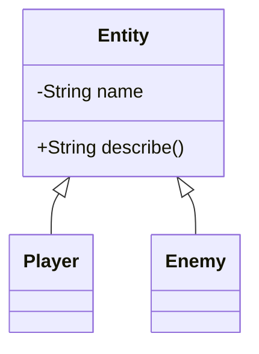
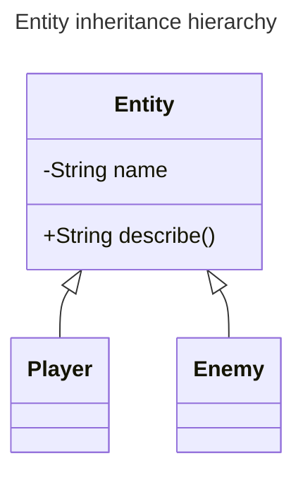
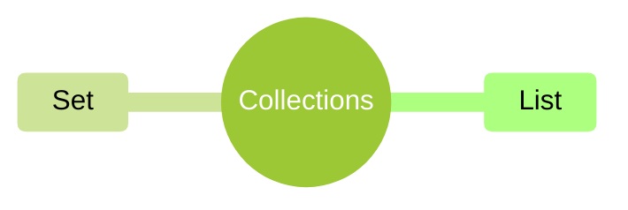
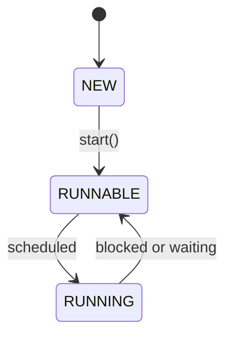

# Accessibility Style Guide — Module Notes

## Purpose and scope

This guide governs the markdown source of the module notes (`t*notes.md`), the applied case study files, the assessment briefs, and any new material added to the repository.

The goal is that a reader using a screen reader or braille display can read, navigate, and teach from the same source files as everyone else — not a separately maintained "accessible version". A single source that is correct for everyone is far more sustainable than a parallel one that drifts.

**How to apply this guide:** treat Section 3 as the rule set and Section 5 as the per-file work list. Apply one rule across all files at a time rather than one file at a time — the edits are more uniform and easier to review in a diff. Ensure a clean Git state before starting, and commit after each rule.

---

## 1. Before you start

Where possible, establish which of the following a reader is using, because the priorities differ sharply:

- **Speech-only screen reader** (JAWS, NVDA, VoiceOver, Orca) — verbosity is the enemy. Symbols, alignment padding, and long tables cost the most.
- **Refreshable braille display** — line width and horizontal structure matter most. Wide tables and long code lines are the worst offenders.
- **Screen magnification or high-contrast** (for a reader with residual vision) — reflow, line length, and colour dependence matter instead.

The rules below are written to be safe for all three. For a speech-only reader, Rule 12 (line length) can be deprioritised; for a braille reader it becomes one of the most important.

It is also worth knowing which markdown renderer is in use (VS Code preview, Obsidian, a Pandoc HTML build, or raw text in an editor). Mermaid accessibility in particular depends on the renderer actually producing SVG.

---

## 2. Guardrails — what must not change

When remediating existing files:

- **Do not change the meaning, difficulty, or pedagogy** of any content. This is a formatting and phrasing pass, not a rewrite.
- **Do not alter code semantics.** Whitespace and comment placement may change; identifiers, logic, and output must not.
- **Do not change YAML frontmatter keys or values** except where a rule explicitly says so. The field set is fixed by the [frontmatter schema](frontmatter-schema.md).
- **Do not delete content** to make it accessible. Diagrams get a text equivalent added; they do not get removed.
- **Do not renumber or retitle Core Ideas, sections, or exercises** in a way that breaks existing links, Moodle references, or student bookmarks.
- Preserve existing British/Irish English spelling.

---

## 3. Rules

### R1 — Every Mermaid diagram needs an accessible description

A rendered Mermaid diagram is an SVG with no accessible name. A screen reader announces nothing, or at best "graphic". This is the single largest gap in the current notes.

Do **both** of the following for every ` ```mermaid ` block:

1. Add `accTitle` and `accDescr` as the first lines inside the diagram. Mermaid emits these as `<title>` and `<desc>` on the SVG.
2. Add a short prose paragraph immediately **after** the block, introduced by a bold `**Diagram description**` label, that conveys the same information as standalone text.

The prose paragraph is not redundant. It survives PDF export, Moodle paste, renderers that don't support Mermaid, and readers who simply prefer prose. Write it so that a reader who never sees the diagram misses nothing.

**Before**

````markdown

````

**After**

````markdown


**Diagram description**
`Entity` is the base class, holding a private `name` field and a `describe()` method.
`Player` and `Enemy` both extend `Entity`, and each overrides `describe()` with its own implementation.
````

Guidance on writing the description:

- State the **relationships**, not the picture. "Player extends Entity" — not "an arrow points upward from Player to Entity."
- For sequence diagrams, describe it as a numbered sequence of steps. The `t16` message-flow diagram is the payoff of that whole topic and needs a full step-by-step equivalent.
- For class diagrams, name the base type first, then each subtype and what it overrides.
- Keep `accDescr` to one or two sentences; put the fuller version in the prose paragraph.
- For multi-line `accDescr`, use the block form: `accDescr {` … `}`.

#### Exception: `mindmap` does not support `accTitle` / `accDescr`

Mermaid's mindmap parser is indentation-sensitive and reads the whole block as a node
tree, so an `accTitle:` or `accDescr:` line is parsed as **a node**. The diagram then fails
to render with:

```text
There can be only one root. No parent could be found for ("accDescr: ...")
```

Verified against Mermaid 11.17. `flowchart`, `sequenceDiagram`, `classDiagram`,
`stateDiagram-v2` and `erDiagram` all accept the inline directives; `mindmap` does not.

For a mind map, put the metadata in **YAML frontmatter** at the top of the block instead,
which the frontmatter parser handles before the diagram parser sees it:

````markdown

````

Two details that matter:

- **Quote the values.** An unquoted value containing a colon — which any sentence with
  `Branches: ...` will have — is read as a nested YAML mapping and fails with
  `bad indentation of a mapping entry`.
- Frontmatter must come **first** in the block, before any `%%{init}%%` directive.

Because the inline directives are unavailable here, the prose **Diagram description** is
the only thing carrying the information for a mind map. Write it as a nested list mirroring
the branches, not a summary — a mind map *is* a nested list, so the list form loses nothing.

### R2 — Replace ASCII and box-drawing diagrams

Box-drawing characters (`─ │ └ ▲ ►`) are read out character by character, or silently skipped, leaving no information at all. Two files currently rely on them.

Replace each with **either** a Mermaid diagram plus the R1 treatment, **or** a plain prose or bulleted description — whichever is genuinely clearer for the concept.

**Before** (thread state diagram, `t14`)

```
NEW  ──start()──►  RUNNABLE  ──►  RUNNING
                      ▲               │
                      │           blocked/waiting
                      └───────────────┘
```

**After**

````markdown


**Diagram description**
A thread begins in `NEW`. Calling `start()` moves it to `RUNNABLE`, where it waits for the scheduler.
When the scheduler selects it, it becomes `RUNNING`. If it blocks or waits, it returns to `RUNNABLE`
rather than to `NEW` — a thread can only be started once.
````

**Before** (file layout, `t15`)

```
Server.java              ← accept loop + pool
ClientHandler.java       ← handles one client session
RequestDispatcher.java   ← routes request type to DAO method
```

**After**

```markdown
| File | Responsibility |
|:-|:-|
| `Server.java` | Accept loop and thread pool |
| `ClientHandler.java` | Handles one client session |
| `RequestDispatcher.java` | Routes a request type to the matching DAO method |
```

### R3 — Promote bold pseudo-headings to real headings

Screen reader users navigate a document by jumping between headings — the equivalent of a sighted reader skimming for bold text. Bold text is **not** a heading and cannot be jumped to.

The notes currently use around 100 bold pseudo-headings, dominated by `**Explanation**` and `**Snippet explanation**`. These are the core structural signposts of every topic, and they are invisible to heading navigation.

Promote any bold line that stands alone on its own line and introduces a block of content to a real heading at the correct level.

**Before**

````markdown
### Core Idea 2 — Generic classes

**Explanation**
A generic class uses a type parameter…

```java
class Box<T> { … }
```

**Snippet explanation**
`Box<T>` stores a value of whatever type…
````

**After**

````markdown
### Core Idea 2 — Generic classes

#### Explanation
A generic class uses a type parameter…

```java
class Box<T> { … }
```

#### Snippet explanation
`Box<T>` stores a value of whatever type…
````

Notes:

- Do not promote bold used **inline** for emphasis within a sentence. Only standalone label lines.
- Do not promote a bold line that is genuinely a lead-in to a single sentence (e.g. `**Important:**` followed by one line) — use a blockquote callout instead (see R11).
- **Do not promote `**Diagram description**`.** R1 mandates that label in bold, directly under its diagram. Promoting it to a heading would put one heading per diagram into the outline and separate the description from the diagram it belongs to. This is the one standalone bold label that stays bold.
- **Do not promote a lead-in to a list.** Labels such as `**Steps:**`, `**Context:**`, `**Hint:**` and `**Quick check:**` introduce a list, and the list already supplies the structure a reader navigates by. Promoting them adds dozens of near-identical headings and makes heading navigation *worse*, which is the opposite of this rule's intent.

In practice the labels worth promoting are the recurring structural signposts — `Explanation`, `Snippet explanation`, `Snippets`, `Checklist` — not every bold line.
- Normalise the label text while you are there: `**Snippet explanation:**` and `**Snippet explanation**` should both become `#### Snippet explanation`.
- Watch heading levels. Under a `###` Core Idea, these become `####`. Never skip a level.

### R4 — Identical section names and order across all topics

Predictability is worth more than polish. Once a reader has learned the shape of one topic, they should be able to navigate all sixteen without re-orienting.

The canonical `##` section order for a topic notes file:

1. `## What you'll learn`
2. `## Why this matters`
3. `## How this builds on previous content`
4. `## Core Ideas / Concepts`
5. `## Worked examples`
6. `## Common mistakes`
7. `## Debugging and pitfalls`
8. `## Practice tasks`
9. `## Reflective questions`
10. `## Key terms`
11. `## Further reading`
12. `## Lesson Context`

Current inconsistencies to fix:

- `What you'll learn` vs `What you’ll learn` — use the straight apostrophe consistently, or the curly one consistently; the mismatch is what breaks search and predictability.
- `Reflective Questions` vs `Reflective questions` — use sentence case throughout.
- `Lesson Context`, the same name with a trailing space, and `Lesson Context (YAML footer)` — use `## Lesson Context`.
- `How this builds on previous content` vs `How this builds on what you know` — pick one.
- `Debugging & Pitfalls` — spell out `and`; ampersands in headings read inconsistently.

Sections that genuinely don't apply to a topic may be omitted, but present sections must keep this relative order.

### R5 — Add a contents list to each file

Immediately after the H1 and prerequisites block, add a short contents list linking to the `##` sections. This gives a single, reliable landing point for navigation and doubles as a summary.

```markdown
## In this topic

- [What you'll learn](#what-youll-learn)
- [Why this matters](#why-this-matters)
- [Core Ideas / Concepts](#core-ideas--concepts)
- …
```

Keep it to `##` level only. A contents list that mirrors every subheading is noise.

### R6 — Code block formatting

Code is where a large share of teaching time goes, so it is worth getting right.

**No column alignment padding.** Runs of spaces used to line up assignments are announced as "space space space…" by some readers and consume braille cells for nothing.

```java
// Before
private static final int PORT          = 9000;
private static final int THREAD_POOL   = 10;

// After
private static final int PORT = 9000;
private static final int THREAD_POOL = 10;
```

**No trailing end-of-line comments.** A trailing comment arrives after the reader has already parsed the line, which is exactly backwards. Move it above.

```java
// Before
Socket clientSocket = serverSocket.accept();   // blocks until a client arrives

// After
// blocks until a client arrives
Socket clientSocket = serverSocket.accept();
```

**Always tag the fence with a language** (` ```java `, ` ```sql `, ` ```bash `). This is what allows tooling to announce a code region, so a reader can skip a snippet they already know.

**Keep snippets short.** Prefer several short blocks with an explanation each over one long block. This is already the house pattern; hold to it.

**Every snippet keeps its prose explanation.** The existing "Explanation → code → Snippet explanation" structure is the single best accessibility feature the notes already have. It is now a rule, not a habit.

### R7 — Ship the code as real files

For each topic, extract the snippets into compilable `.java` files under a per-topic source folder, and link to them from the notes.

```markdown
> Source: [`code/src/t11_generics_1/demos/de01/Demo.java`](../../../code/src/t11_generics_1/demos/de01/Demo.java)
```

The code can then be read in IntelliJ with screen reader mode enabled (Settings, then Accessibility, then "Support screen readers"), which provides structure view, jump-to-definition, error navigation, and code folding — instead of arrowing through a markdown blob character by character.

This is probably the largest single quality-of-life improvement available, and it benefits students too.

### R8 — Symbols and special characters

Replace symbols that carry meaning with words. Symbols that are decorative should simply go.

| Character | Where it appears | Replace with |
|:-|:-|:-|
| `→` (75 uses) | Prose and comments | The word "to", "then", or "becomes". Keep inside Mermaid and code. |
| `←` (9 uses) | `t15` file layout annotations | Convert the block to a table (see R2) |
| `↑` `↓` | `t02` comparator comments | "ascending" / "descending" — clearer anyway |
| `★` | `t02` toString example | Keep only if the star is genuinely part of the program's output; otherwise `*` |
| `🌍` `⚠️` | `t10`, `t11` section labels | Delete the emoji, keep the text label |
| `‑` U+2011 non-breaking hyphen (27 uses) | Throughout | Plain ASCII hyphen `-` |
| `…` U+2026 | Throughout | Three full stops `...` |
| `&amp;` | `t10` line 194 | A literal `&` — this is a leaked HTML entity, a straightforward bug |

Em dashes (`—`) and en dashes (`–`) are fine and may stay. Curly quotes are fine, but use them consistently rather than mixing with straight quotes in headings.

Emoji are currently rare in the notes — that is a good state. Do not introduce emoji as status markers, section icons, or bullet decoration.

### R9 — Gloss nested generics on first use

`Map<String, List<Player>>` spoken aloud is "Map less-than String comma List less-than Player greater-than greater-than". It is parseable but expensive, and the angle-bracket nesting is easy to lose track of.

The first time a non-trivial generic type appears in a topic, add a one-sentence plain-English gloss.

```markdown
`Map<String, List<Player>>` — a map from team name to the list of players on that team.
```

Single-parameter types (`List<String>`, `Optional<Player>`) do not need this. Anything with nesting or three or more parameters does.

### R10 — Tables

- **Maximum three columns.** Four is tolerable for a short table; beyond that, split it or convert to headed subsections.
- **Always a real header row** with the `|:-|:-|` separator, so the renderer emits `<th>` and the reader can announce column names with each cell.
- **No empty cells.** Use an explicit "n/a" or "none". An empty cell is announced as "blank" with no indication of which column it belongs to.
- **No merged or multi-line cells**, and no `<br>` inside cells.
- **No tables used purely for layout.**
- **Split long tables.** Anything over about eight rows read linearly is exhausting. `t16` currently has around 74 table lines and `t15` around 34 — break these into headed subsections with a short table each, or convert to definition-style bullets.
- Keep cell text short. A cell containing three sentences belongs in prose beneath the table.

### R11 — Line breaks and callouts

**Remove trailing double-space line breaks.** These produce a soft `<br>` that fragments a sentence mid-flow, and they are invisible when editing. There are currently around 155 of them across the notes, concentrated in `t06`, `t08`, and `t09`.

Use a real blank line for a paragraph break. If a genuine line break is needed inside a paragraph, restructure into a list instead.

**Use blockquote callouts, not `<br>` chains.** The `gca1` and `gca2` briefs contain runs of `<br>`-separated lines inside a raw `<div>`; these render as one run-on paragraph with no list structure.

```markdown
<!-- Before -->
<div class="internal-guide">
1. Private fields: must be fName.<br>
2. Class member order: use these headings.<br>
</div>

<!-- After -->
> **Coding style requirements**
>
> 1. Private fields must be named `fName` (for example, `fScore`).
> 2. Class members must appear in the documented order.
```

Avoid raw HTML in markdown generally. Where a container is genuinely needed for styling, keep the markdown list structure inside it rather than flattening to `<br>`.

### R12 — Line length

Keep source lines under roughly 100 characters, including inside code blocks. This matters most for braille display users, who read a fixed window (typically 40 or 80 cells) and must pan horizontally across anything longer.

Current worst offenders: `t16` (~135 long lines), `t14` (~43), `t15` (~37), `t06` (~34).

For prose, this means wrapping at sentence boundaries rather than mid-clause. For code, prefer breaking long chained calls and long parameter lists across lines.

### R13 — Link text must make sense out of context

Screen reader users often pull up a list of all links in a document. "Click here", "this", and bare URLs are useless in that list.

```markdown
<!-- Before -->
See the docs [here](https://docs.oracle.com/...).

<!-- After -->
See the [Oracle Java Generics tutorial](https://docs.oracle.com/...).
```

### R14 — File hygiene

- **One H1 per file**, matching the frontmatter `title`.
- **Never skip heading levels** (no `##` followed directly by `####`).
- **Consistent line endings** — normalise everything to LF; a few files currently contain CRLF.
- **No trailing whitespace** (which R11 also addresses).
- **No colour-only meaning.** If anything in slides, diagrams, or CommitLens output uses colour to convey status, add a text label alongside it.

---

## 4. Distribution formats

- **Markdown source in the repository is the canonical format.** Whatever format students receive, the source must remain available alongside it.
- **Prefer Pandoc-generated HTML** over PDF or PowerPoint for any published version. HTML preserves semantic headings, real `<table>` markup, and code regions. PDF frequently loses the tag tree; PowerPoint reading order is unreliable unless carefully set.

```bash
pandoc t08_generics_1_notes.md -s --toc --mathml -o t08_generics_1_notes.html
```

- If a PDF is required for Moodle, generate it from the HTML rather than exporting from Word, and check the tag order afterwards.
- Mermaid needs a renderer that produces SVG for `accTitle`/`accDescr` to reach the reader. The R1 prose paragraph is what guarantees the information survives regardless.

---

## 5. Per-file work list

Regenerated 2026-09-09 against the current filenames. Rules R1–R5, R8, R11 and R14 are
complete; the table lists only what is still outstanding. Counts drift as edits land, so
regenerate it with the `accessibility-report` script rather than editing it by hand.
(The `scripts/` folder is lecturer-local and is not published to GitHub.)

| File | Mermaid | Trailing comments (R6) | Code >100 (R12) | Table rows >100 (R10) | Tables >8 rows (R10) |
|:-|-:|-:|-:|-:|-:|
| `shared/mind maps/revision_t00_t09.md` | 10 | 63 | 10 | 10 | 1 |
| `shared/mind maps/revision_t10_t22.md` | 13 | 44 | 13 | 13 | 1 |
| `topics/t21_json_2_jackson_advanced/t21_json_2_jackson_advanced_notes.md` | 3 | 12 | 8 | 28 | 2 |
| `topics/t02_recursion/t02_recursion_notes.md` | — | 18 | — | 17 | — |
| `topics/t25_documenting_a_project/t25_documenting_a_project_notes.md` | 7 | — | 12 | 21 | 2 |
| `topics/t00_oop_fundamentals/t00_oop_fundamentals_notes.md` | — | 15 | 1 | 14 | — |
| `topics/t07_collections_3_set_map/t07_collections_3_set_map_notes.md` | — | 24 | — | 6 | — |
| `topics/t23_unit_testing/t23_unit_testing_notes.md` | 1 | 4 | 3 | 17 | 2 |
| `topics/t20_json_1_jackson_basics/t20_json_1_jackson_basics_notes.md` | — | — | — | 21 | 2 |
| `topics/t22_networking/exercises/t22_networking_exercises.md` | — | 4 | 19 | — | — |
| `topics/t16_functional_interfaces/t16_functional_interfaces_notes.md` | — | 5 | 1 | 15 | — |
| `topics/t22_networking/t22_networking_notes.md` | — | 6 | 4 | 10 | — |
| `topics/t01_arrays/t01_arrays_notes.md` | — | 7 | — | 12 | — |
| `topics/t05_collections_1/t05_collections_1_notes.md` | — | 17 | — | 2 | — |
| `topics/t06_collections_2/t06_collections_2_notes.md` | — | 14 | — | 5 | — |
| `shared/cheat sheets/cheatsheet_junit_asserts_by_parameter_type.md` | — | 2 | 16 | — | — |
| `topics/t12_generics_2/t12_generics_2_notes.md` | — | 8 | — | 10 | — |
| `topics/t17_streams_api/t17_streams_api_notes.md` | — | 9 | — | 9 | — |
| `topics/t18_io/t18_io_notes.md` | — | 9 | — | 8 | 1 |
| `topics/t19_concurrency/t19_concurrency_notes.md` | 1 | 8 | 2 | 7 | — |

Suggested order of work, highest value first:

1. **R1 and R2** — diagrams in `revision_t01_t07`, `t16`, `t06`, `t14`, `t15`, `collections`. This is the only category where information is currently lost entirely.
2. **R3** — promote pseudo-headings across all files. Mechanical, low-risk, transforms navigability.
3. **R7** — extract code to `.java` files.
4. **R8** — symbol replacement. Mechanical and scriptable.
5. **R11** — remove trailing double-spaces, fix the `<br>` chains in the briefs.
6. **R4 and R5** — heading normalisation and contents lists.
7. **R6, R10, R12** — code formatting, table splitting, line length. Most effortful; do last and per-file.

---

## 6. Verification

The reliable check is the maintenance scripts, which are fence-aware and understand the
exceptions (arrows are allowed inside code and Mermaid; frontmatter is never wrapped).
These live in the lecturer-local `scripts/` folder, which is gitignored and therefore not
available in a fresh clone:

```bash
node scripts/accessibility-report.mjs        # counts per rule, per file
node scripts/validate-mermaid.mjs            # parses every diagram, flags missing accDescr
```

The one-liners below are useful for a quick look, but read the notes on each — several
obvious-looking greps are wrong.

```bash
# R1: mermaid blocks without an accDescr.
# Only approximate: it cannot see nested ```` wrappers, and mindmap blocks legitimately
# carry accDescr in frontmatter rather than inline. Prefer validate-mermaid.mjs.
find notes -name '*.md' -print0 | while IFS= read -r -d '' f; do
  m=$(grep -c '^```mermaid' "$f"); a=$(grep -c 'accDescr' "$f")
  [ "$m" -ne "$a" ] && echo "$f: $m diagrams, $a accDescr"
done

# R2: box-drawing characters.
# grep -P needs a unibyte or UTF-8 locale; force it or the pattern silently fails.
LC_ALL=C.UTF-8 grep -rnP '[\x{2500}-\x{257F}]' --include='*.md' notes

# R3: remaining standalone bold pseudo-headings.
# Excludes **Diagram description**, which R1 requires to stay bold.
grep -rn '^\*\*[A-Z][^*]*\*\*:\?[[:space:]]*$' --include='*.md' notes \
  | grep -v 'Diagram description'

# R6: alignment padding before an assignment (inside code blocks).
grep -rn '[^ ]  \+=[^=]' --include='*.md' notes

# R8: symbols to replace in PROSE. Arrows inside code and Mermaid are allowed,
# so expect hits from fenced blocks here - check the context before editing.
grep -rn '→\|←\|↑\|↓\|‑\|…\|&amp;' --include='*.md' notes

# R11/R14: trailing whitespace.
# NOTE: '[ \t]$' does NOT work - in a bracket expression \t is a literal 't',
# so it matches every line ending in the letter t. Use -P, or a literal tab.
grep -rnP '[ \t]$' --include='*.md' notes

# R12: long lines. Table rows, headings and YAML frontmatter cannot be wrapped,
# so subtract those before judging the number.
awk 'length>100 {print FILENAME":"FNR}' $(find notes -name '*.md') | wc -l

# R14: CRLF line endings. Quote the path - several folders contain spaces.
find notes -name '*.md' -print0 | xargs -0 file | grep CRLF
```

---

## 7. Template for new topic notes

Apply these rules at authoring time rather than remediating later.

````markdown
---
title: "Topic Name — Subtitle"
subtitle: "COMP C8Z03 — Year 2 OOP"
description: "One sentence."
created: YYYY-MM-DD
version: 1.0
authors: ["OOP Teaching Team"]
tags: [java, topic, year2, comp-c8z03]
prerequisites:
  - Prior topic one
  - Prior topic two
---

# Topic Name

> **Prerequisites:**
> - You can do X
> - You understand Y

## In this topic

- [What you'll learn](#what-youll-learn)
- [Why this matters](#why-this-matters)
- [Core Ideas / Concepts](#core-ideas--concepts)

## What you'll learn

| Skill Type | You will be able to… |
|:-|:-|
| Understand | … |

## Core Ideas / Concepts

### Core Idea 1 — Name

#### Explanation

Prose. No trailing double-spaces. Lines under 100 characters. Symbols written as words.

```java
// what this line does
int total = scores.length;
```

#### Snippet explanation

What the example demonstrates, in prose that stands alone without the code.

> Source: `code/src/tNN_topic/demos/deNN/Demo.java`

## Lesson Context

```yaml
previous_lesson:
  topic_code: tNN_previous
this_lesson:
  topic_code: tNN_current
```
````

---

## 8. A note on maintenance

Accessibility passes decay. The most reliable way to hold the gains is to put Section 6's verification commands into a pre-commit hook or a small CI check, so a regression is caught at commit time rather than discovered in a lecture.

Two of these rules — R3 (real headings) and R6 (short, explained snippets) — also demonstrably help sighted students, who skim by heading and rely on the prose explanation when the code is unfamiliar. These are house standards for good technical writing, and they raise the quality of the notes for every reader.
