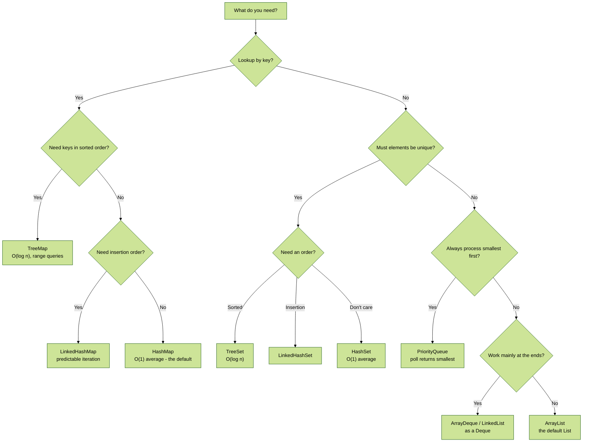
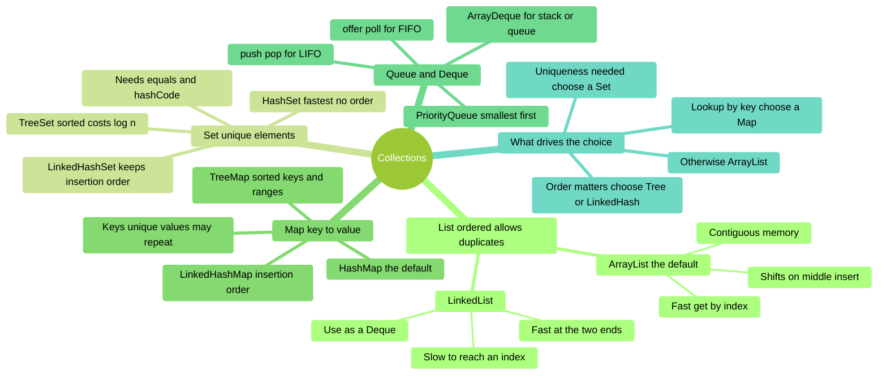

# Collections — Choosing the Right One

A cross-topic revision aid. The per-topic mindmaps cover each collection in detail —
[t05 ArrayList](revision_t00_t09.md#t05--collections-i-arraylist),
[t06 LinkedList](revision_t00_t09.md#t06--collections-ii-linkedlist-and-iterators) and
[t07 Set, Map and
PriorityQueue](revision_t00_t09.md#t07--collections-iii-set-map-and-priorityqueue).
This page answers the question that spans all three: **which one do I actually pick?**

> :warning: This revision document is not a substitute for reading, understanding, and learning
> the content covered in the related notes.

---

## The decision in one picture



**Diagram description**
Work down two questions. **Do you need lookup by key?** If yes: `TreeMap` when keys must be
sorted or queried by range, `LinkedHashMap` when insertion order matters, otherwise `HashMap`
as the default. If no, ask **must elements be unique?** If yes: `TreeSet` for sorted order,
`LinkedHashSet` for insertion order, `HashSet` when order does not matter. If neither applies,
ask whether you always process the smallest element first (`PriorityQueue`), whether the work
happens at the two ends (`ArrayDeque` or `LinkedList` as a Deque), or neither — in which case
`ArrayList` is the default.

---

## The shape of the whole family



**Diagram description**
Mind map of **Collections**, organised into 5 branches:

- **List ordered allows duplicates** — ArrayList the default; Contiguous memory; Fast get by
  index; Shifts on middle insert; LinkedList; Fast at the two ends; Slow to reach an index; Use
  as a Deque.
- **Set unique elements** — HashSet fastest no order; LinkedHashSet keeps insertion order;
  TreeSet sorted costs log n; Needs equals and hashCode.
- **Map key to value** — HashMap the default; LinkedHashMap insertion order; TreeMap sorted
  keys and ranges; Keys unique values may repeat.
- **Queue and Deque** — ArrayDeque for stack or queue; PriorityQueue smallest first; push pop
  for LIFO; offer poll for FIFO.
- **What drives the choice** — Uniqueness needed choose a Set; Lookup by key choose a Map;
  Order matters choose Tree or LinkedHash; Otherwise ArrayList.

---

## Cost at a glance

Averages, and the reason each one matters more than the number itself.

**The two List types**

| Operation | ArrayList | LinkedList |
|:--|:--|:--|
| Get by index | **O(1)** | O(n) |
| Add at end | O(1)* | O(1) |
| Add / remove at start | O(n) | **O(1)** |
| Insert / remove in middle | O(n) | O(n)† |
| `contains` / lookup | O(n) | O(n) |

**Hashed versus sorted**

| Operation | HashSet / HashMap | TreeSet / TreeMap |
|:--|:--|:--|
| `contains` / lookup | **O(1)** | O(log n) |
| Iterate in sorted order | O(n log n) | **O(n)** |
| Get by index | Not supported | Not supported |

\* Amortised — resizing copies to a bigger array, but rarely.
† O(1) *once you are positioned* with a `ListIterator`; reaching the position is the O(n) part.
This is why `LinkedList` wins far less often than its reputation suggests.

---

## Choices that trip people up

**"I need fast membership tests"** — `HashSet`, not `List`. `list.contains(x)` is a linear
scan, so 10 000 lookups over a 10 000-element list is 100 million comparisons. A `HashSet`
makes each lookup O(1).

**"I need uniqueness *and* insertion order"** — `LinkedHashSet`. Reaching for a `List` plus a
manual duplicate check re-introduces the O(n) scan you were avoiding.

**"I printed my `PriorityQueue` and it isn't sorted"** — it is not broken. A `PriorityQueue`
guarantees only that **`poll()`** returns the smallest remaining element. Its internal heap is
partially ordered, so iteration and `toString()` look wrong.

**"My `HashSet` contains duplicates"** — the element type overrides `equals` but not
`hashCode`, or overloads `equals(MyType)` instead of overriding `equals(Object)`. See
[t04](revision_t00_t09.md#t04--equality-and-hashing).

**"`contains` returns false for an object I definitely added"** — a field used by `hashCode`
was mutated after insertion, so the object now sits in the wrong bucket. Make key fields final.

**"`ConcurrentModificationException` while removing"** — you removed through the collection
during a `for-each`. Use `removeIf`, or an explicit `Iterator` and call `it.remove()`.

---

## Declaring them well

```java
// Declare the interface, instantiate the implementation.
// Callers depend on List, so the implementation can change freely.
List<Task> tasks = new ArrayList<>();
Set<String> seen = new HashSet<>();
Map<String, Integer> counts = new HashMap<>();
Deque<Command> undo = new ArrayDeque<>();

// Ask for the least specific type that supports what you need
public int countOverdue(Collection<Task> tasks) { ... }   // only iterates
public void promote(List<Task> tasks, int index) { ... }  // needs indexing
```

---

## Self-Assessment Prompts

1. **You need uniqueness, insertion order, and fast membership tests. Which collection?**
   *(Two of the three rule out most options)*

2. **When does `LinkedList` genuinely beat `ArrayList`, and why is "frequent middle insertion"
   not the answer?**
   *(What has to happen before the O(1) splice can occur?)*

3. **What does `HashMap` need from a key type, and what must be true of those fields afterwards?**
   *(Two method overrides, and one property)*

4. **`TreeMap` costs O(log n) against `HashMap`'s O(1). What do you get for that?**
   *(Name two operations `HashMap` cannot offer at all)*

5. **Why declare `List<Task> tasks` rather than `ArrayList<Task> tasks`?**
   *(What can you change later in each case?)*
