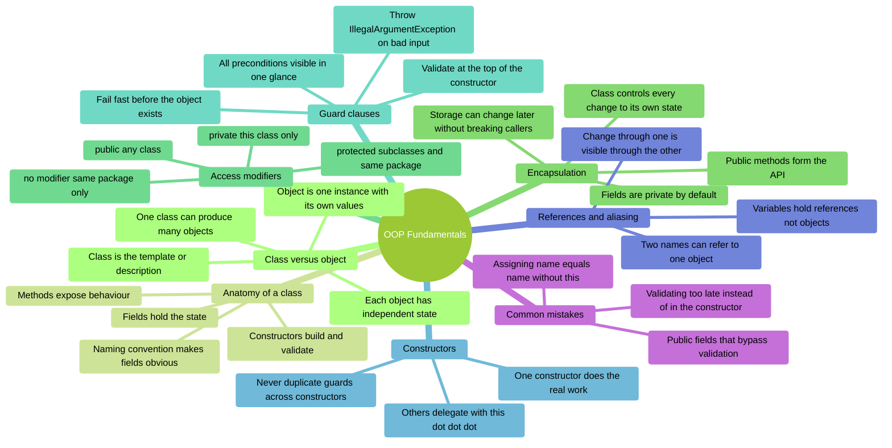
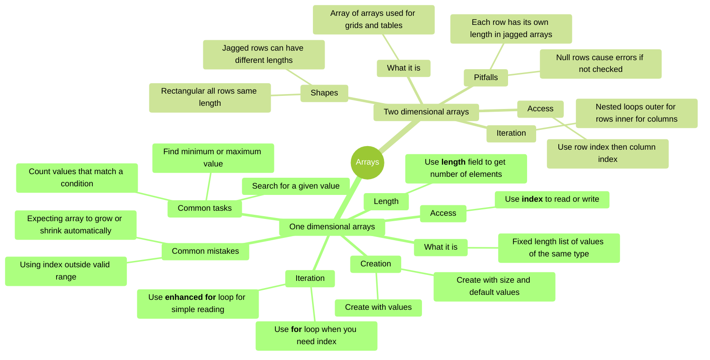
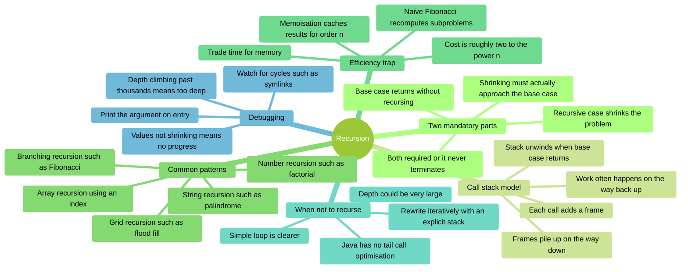
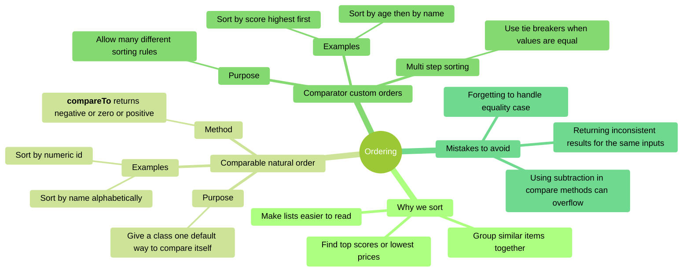
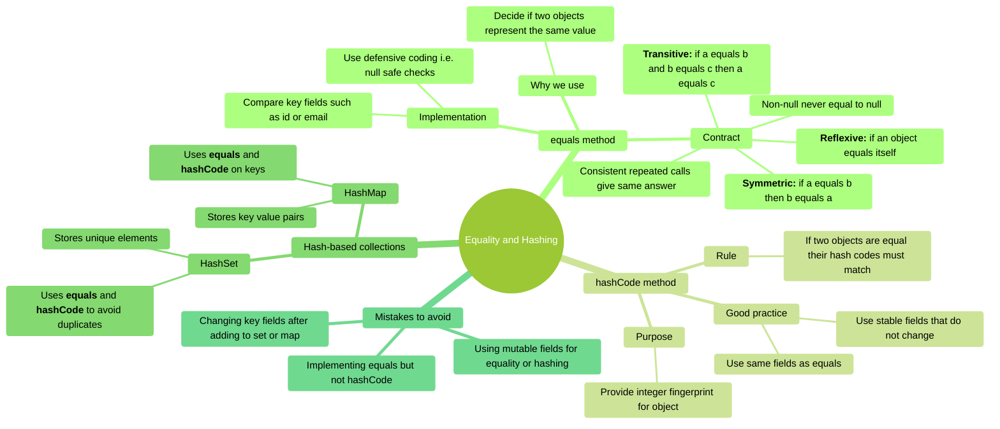
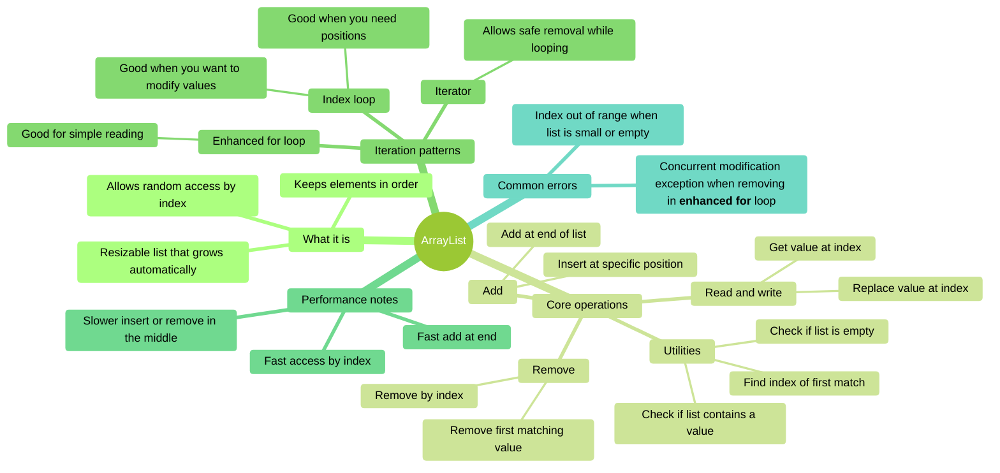
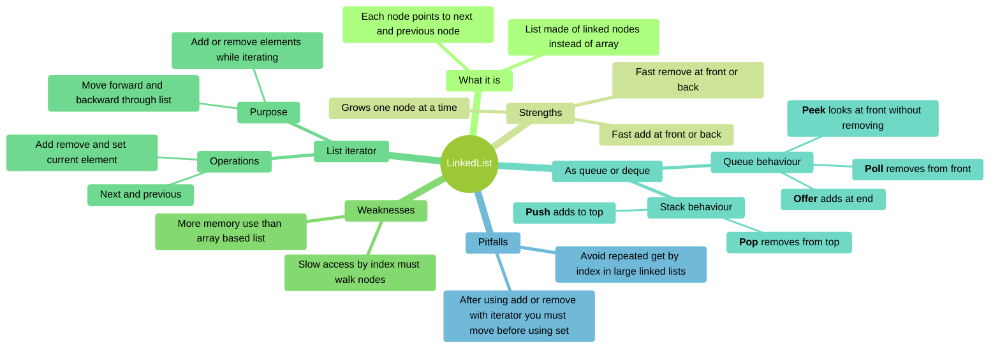
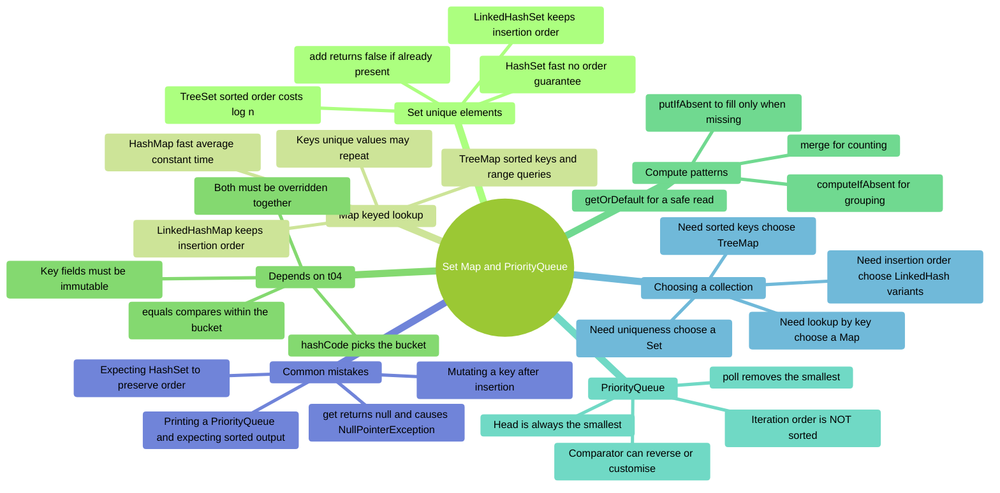
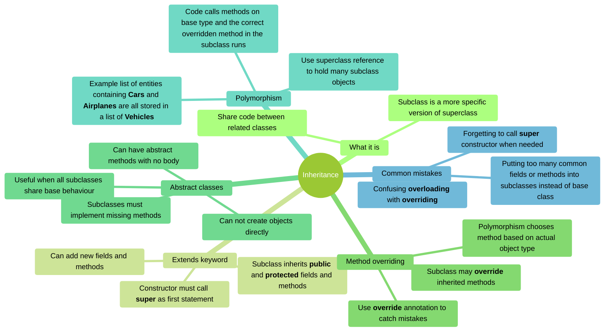
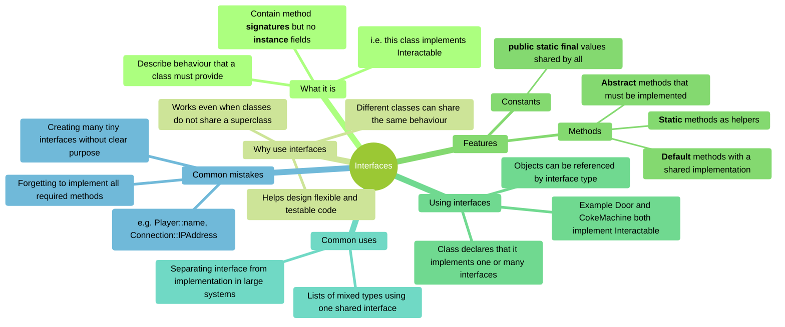

# COMP C8Z03 — Revision Mindmaps, Part 1 (t00–t09)

This document collects the mindmaps for **topics t00–t09**. Each section has:

- A short explanation of what the topic covers.
- A Mermaid **mindmap** you can use to review key ideas.
- **Code snippets** showing the syntax in use.
- **Self-assessment prompts** to test yourself before checking the notes.

> :warning: This revision document is not a substitute for reading, understanding, and learning
> the content covered in the related notes.

| Topic | Covers | Notes |
|:--|:--|:--|
| [t00](#t00--oop-fundamentals) | Classes, objects, encapsulation, guard clauses | [Notes](../../topics/t00_oop_fundamentals/t00_oop_fundamentals_notes.md) |
| [t01](#t01--arrays-1d-and-2d) | Fixed-size 1D and 2D arrays | [Notes](../../topics/t01_arrays/t01_arrays_notes.md) |
| [t02](#t02--recursion) | Base case, call stack, when not to recurse | [Notes](../../topics/t02_recursion/t02_recursion_notes.md) |
| [t03](#t03--ordering-comparable-and-comparator) | Comparable, Comparator, tie-breakers | [Notes](../../topics/t03_ordering/t03_ordering_notes.md) |
| [t04](#t04--equality-and-hashing) | equals/hashCode contract, identity vs value | [Notes](../../topics/t04_equality_hashing/t04_equality_hashing_notes.md) |
| [t05](#t05--collections-i-arraylist) | ArrayList, safe iteration and removal | [Notes](../../topics/t05_collections_1/t05_collections_1_notes.md) |
| [t06](#t06--collections-ii-linkedlist-and-iterators) | LinkedList, ListIterator, Deque | [Notes](../../topics/t06_collections_2/t06_collections_2_notes.md) |
| [t07](#t07--collections-iii-set-map-and-priorityqueue) | HashSet, HashMap, TreeMap, PriorityQueue | [Notes](../../topics/t07_collections_3_set_map/t07_collections_3_set_map_notes.md) |
| [t08](#t08--inheritance) | extends, overriding, abstract classes | [Notes](../../topics/t08_inheritance/t08_inheritance_notes.md) |
| [t09](#t09--interfaces) | Contracts, polymorphism, multiple interfaces | [Notes](../../topics/t09_interface/t09_interface_notes.md) |

Topics t10 onwards are in [Part 2](revision_t10_t22.md); testing, pathfinding and
documentation are in [Part 3](revision_t23_t25.md).

---

## t00 — OOP Fundamentals

### Overview

A **class** is the description; an **object** is one instance built from it, holding its own
field values.
Encapsulation means the class keeps its fields `private` and controls every change through its
own methods, so its validation can never be bypassed.
Guard clauses at the top of a constructor make it impossible for an invalid object to exist in
the first place.



**Diagram description**
Mind map of **OOP Fundamentals**, organised into 8 branches:

- **Class versus object** — Class is the template or description; Object is one instance with
  its own values; One class can produce many objects; Each object has independent state.
- **Anatomy of a class** — Fields hold the state; Constructors build and validate; Methods
  expose behaviour; Naming convention makes fields obvious.
- **Encapsulation** — Fields are private by default; Public methods form the API; Class
  controls every change to its own state; Storage can change later without breaking callers.
- **Access modifiers** — private this class only; public any class; protected subclasses and
  same package; no modifier same package only.
- **Guard clauses** — Validate at the top of the constructor; Fail fast before the object
  exists; Throw IllegalArgumentException on bad input; All preconditions visible in one glance.
- **Constructors** — One constructor does the real work; Others delegate with this dot dot dot;
  Never duplicate guards across constructors.
- **References and aliasing** — Variables hold references not objects; Two names can refer to
  one object; Change through one is visible through the other.
- **Common mistakes** — Public fields that bypass validation; Assigning name equals name
  without this; Validating too late instead of in the constructor.

### Code Snippets

```java
public class Player {

    // === Fields === (private: the class controls all changes)
    private final String _name;
    private int _health;

    // === Constructor === (guards first, so an invalid Player cannot exist)
    public Player(String name, int health) {
        if (name == null || name.isBlank())
            throw new IllegalArgumentException("name is required");
        if (health <= 0)
            throw new IllegalArgumentException("health must be positive");

        _name = name;
        _health = health;
    }

    // Delegating constructor: a sensible default, validation in one place only
    public Player(String name) {
        this(name, 100);
    }

    // === Public API ===
    public String getName() { return _name; }
    public int getHealth(){ return _health; }

    public void takeDamage(int amount) {
        if (amount < 0)
            throw new IllegalArgumentException("damage cannot be negative");
        _health = Math.max(0, _health - amount);
    }
}
```

```java
// Aliasing: both names refer to ONE object
Player p1 = new Player("Ana");
Player p2 = p1;
p2.takeDamage(30);
System.out.println(p1.getHealth());  // 70 - not 100

// Two separate objects with equal data are still two objects
Player a = new Player("Ana");
Player b = new Player("Ana");
System.out.println(a == b);          // false (compares references)
```

### Self-Assessment Prompts

1. **In one sentence each, what is a class and what is an object?**
   *(Hint: which one exists at runtime and holds values?)*

2. **What can go wrong if a field is `public` instead of `private`?**
   *(Think about the guard clauses in the constructor — can they still be trusted?)*

3. **Why put guard clauses at the top of the constructor rather than where the field is first
   used?**
   *(Consider how far a bad object could travel before anything complains)*

4. **`ref2 = ref1;` then `ref2.setName("Dave")`. What does `ref1.getName()` return, and why?**
   *(What exactly was copied by the assignment?)*

5. **When would you add a second constructor, and what must it not do?**
   *(Hint: `this(...)` — and what happens if guards are copied into both?)*

---

## t01 — Arrays (1D and 2D)

### Overview

Arrays are the most basic way to store multiple values in Java. They have a fixed size and hold
items of the same type.  You must understand arrays before learning lists, sorting, or
searching.
This mindmap shows how to create arrays, access elements, loop through them, and avoid common
errors.



**Diagram description**
Mind map of **Arrays**, organised into 2 branches:

- **One dimensional arrays** — What it is; Fixed length list of values of the same type;
  Creation; Create with values; Create with size and default values; Access; Use **index** to
  read or write; Length; Use **length** field to get number of elements; Iteration; Use **for**
  loop when you need index; Use **enhanced for** loop for simple reading; Common tasks; Find
  minimum or maximum value; Search for a given value; Count values that match a condition;
  Common mistakes; Using index outside valid range; Expecting array to grow or shrink
  automatically.
- **Two dimensional arrays** — What it is; Array of arrays used for grids and tables; Shapes;
  Rectangular all rows same length; Jagged rows can have different lengths; Access; Use row
  index then column index; Iteration; Nested loops outer for rows inner for columns; Pitfalls;
  Each row has its own length in jagged arrays; Null rows cause errors if not checked.

### Code Snippets

```java
// 1D array creation and access
int[] scores = {85, 92, 78, 90};
System.out.println(scores[0]);  // 85
System.out.println(scores.length);  // 4

// Enhanced for loop (read-only)
for (int score : scores) {
    System.out.println(score);
}

// Traditional for loop (when you need index)
for (int i = 0; i < scores.length; i++) {
    scores[i] = scores[i] + 5;  // Curve all scores
}

// 2D array (rectangular)
int[][] grid = {
    {1, 2, 3},
    {4, 5, 6},
    {7, 8, 9}
};
System.out.println(grid[1][2]);  // 6

// Nested loops for 2D array
for (int row = 0; row < grid.length; row++) {
    for (int col = 0; col < grid[row].length; col++) {
        System.out.print(grid[row][col] + " ");
    }
    System.out.println();
}
```

### Self-Assessment Prompts

1. **Why doesn't `array.length` have parentheses like `list.size()`?**
   *(Hint: One is a field, the other is a method)*

2. **What happens if you try to access `scores[4]` when `scores.length` is 4?**
   *(What error do you get, and why?)*

3. **In a jagged 2D array, why must you check `grid[row].length` for each row separately?**
   *(What assumption breaks down compared to rectangular arrays?)*

4. **When should you use an enhanced for loop versus a traditional indexed for loop?**
   *(Consider: reading vs. modifying, needing position vs. just values)*

---

## t02 — Recursion

### Overview

A recursive method calls itself on a **smaller** version of the same problem.
Every correct one needs two parts: a **base case** that returns without recursing, and a
**recursive case** that moves strictly closer to it. Missing either gives `StackOverflowError`.
Recursion suits data that is itself recursive — trees, directories, grids — where the code then
mirrors the shape of the data.



**Diagram description**
Mind map of **Recursion**, organised into 6 branches:

- **Two mandatory parts** — Base case returns without recursing; Recursive case shrinks the
  problem; Both required or it never terminates; Shrinking must actually approach the base
  case.
- **Call stack model** — Each call adds a frame; Frames pile up on the way down; Work often
  happens on the way back up; Stack unwinds when base case returns.
- **Common patterns** — Number recursion such as factorial; Array recursion using an index;
  String recursion such as palindrome; Branching recursion such as Fibonacci; Grid recursion
  such as flood fill.
- **Efficiency trap** — Naive Fibonacci recomputes subproblems; Cost is roughly two to the
  power n; Memoisation caches results for order n; Trade time for memory.
- **When not to recurse** — Depth could be very large; Java has no tail call optimisation;
  Simple loop is clearer; Rewrite iteratively with an explicit stack.
- **Debugging** — Print the argument on entry; Values not shrinking means no progress; Depth
  climbing past thousands means too deep; Watch for cycles such as symlinks.

### Code Snippets

```java
// Classic warm-up: multiplication happens as the stack unwinds
static long factorial(int n) {
    if (n <= 1) return 1;          // base case
    return n * factorial(n - 1);   // recursive case: n gets smaller
}
// factorial(4) -> 4 * (3 * (2 * 1)) = 24
```

```java
// Array recursion with a public wrapper hiding the index parameter
public static int sum(int[] xs) {
    if (xs == null) return 0;
    return sum(xs, 0);
}

private static int sum(int[] xs, int i) {
    if (i == xs.length) return 0;        // base case: past the end
    return xs[i] + sum(xs, i + 1);       // shrink by advancing the index
}
```

```java
// String recursion: work inwards from both ends
static boolean isPalindrome(String s) {
    if (s.length() <= 1) return true;                    // base case
    if (s.charAt(0) != s.charAt(s.length() - 1)) return false;
    return isPalindrome(s.substring(1, s.length() - 1)); // shrink by two
}
```

```java
// Memoised Fibonacci: O(2^n) becomes O(n)
private static final Map<Integer, Long> CACHE = new HashMap<>();

static long fib(int n) {
    if (n <= 1) return n;
    return CACHE.computeIfAbsent(n, k -> fib(k - 1) + fib(k - 2));
}
```

### Self-Assessment Prompts

1. **Name the two mandatory parts of a recursive method, and the symptom when each is missing.**
   *(Both failures look identical from the outside — what is the error?)*

2. **Trace `factorial(3)` by hand. At what moment does the first multiplication actually happen?**
   *(Hint: nothing is multiplied on the way down)*

3. **Why is naive `fib(40)` unusably slow when its recursion depth is only 40?**
   *(The problem is not stack depth — count how many times `fib(35)` is computed)*

4. **A method has a correct base case but still throws `StackOverflowError`. Give two possible
   causes.**
   *(One is about the argument; one is about legitimate depth)*

5. **You must find every `.java` file under a directory. Recursion or a loop? Justify it.**
   *(What shape is the data, and how deep can it realistically get?)*

---

## t03 — Ordering (Comparable and Comparator)

### Overview

Sorting is essential when organising data. Java provides two main tools:
- `Comparable` defines one “natural” order for a class.
- `Comparator` allows many different custom orders.

This section helps you understand their differences and how to apply them correctly.



**Diagram description**
Mind map of **Ordering**, organised into 4 branches:

- **Why we sort** — Make lists easier to read; Find top scores or lowest prices; Group similar
  items together.
- **Comparable natural order** — Purpose; Give a class one default way to compare itself;
  Method; **compareTo** returns negative or zero or positive; Examples; Sort by name
  alphabetically; Sort by numeric id.
- **Comparator custom orders** — Purpose; Allow many different sorting rules; Examples; Sort by
  score highest first; Sort by age then by name; Multi step sorting; Use tie breakers when
  values are equal.
- **Mistakes to avoid** — Using subtraction in compare methods can overflow; Returning
  inconsistent results for the same inputs; Forgetting to handle equality case.

### Code Snippets

```java
// Comparable: natural order (one way to sort)
public class Student implements Comparable<Student> {
    private String name;
    private int id;

    @Override
    public int compareTo(Student other) {
        return Integer.compare(this.id, other.id);  // Sort by id
    }
}

// Comparator: custom orders (many ways to sort)
public class StudentNameComparator implements Comparator<Student> {
    @Override
    public int compare(Student s1, Student s2) {
        return s1.getName().compareTo(s2.getName());  // Sort by name
    }
}

// Using Comparators with sorting
List<Student> students = new ArrayList<>();
Collections.sort(students);  // Uses Comparable (natural order)
Collections.sort(students, new StudentNameComparator());  // Uses Comparator

// Lambda syntax for simple comparators
students.sort((s1, s2) -> s1.getName().compareTo(s2.getName()));
students.sort(Comparator.comparing(Student::getName));  // Even cleaner

// Multi-level sorting (tie breakers)
students.sort(Comparator.comparing(Student::getGrade)
                        .thenComparing(Student::getName));
```

### Self-Assessment Prompts

1. **Why is using subtraction (`return this.age - other.age`) dangerous in `compareTo` methods?**
   *(Hint: What happens with very large positive and negative numbers?)*

2. **If a class implements `Comparable`, can you still sort it in different ways?**
   *(How would you sort by a different field without changing the class?)*

3. **What does `compareTo` return when two objects are equal? Why is this important?**
   *(What breaks if you return inconsistent results for the same comparison?)*

4. **When would you use a `Comparator` instead of `Comparable`?**
   *(Consider: Can you modify the class? Do you need multiple sort orders?)*

---

## t04 — Equality and Hashing

### Overview

To store custom objects correctly in sets and maps, Java needs two methods:
- `equals`
- `hashCode`

This mindmap explains how they work together, the rules they must follow, and the problems that
occur when the contract is broken.



**Diagram description**
Mind map of **Equality and Hashing**, organised into 4 branches:

- **equals method** — Why we use; Decide if two objects represent the same value; Contract;
  **Reflexive:** if an object equals itself; **Symmetric:** if a equals b then b equals a;
  **Transitive:** if a equals b and b equals c then a equals c; Consistent repeated calls give
  same answer; Non-null never equal to null; Implementation; Compare key fields such as id or
  email; Use defensive coding i.e. null safe checks.
- **hashCode method** — Purpose; Provide integer fingerprint for object; Rule; If two objects
  are equal their hash codes must match; Good practice; Use same fields as equals; Use stable
  fields that do not change.
- **Hash-based collections** — HashSet; Stores unique elements; Uses **equals** and
  **hashCode** to avoid duplicates; HashMap; Stores key value pairs; Uses **equals** and
  **hashCode** on keys.
- **Mistakes to avoid** — Implementing equals but not hashCode; Using mutable fields for
  equality or hashing; Changing key fields after adding to set or map.

### Code Snippets

```java
// Proper equals and hashCode implementation
public class Student {
    private int id;
    private String email;

    @Override
    public boolean equals(Object obj) {
        if (this == obj) return true;  // Same object
        if (obj == null || getClass() != obj.getClass()) return false;

        Student other = (Student) obj;
        return id == other.id &&
               Objects.equals(email, other.email);  // Null-safe
    }

    @Override
    public int hashCode() {
        return Objects.hash(id, email);  // Use same fields as equals
    }
}

// Using in HashSet (duplicates removed)
Set<Student> students = new HashSet<>();
students.add(new Student(1, "alice@email.com"));
students.add(new Student(1, "alice@email.com"));  // Duplicate - not added
System.out.println(students.size());  // 1

// Using in HashMap (keys must be unique)
Map<Student, Integer> grades = new HashMap<>();
Student alice = new Student(1, "alice@email.com");
grades.put(alice, 85);
grades.put(alice, 90);  // Replaces previous value
System.out.println(grades.get(alice));  // 90

// Common mistake: mutable keys
Student bob = new Student(2, "bob@email.com");
grades.put(bob, 75);
bob.setId(3);  // DANGER! Changed key after adding to map
System.out.println(grades.get(bob));  // null - can't find it anymore!
```

### Self-Assessment Prompts

1. **If two objects are equal according to `equals()`, what must be true about their
   `hashCode()` values?**
   *(What breaks if they have different hash codes?)*

2. **Why should you use the same fields in both `equals()` and `hashCode()`?**
   *(What happens if you use `id` in equals but not in hashCode?)*

3. **What goes wrong if you modify an object's key fields after adding it to a HashSet or HashMap?**
   *(Why can't the collection find it anymore?)*

4. **Why do hash-based collections need both `equals()` and `hashCode()`?**
   *(What does hashCode do first, and when does equals get called?)*

---

## t05 — Collections I: ArrayList

### Overview

`ArrayList` is Java’s most commonly used resizable list.
It behaves like an array but grows as needed. This mindmap explains how to add, remove, and
access items, and how performance changes depending on where you modify the list.



**Diagram description**
Mind map of **ArrayList**, organised into 5 branches:

- **What it is** — Resizable list that grows automatically; Keeps elements in order; Allows
  random access by index.
- **Core operations** — Add; Add at end of list; Insert at specific position; Remove; Remove by
  index; Remove first matching value; Read and write; Get value at index; Replace value at
  index; Utilities; Check if list contains a value; Check if list is empty; Find index of first
  match.
- **Iteration patterns** — Index loop; Good when you need positions; Good when you want to
  modify values; Enhanced for loop; Good for simple reading; Iterator; Allows safe removal
  while looping.
- **Performance notes** — Fast access by index; Fast add at end; Slower insert or remove in the
  middle.
- **Common errors** — Concurrent modification exception when removing in **enhanced for** loop;
  Index out of range when list is small or empty.

### Code Snippets

```java
// Creating and adding to ArrayList
List<String> names = new ArrayList<>();
names.add("Alice");       // Add at end - fast
names.add("Bob");
names.add(1, "Charlie");  // Insert at position 1 - slower

// Accessing and modifying
String first = names.get(0);           // Fast random access
names.set(1, "Charlotte");             // Replace at index
System.out.println(names.contains("Bob"));  // true

// Removing elements
names.remove(0);              // Remove by index
names.remove("Charlotte");    // Remove first match
names.clear();                // Remove all

// Index loop (when you need position)
for (int i = 0; i < names.size(); i++) {
    System.out.println(i + ": " + names.get(i));
}

// Enhanced for loop (simple reading)
for (String name : names) {
    System.out.println(name);
}

// Iterator (safe removal while looping)
Iterator<String> iter = names.iterator();
while (iter.hasNext()) {
    String name = iter.next();
    if (name.startsWith("A")) {
        iter.remove();  // Safe removal
    }
}

// Common mistake: ConcurrentModificationException
for (String name : names) {
    if (name.startsWith("A")) {
        names.remove(name);  // ERROR! Can't modify during enhanced for
    }
}
```

### Self-Assessment Prompts

1. **Why is adding to the end of an ArrayList fast, but inserting in the middle slower?**
   *(Think about what happens to elements after the insertion point)*

2. **What causes a `ConcurrentModificationException`, and how do you avoid it?**
   *(When can you NOT use `names.remove()` directly?)*

3. **When would you use `get(i)` in a loop versus an enhanced for loop?**
   *(Consider: Do you need the index? Are you modifying elements?)*

4. **Why does `ArrayList` use an array internally, and what happens when it runs out of space?**
   *(What's the trade-off between memory and performance?)*

---

## t06 — Collections II: LinkedList and Iterators

### Overview

`LinkedList` stores items using connected nodes instead of an array.
This makes some operations fast (adding at the front) and others slow (accessing by index).
This mindmap also explains the `ListIterator`, which is essential for safe element removal
during iteration.



**Diagram description**
Mind map of **LinkedList**, organised into 6 branches:

- **What it is** — List made of linked nodes instead of array; Each node points to next and
  previous node.
- **Strengths** — Fast add at front or back; Fast remove at front or back; Grows one node at a time.
- **Weaknesses** — Slow access by index must walk nodes; More memory use than array based list.
- **List iterator** — Purpose; Move forward and backward through list; Add or remove elements
  while iterating; Operations; Next and previous; Add remove and set current element.
- **As queue or deque** — Queue behaviour; **Offer** adds at end; **Poll** removes from front;
  **Peek** looks at front without removing; Stack behaviour; **Push** adds to top; **Pop**
  removes from top.
- **Pitfalls** — Avoid repeated get by index in large linked lists; After using add or remove
  with iterator you must move before using set.

### Code Snippets

```java
// Creating a LinkedList
LinkedList<String> list = new LinkedList<>();
list.addFirst("Alice");   // Fast - add at front
list.addLast("Bob");      // Fast - add at end
list.add(1, "Charlie");   // Insert at position

// Slow index access (must walk through nodes)
String item = list.get(2);  // Slow in large lists

// ListIterator - bidirectional and modifiable
ListIterator<String> iter = list.listIterator();
while (iter.hasNext()) {
    String name = iter.next();
    if (name.equals("Bob")) {
        iter.remove();         // Safe removal
        iter.add("Betty");     // Safe addition
    }
}

// Move backward
while (iter.hasPrevious()) {
    System.out.println(iter.previous());
}

// Queue operations (FIFO)
LinkedList<String> queue = new LinkedList<>();
queue.offer("First");      // Add to end
queue.offer("Second");
String head = queue.poll();  // Remove from front: "First"
String peek = queue.peek();  // Look at front: "Second"

// Stack operations (LIFO)
LinkedList<String> stack = new LinkedList<>();
stack.push("Bottom");      // Add to top
stack.push("Top");
String top = stack.pop();  // Remove from top: "Top"
```

### Self-Assessment Prompts

1. **Why is accessing `list.get(1000)` slow in a LinkedList but fast in an ArrayList?**
   *(What must LinkedList do that ArrayList doesn't?)*

2. **When would you choose LinkedList over ArrayList?**
   *(Consider: Where are you adding/removing elements? Do you need index access?)*

3. **Why can ListIterator move backward but a regular Iterator cannot?**
   *(What's different about the underlying structure?)*

4. **After calling `iterator.remove()`, why can't you immediately call `iterator.set()`?**
   *(What element would `set()` operate on after a removal?)*

---

## t07 — Collections III: Set, Map and PriorityQueue

### Overview

A **Set** stores unique elements; a **Map** stores key-value pairs for fast lookup by key; a
**PriorityQueue** always hands you the smallest remaining element.
`HashSet` and `HashMap` depend directly on the `equals`/`hashCode` contract from t04 — get that
wrong and duplicates leak in or lookups fail.
Choosing the right one is usually about a single question: do you need *order*, *uniqueness*,
or *lookup by key*?



**Diagram description**
Mind map of **Set Map and PriorityQueue**, organised into 7 branches:

- **Set unique elements** — HashSet fast no order guarantee; LinkedHashSet keeps insertion
  order; TreeSet sorted order costs log n; add returns false if already present.
- **Map keyed lookup** — HashMap fast average constant time; LinkedHashMap keeps insertion
  order; TreeMap sorted keys and range queries; Keys unique values may repeat.
- **Depends on t04** — hashCode picks the bucket; equals compares within the bucket; Both must
  be overridden together; Key fields must be immutable.
- **Compute patterns** — merge for counting; computeIfAbsent for grouping; getOrDefault for a
  safe read; putIfAbsent to fill only when missing.
- **PriorityQueue** — Head is always the smallest; Comparator can reverse or customise; poll
  removes the smallest; Iteration order is NOT sorted.
- **Choosing a collection** — Need uniqueness choose a Set; Need lookup by key choose a Map;
  Need sorted keys choose TreeMap; Need insertion order choose LinkedHash variants.
- **Common mistakes** — Mutating a key after insertion; Expecting HashSet to preserve order;
  Printing a PriorityQueue and expecting sorted output; get returns null and causes
  NullPointerException.

### Code Snippets

```java
// Set: add returns false when the element was already present
Set<String> seen = new HashSet<>();
seen.add("alpha");
System.out.println(seen.add("alpha"));  // false - test and record in one step

// Sorted and insertion-ordered variants
Set<String> sorted = new TreeSet<>(seen);        // alphabetical iteration
Set<String> ordered = new LinkedHashSet<>(seen);  // insertion order kept
```

```java
// Counting: merge inserts 1 first time, then adds
Map<String, Integer> counts = new HashMap<>();
for (String word : sentence.toLowerCase().split("\\s+")) {
    counts.merge(word, 1, Integer::sum);
}

// Grouping: computeIfAbsent creates the list only when needed
Map<Character, List<String>> byLetter = new TreeMap<>();
for (String w : words) {
    byLetter.computeIfAbsent(w.charAt(0), k -> new ArrayList<>()).add(w);
}

// Safe read: no null check needed
int score = counts.getOrDefault("missing", 0);
```

```java
// PriorityQueue: poll() order is sorted, iteration order is NOT
PriorityQueue<Integer> pq = new PriorityQueue<>(Comparator.reverseOrder());
pq.addAll(List.of(5, 1, 9, 3));
System.out.println(pq);          // e.g. [9, 3, 5, 1] - heap order, looks wrong
System.out.println(pq.poll());   // 9 - largest first, as configured
System.out.println(pq.poll());   // 5
```

### Self-Assessment Prompts

1. **Why does `HashSet` need `equals` and `hashCode` when `ArrayList.add` does not?**
   *(What question is each collection built to answer?)*

2. **Two objects share a hash code but are not equal. What does a `HashSet` do with them?**
   *(Is this a bug, and which of `equals`/`hashCode` resolves it?)*

3. **You have a million strings and need millions of membership checks. Which collection, and
   why not the others?**
   *(Compare the cost of one lookup in a List, a HashSet and a TreeSet)*

4. **When is `TreeMap` worth its O(log n) cost over `HashMap`?**
   *(What can it do that HashMap simply cannot?)*

5. **You print a `PriorityQueue` and the output is not sorted. Is it broken?**
   *(What exactly does a PriorityQueue guarantee — and about which operation?)*

6. **What breaks if you change a field used by `hashCode` after adding the object to a `HashSet`?**
   *(Can you still find it? Can you still remove it?)*

---

## t08 — Inheritance

### Overview

Inheritance lets you create a hierarchy of related classes.  A superclass defines common
behaviour; subclasses extend or customise it.
This mindmap shows how `extends`, `super`, overriding, abstract classes, and polymorphism work
together.



**Diagram description**
Mind map of **Inheritance**, organised into 6 branches:

- **What it is** — Share code between related classes; Subclass is a more specific version of
  superclass.
- **Extends keyword** — Subclass inherits **public** and **protected** fields and methods; Can
  add new fields and methods; Constructor must call **super** as first statement.
- **Method overriding** — Subclass may **override** inherited methods; Use **override**
  annotation to catch mistakes; Polymorphism chooses method based on actual object type.
- **Abstract classes** — Can not create objects directly; Can have abstract methods with no
  body; Subclasses must implement missing methods; Useful when all subclasses share base
  behaviour.
- **Polymorphism** — Use superclass reference to hold many subclass objects; Example list of
  entities containing **Cars** and **Airplanes** are all stored in a list of **Vehicles**; Code
  calls methods on base type and the correct overridden method in the subclass runs.
- **Common mistakes** — Confusing **overloading** with **overriding**; Forgetting to call
  **super** constructor when needed; Putting too many common fields or methods into subclasses
  instead of base class.

### Code Snippets

```java
// Basic inheritance
public class Vehicle {
    protected String make;
    protected int year;

    public Vehicle(String make, int year) {
        this.make = make;
        this.year = year;
    }

    public void start() {
        System.out.println("Vehicle starting...");
    }
}

public class Car extends Vehicle {
    private int numDoors;

    public Car(String make, int year, int numDoors) {
        super(make, year);  // Must call parent constructor first
        this.numDoors = numDoors;
    }

    @Override  // Annotation helps catch typos
    public void start() {
        System.out.println("Car engine starting...");
    }
}

// Abstract class with abstract methods
public abstract class Shape {
    protected String color;

    public abstract double getArea();  // No implementation

    public void setColor(String color) {  // Concrete method
        this.color = color;
    }
}

public class Circle extends Shape {
    private double radius;

    @Override
    public double getArea() {
        return Math.PI * radius * radius;  // Must implement
    }
}

// Polymorphism in action
List<Vehicle> fleet = new ArrayList<>();
fleet.add(new Car("Toyota", 2020, 4));
fleet.add(new Truck("Ford", 2019, 2000));

for (Vehicle v : fleet) {
    v.start();  // Calls correct version based on actual type
}
```

### Self-Assessment Prompts

1. **What's the difference between overriding and overloading?**
   *(Hint: One changes behavior, one adds behavior)*

2. **Why must you call `super()` in a subclass constructor, and why must it be the first
   statement?**
   *(What happens if the parent isn't fully constructed?)*

3. **When would you use an abstract class versus a concrete class?**
   *(Consider: Do all subclasses share common implementation? Can you create instances?)*

4. **How does polymorphism work at runtime?**
   *(If you have `Vehicle v = new Car()`, which `start()` method runs and why?)*

---

## t09 — Interfaces

### Overview

Interfaces define *behaviour* without defining *data*.  They allow unrelated classes to share
capabilities, support flexibility, and allow patterns such as “strategy” or “pluggable
behaviours.”



**Diagram description**
Mind map of **Interfaces**, organised into 6 branches:

- **What it is** — Describe behaviour that a class must provide; Contain method **signatures**
  but no **instance** fields; Used as capability labels on classes (i.e. this class implements
  Interactable.
- **Why use interfaces** — Different classes can share the same behaviour; Works even when
  classes do not share a superclass; Helps design flexible and testable code.
- **Features** — Methods; **Abstract** methods that must be implemented; **Default** methods
  with a shared implementation; **Static** methods as helpers; Constants; **public static
  final** values shared by all.
- **Using interfaces** — Class declares that it implements one or many interfaces; Objects can
  be referenced by interface type; Example Door and CokeMachine both implement Interactable.
- **Common uses** — Lists of mixed types using one shared interface; Separating interface from
  implementation in large systems.
- **Common mistakes** — Trying to store per object state in interface (e.g. Player::name,
  Connection::IPAddress; Creating many tiny interfaces without clear purpose; Forgetting to
  implement all required methods.

### Code Snippets

```java
// Basic interface definition
public interface Interactable {
    void interact();  // Abstract method (must be implemented)

    default void playSound() {  // Default method (optional to override)
        System.out.println("Generic interaction sound");
    }

    static int MAX_INTERACTIONS = 10;  // Constant (public static final)
}

// Multiple unrelated classes implementing the same interface
public class Door implements Interactable {
    @Override
    public void interact() {
        System.out.println("Door opens");
    }
}

public class VendingMachine implements Interactable {
    @Override
    public void interact() {
        System.out.println("Dispense soda");
    }

    @Override
    public void playSound() {  // Override default
        System.out.println("*ka-chunk*");
    }
}

// A class can implement multiple interfaces
public class SmartDoor implements Interactable, Lockable {
    @Override
    public void interact() {
        System.out.println("Smart door unlocking...");
    }

    @Override
    public void lock() {
        System.out.println("Locked");
    }
}

// Polymorphism with interfaces
List<Interactable> objects = new ArrayList<>();
objects.add(new Door());
objects.add(new VendingMachine());
objects.add(new SmartDoor());

for (Interactable obj : objects) {
    obj.interact();  // Calls correct implementation
}
```

### Self-Assessment Prompts

1. **What's the key difference between an interface and an abstract class?**
   *(Consider: Can you extend multiple? Can you have instance fields?)*

2. **When would you use a default method in an interface?**
   *(What happens to existing implementations if you add a new method to an interface?)*

3. **Why can't interfaces have instance fields, only constants?**
   *(Think about what an interface represents versus what a class represents)*

4. **How do interfaces enable polymorphism with unrelated classes?**
   *(Can Door and VendingMachine share a superclass? How can they still be treated uniformly?)*

---

## Appendix — Glossary of Terms

## Capability label

A simple interface used to indicate that a class *can* do something (e.g., `Interactable`,
`Moveable`).
It acts like a “tag” describing behaviour.

## Polymorphism

The ability to treat different objects through the same type (e.g., a list of `Entity` holding
`Player`, `Enemy`, etc.) and still call the correct method at runtime.

## Iterator

A special object used to safely walk through a collection.  Allows removal while iterating
without errors.

## ListIterator

A more advanced iterator that can move *both forward and backward*, and can add or modify items
while iterating.

## Natural order

The default sorting order for a class when implementing `Comparable`.

## Custom comparator

A separate object defining a different way to sort the same items.

## Hash-based collection

A data structure (like `HashSet` or `HashMap`) that uses hash codes for fast lookup.

## Abstract method

A method with no body that subclasses must implement.

## Abstract class

A class you cannot instantiate directly. Often used as a template for subclasses.
