# COMP C8Z03 — Revision Mindmaps, Part 2 (t10–t22)

This document collects the mindmaps for **topics t10–t22**. Each section has:

- A short explanation of what the topic covers.
- A Mermaid **mindmap** you can use to review key ideas.
- **Code snippets** showing the syntax in use.
- **Self-assessment prompts** to test yourself before checking the notes.

> :warning: This revision document is not a substitute for reading, understanding, and learning
> the content covered in the related notes.

| Topic | Covers | Notes |
|:--|:--|:--|
| [t10](#t10--exception-handling) | Checked vs unchecked, try-with-resources | [Notes](../../topics/t10_exception_handling/t10_exception_handling_notes.md) |
| [t11](#t11--generics-i) | Type parameters, bounds, erasure | [Notes](../../topics/t11_generics_1/t11_generics_1_notes.md) |
| [t12](#t12--generics-ii) | Wildcards, invariance, PECS | [Notes](../../topics/t12_generics_2/t12_generics_2_notes.md) |
| [t13](#t13--design-patterns-i) | Strategy, Command | [Notes](../../topics/t13_design_patterns_1/t13_design_patterns_1_notes.md) |
| [t14](#t14--design-patterns-ii) | Factory, Observer, Adapter | [Notes](../../topics/t14_design_patterns_2/t14_design_patterns_2_notes.md) |
| [t15](#t15--db-connectivity-and-dao) | JDBC, DAO, layering, Optional | [Notes](../../topics/t15_dao/t15_dao_notes.md) |
| [t16](#t16--functional-interfaces) | Predicate, Function, Consumer, Supplier | [Notes](../../topics/t16_functional_interfaces/t16_functional_interfaces_notes.md) |
| [t17](#t17--streams-api) | Pipelines, laziness, Collectors | [Notes](../../topics/t17_streams_api/t17_streams_api_notes.md) |
| [t18](#t18--java-io) | Path/Files, buffered IO, CSV | [Notes](../../topics/t18_io/t18_io_notes.md) |
| [t19](#t19--concurrency) | Threads, ExecutorService, race conditions | [Notes](../../topics/t19_concurrency/t19_concurrency_notes.md) |
| [t20](#t20--json-i-jackson-basics) | ObjectMapper, TypeReference | [Notes](../../topics/t20_json_1_jackson_basics/t20_json_1_jackson_basics_notes.md) |
| [t21](#t21--json-ii-protocol-base64-and-blobs) | Protocol design, Base64, BLOB storage | [Notes](../../topics/t21_json_2_jackson_advanced/t21_json_2_jackson_advanced_notes.md) |
| [t22](#t22--networking) | TCP sockets, multi-client server | [Notes](../../topics/t22_networking/t22_networking_notes.md) |

Earlier topics are in [Part 1](revision_t00_t09.md); testing, pathfinding and documentation
are in [Part 3](revision_t23_t25.md).

---

## t10 — Exception Handling

### Overview

A **checked** exception (`IOException`, `SQLException`) must be caught or declared — it models
a failure outside your control that a caller can reasonably handle.
An **unchecked** exception (`IllegalArgumentException`, `NullPointerException`) carries no
compiler obligation — it signals a **programming error** that should be fixed, not tolerated.
The distinction is about *who is at fault*: a missing file is the world's fault; a null
argument is the caller's.

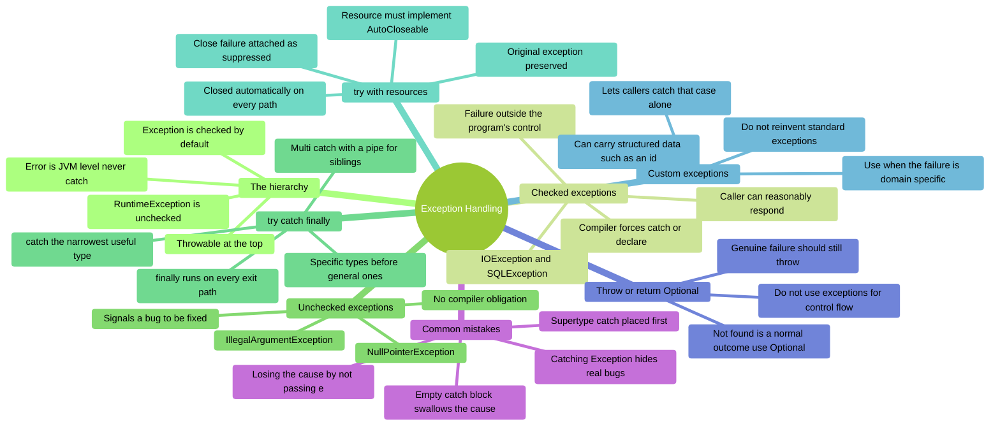

**Diagram description**
Mind map of **Exception Handling**, organised into 8 branches:

- **The hierarchy** — Throwable at the top; Error is JVM level never catch; Exception is
  checked by default; RuntimeException is unchecked.
- **Checked exceptions** — Compiler forces catch or declare; Failure outside the program's
  control; IOException and SQLException; Caller can reasonably respond.
- **Unchecked exceptions** — No compiler obligation; Signals a bug to be fixed;
  IllegalArgumentException; NullPointerException.
- **try catch finally** — catch the narrowest useful type; Specific types before general ones;
  finally runs on every exit path; Multi catch with a pipe for siblings.
- **try with resources** — Resource must implement AutoCloseable; Closed automatically on every
  path; Original exception preserved; Close failure attached as suppressed.
- **Custom exceptions** — Use when the failure is domain specific; Lets callers catch that case
  alone; Can carry structured data such as an id; Do not reinvent standard exceptions.
- **Throw or return Optional** — Not found is a normal outcome use Optional; Genuine failure
  should still throw; Do not use exceptions for control flow.
- **Common mistakes** — Empty catch block swallows the cause; Catching Exception hides real
  bugs; Losing the cause by not passing e; Supertype catch placed first.

### Code Snippets

```java
// Guard clauses throw unchecked exceptions: the caller made a mistake
public void setHealth(int health) {
    if (health < 0)
        throw new IllegalArgumentException("health cannot be negative: " + health);
    _health = health;
}
```

```java
// try-with-resources: closed automatically, even on exception
try (BufferedReader br = Files.newBufferedReader(path)) {
    return br.readLine();
}   // br.close() runs here whatever happened

// Multi-catch, most specific first
try {
    process(path);
} catch (FileNotFoundException e) {          // MUST come before IOException
    log("no such file: " + e.getMessage());
} catch (IOException | SecurityException e) { // siblings, not subtypes
    log("could not read", e);                 // pass e - keep the stack trace
}
```

```java
// Custom domain exception carrying structured data
public class TaskNotFoundException extends RuntimeException {
    private final int _id;

    public TaskNotFoundException(int id) {
        super("no task with id=" + id);
        _id = id;
    }
    public int getId() { return _id; }
}
```

```java
// Wrong: hides every bug, discards the cause
try { save(task); } catch (Exception e) { }

// Right: narrow type, cause preserved, rethrown as a domain type
try {
    save(task);
} catch (SQLException e) {
    throw new DataAccessException("could not save task " + task.getId(), e);
}
```

### Self-Assessment Prompts

1. **Give one checked and one unchecked exception from the JDK, and say why each is classified
   that way.**
   *(Hint: whose mistake is it — the caller's, or the environment's?)*

2. **Name the two separate faults in `catch (Exception e) {}`.**
   *(One is the type; one is the body)*

3. **Should a DAO's `findById` throw or return `Optional`? What would change your answer?**
   *(Is "not found" exceptional? What about a dropped connection?)*

4. **Why is try-with-resources safer than closing in a `finally` block?**
   *(What happens to the original exception if `close()` also throws?)*

5. **Two catch blocks: `IOException` and `FileNotFoundException`. Which order compiles, and why?**
   *(What does the compiler say about the other order?)*

---

## t11 — Generics I

### Overview

Generics let you write classes and methods that work with any type while staying type-safe.
Instead of using `Object` (which loses type information and requires casting), you use type
parameters like `T` or `E`.
This mindmap shows how to declare generic classes and methods, apply bounds, and avoid the
pitfalls of raw types.

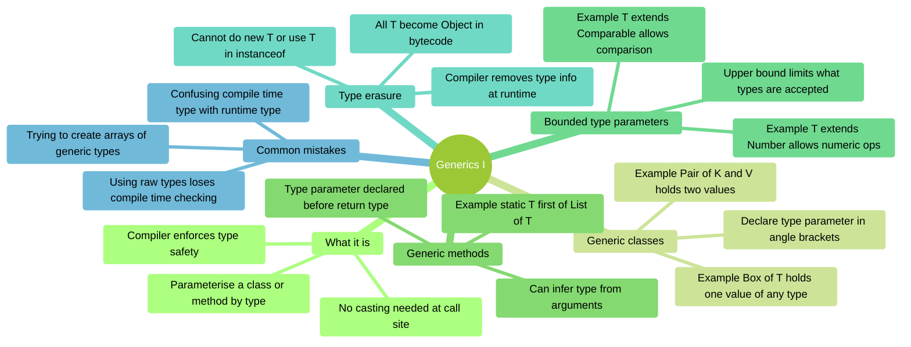

**Diagram description**
Mind map of **Generics I**, organised into 6 branches:

- **What it is** — Parameterise a class or method by type; Compiler enforces type safety; No
  casting needed at call site.
- **Generic classes** — Declare type parameter in angle brackets; Example Box of T holds one
  value of any type; Example Pair of K and V holds two values.
- **Generic methods** — Type parameter declared before return type; Can infer type from
  arguments; Example static T first of List of T.
- **Bounded type parameters** — Upper bound limits what types are accepted; Example T extends
  Comparable allows comparison; Example T extends Number allows numeric ops.
- **Type erasure** — Compiler removes type info at runtime; All T become Object in bytecode;
  Cannot do new T or use T in instanceof.
- **Common mistakes** — Using raw types loses compile time checking; Trying to create arrays of
  generic types; Confusing compile time type with runtime type.

### Code Snippets

```java
// Generic class
public class Box<T> {
    private T _value;

    public Box(T value) { _value = value; }
    public T get() { return _value; }
}

Box<String> strBox = new Box<>("hello");
Box<Integer> intBox = new Box<>(42);
String s = strBox.get();  // No cast needed

// Generic method
public static <T> T first(List<T> list) {
    if (list.isEmpty()) throw new NoSuchElementException();
    return list.get(0);
}

String name = first(List.of("Alice", "Bob"));  // T inferred as String

// Bounded type parameter — T must be Comparable
public static <T extends Comparable<T>> T max(T a, T b) {
    return a.compareTo(b) >= 0 ? a : b;
}

int bigger = max(3, 7);          // 7
String later = max("Apple", "Mango");  // "Mango"

// Raw type (avoid — no compile-time safety)
Box rawBox = new Box("unsafe");   // Raw type warning
Object val = rawBox.get();        // Must cast manually
```

### Self-Assessment Prompts

1. **What is the difference between using `Object` and using a type parameter `T`?**
   *(What does the compiler know at each call site?)*

2. **Why can you not write `new T()` inside a generic class?**
   *(What happens to T at runtime because of type erasure?)*

3. **What does `<T extends Comparable<T>>` mean, and why is it needed?**
   *(Which method becomes available to T that wouldn't be available otherwise?)*

4. **Why are raw types dangerous, and what should you use instead?**
   *(What compile-time protection do you lose with a raw type?)*

---

## t12 — Generics II

### Overview

Generics are *invariant*: `List<Dog>` is **not** a `List<Animal>`, even if `Dog extends Animal`.
Wildcards (`?`) solve this. The **PECS rule** (Producer Extends, Consumer Super) tells you
which wildcard to use.
This mindmap also covers wildcard capture, which is required for performing operations on `List<?>`.

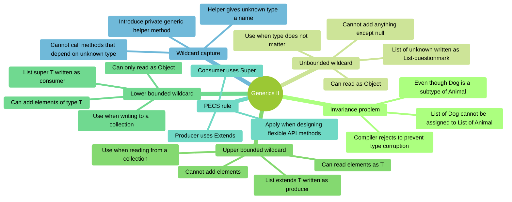

**Diagram description**
Mind map of **Generics II**, organised into 6 branches:

- **Invariance problem** — List of Dog cannot be assigned to List of Animal; Even though Dog is
  a subtype of Animal; Compiler rejects to prevent type corruption.
- **Unbounded wildcard** — List of unknown written as List-questionmark; Can read as Object;
  Cannot add anything except null; Use when type does not matter.
- **Upper bounded wildcard** — List extends T written as producer; Can read elements as T;
  Cannot add elements; Use when reading from a collection.
- **Lower bounded wildcard** — List super T written as consumer; Can add elements of type T;
  Can only read as Object; Use when writing to a collection.
- **PECS rule** — Producer uses Extends; Consumer uses Super; Apply when designing flexible API
  methods.
- **Wildcard capture** — Cannot call methods that depend on unknown type; Introduce private
  generic helper method; Helper gives unknown type a name.

### Code Snippets

```java
// Invariance — this does NOT compile
List<Dog> dogs = new ArrayList<>();
List<Animal> animals = dogs;  // COMPILE ERROR — invariant

// Unbounded wildcard — read anything, add nothing
public static void printAll(List<?> list) {
    for (Object item : list) {
        System.out.println(item);
    }
    // list.add("something");  // COMPILE ERROR
}

// Upper bounded — Producer Extends (read as Number)
public static double sum(List<? extends Number> numbers) {
    double total = 0;
    for (Number n : numbers) total += n.doubleValue();
    return total;
}
sum(List.of(1, 2, 3));       // Integer list — ok
sum(List.of(1.5, 2.5));      // Double list — ok

// Lower bounded — Consumer Super (write T into list)
public static <T> void fill(List<? super T> list, T value, int count) {
    for (int i = 0; i < count; i++) list.add(value);
}
List<Number> nums = new ArrayList<>();
fill(nums, 42, 3);   // Integer is a subtype of Number — ok

// Full PECS copy
public static <T> void copy(List<? extends T> src, List<? super T> dst) {
    for (T item : src) dst.add(item);
}

// Wildcard capture helper
public static void swapFirstTwo(List<?> list) {
    swapHelper(list);  // delegates to typed helper
}
private static <T> void swapHelper(List<T> list) {
    T tmp = list.get(0);
    list.set(0, list.get(1));
    list.set(1, tmp);
}
```

### Self-Assessment Prompts

1. **Why is `List<Dog>` not a subtype of `List<Animal>` in Java?**
   *(What dangerous operation would be allowed if it were?)*

2. **Why can you not add elements to a `List<? extends Animal>`?**
   *(What does the compiler not know about the actual list type?)*

3. **State the PECS rule and give one example of each side.**
   *(What does "producer" mean? What does "consumer" mean?)*

4. **Why is a wildcard capture helper needed for operations like swap on `List<?>`?**
   *(What does the helper method give you that `List<?>` alone does not?)*

---

## t13 — Design Patterns I

### Overview

Strategy and Command are *behavioural* patterns that replace hard-coded conditional logic with
pluggable objects.
- **Strategy** lets you swap algorithms at runtime by extracting them into interchangeable objects.
- **Command** encapsulates a request as an object, enabling queueing, logging, and undo.

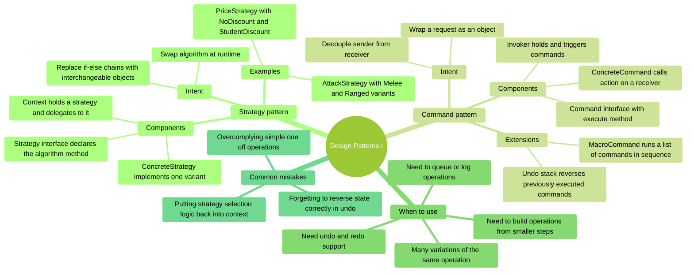

**Diagram description**
Mind map of **Design Patterns I**, organised into 4 branches:

- **Strategy pattern** — Intent; Replace if-else chains with interchangeable objects; Swap
  algorithm at runtime; Components; Strategy interface declares the algorithm method;
  ConcreteStrategy implements one variant; Context holds a strategy and delegates to it;
  Examples; AttackStrategy with Melee and Ranged variants; PriceStrategy with NoDiscount and
  StudentDiscount.
- **Command pattern** — Intent; Wrap a request as an object; Decouple sender from receiver;
  Components; Command interface with execute method; ConcreteCommand calls action on a
  receiver; Invoker holds and triggers commands; Extensions; MacroCommand runs a list of
  commands in sequence; Undo stack reverses previously executed commands.
- **When to use** — Many variations of the same operation; Need to queue or log operations;
  Need undo and redo support; Need to build operations from smaller steps.
- **Common mistakes** — Putting strategy selection logic back into context; Forgetting to
  reverse state correctly in undo; Overcomplying simple one off operations.

### Code Snippets

```java
// Strategy pattern
public interface AttackStrategy {
    void attack(String target);
}

public class MeleeAttack implements AttackStrategy {
    @Override
    public void attack(String target) {
        System.out.println("Striking " + target + " with sword");
    }
}

public class RangedAttack implements AttackStrategy {
    @Override
    public void attack(String target) {
        System.out.println("Shooting " + target + " with arrow");
    }
}

public class Enemy {
    private AttackStrategy _strategy;

    public Enemy(AttackStrategy strategy) { _strategy = strategy; }
    public void setStrategy(AttackStrategy s) { _strategy = s; }
    public void attack(String target) { _strategy.attack(target); }
}

Enemy goblin = new Enemy(new MeleeAttack());
goblin.attack("Player");         // Striking Player with sword
goblin.setStrategy(new RangedAttack());
goblin.attack("Player");         // Shooting Player with arrow

// Command with undo stack
public interface UndoableCommand {
    void execute();
    void undo();
}

public class AddNumberCommand implements UndoableCommand {
    private Counter _counter;
    private int _amount;

    public AddNumberCommand(Counter counter, int amount) {
        _counter = counter;
        _amount = amount;
    }

    @Override public void execute() { _counter.add(_amount); }
    @Override public void undo() { _counter.add(-_amount); }
}

Deque<UndoableCommand> history = new ArrayDeque<>();
UndoableCommand cmd = new AddNumberCommand(counter, 5);
cmd.execute();
history.push(cmd);

// Undo last command
if (!history.isEmpty()) history.pop().undo();
```

### Self-Assessment Prompts

1. **How does Strategy differ from a simple set of if/else branches?**
   *(What happens to the context class when you need to add a new strategy?)*

2. **What is a MacroCommand, and how does it demonstrate the value of the Command pattern?**
   *(What interface does MacroCommand itself implement?)*

3. **What state does an undoable Command need to store, and why?**
   *(What information is needed to reverse an action that was already executed?)*

4. **Why does Command decouple the sender from the receiver?**
   *(Does the invoker need to know which object the command acts on?)*

---

## t14 — Design Patterns II

### Overview

Factory, Observer, and Adapter are three patterns that address *creation*, *event
notification*, and *compatibility*.
- **Factory** centralises object creation behind a method, hiding which concrete class is
  instantiated.
- **Observer** lets objects subscribe to events so they are notified automatically when state
  changes.
- **Adapter** wraps an incompatible interface to make it fit one that existing code expects.

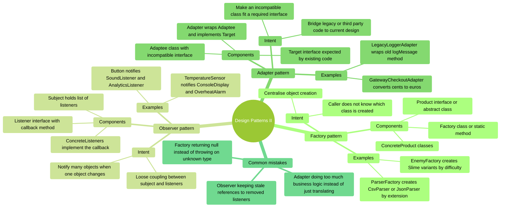

**Diagram description**
Mind map of **Design Patterns II**, organised into 4 branches:

- **Factory pattern** — Intent; Centralise object creation; Caller does not know which class is
  created; Components; Factory class or static method; Product interface or abstract class;
  ConcreteProduct classes; Examples; ParserFactory creates CsvParser or JsonParser by
  extension; EnemyFactory creates Slime variants by difficulty.
- **Observer pattern** — Intent; Notify many objects when one object changes; Loose coupling
  between subject and listeners; Components; Subject holds list of listeners; Listener
  interface with callback method; ConcreteListeners implement the callback; Examples; Button
  notifies SoundListener and AnalyticsListener; TemperatureSensor notifies ConsoleDisplay and
  OverheatAlarm.
- **Adapter pattern** — Intent; Make an incompatible class fit a required interface; Bridge
  legacy or third party code to current design; Components; Target interface expected by
  existing code; Adaptee class with incompatible interface; Adapter wraps Adaptee and
  implements Target; Examples; LegacyLoggerAdapter wraps old logMessage method;
  GatewayCheckoutAdapter converts cents to euros.
- **Common mistakes** — Factory returning null instead of throwing on unknown type; Observer
  keeping stale references to removed listeners; Adapter doing too much business logic instead
  of just translating.

### Code Snippets

```java
// Factory pattern
public interface Parser { List<String> parse(String input); }

public class CsvParser implements Parser { /* ... */ }
public class JsonParser implements Parser { /* ... */ }

public class ParserFactory {
    public static Parser createFor(String extension) {
        return switch (extension.toLowerCase()) {
            case "csv" -> new CsvParser();
            case "json" -> new JsonParser();
            default -> throw new IllegalArgumentException("Unknown: " + extension);
        };
    }
}

Parser p = ParserFactory.createFor("csv");

// Observer pattern
public interface ClickListener {
    void onClick(String buttonName);
}

public class Button {
    private String _name;
    private List<ClickListener> _listeners = new ArrayList<>();

    public Button(String name) { _name = name; }

    public void addListener(ClickListener l) { _listeners.add(l); }
    public void removeListener(ClickListener l) { _listeners.remove(l); }

    public void click() {
        for (ClickListener l : _listeners) l.onClick(_name);
    }
}

Button btn = new Button("Submit");
btn.addListener(name -> System.out.println("Sound for: " + name));
btn.addListener(name -> System.out.println("Analytics: " + name));
btn.click();  // Both listeners notified

// Adapter pattern
public interface Logger { void log(String message); }

public class LegacyLogger {
    public void logMessage(String level, String msg) {
        System.out.println("[" + level + "] " + msg);
    }
}

public class LegacyLoggerAdapter implements Logger {
    private LegacyLogger _legacy;

    public LegacyLoggerAdapter(LegacyLogger legacy) { _legacy = legacy; }

    @Override
    public void log(String message) {
        _legacy.logMessage("INFO", message);  // Translate the call
    }
}

Logger logger = new LegacyLoggerAdapter(new LegacyLogger());
logger.log("Application started");
```

### Self-Assessment Prompts

1. **What advantage does a Factory method give over calling `new CsvParser()` directly in your
   code?**
   *(What happens when you need to add a third parser type?)*

2. **How does Observer achieve loose coupling between subject and listeners?**
   *(Does Button need to know what SoundListener does?)*

3. **What is the difference between an Adapter and a subclass?**
   *(When can you not subclass the adaptee instead?)*

4. **Why might you prefer an interface-based Observer over direct method calls?**
   *(What does it cost to add a new listener? What does it cost to remove one?)*

---

## t15 — DB Connectivity and DAO

### Overview

JDBC (Java Database Connectivity) lets Java programs communicate with relational databases.
The **DAO (Data Access Object)** pattern separates database code from business logic by hiding
all SQL behind an interface.
A service layer then uses the DAO interface without knowing whether the backing store is MySQL,
in-memory, or anything else.

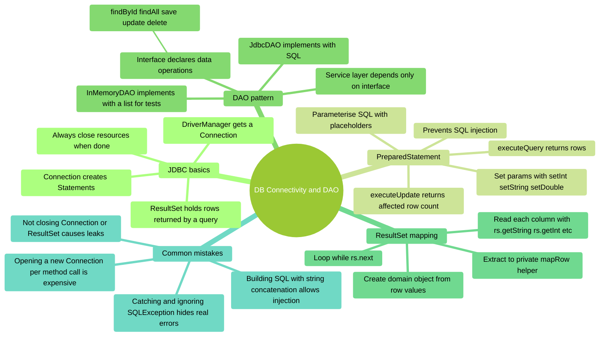

**Diagram description**
Mind map of **DB Connectivity and DAO**, organised into 5 branches:

- **JDBC basics** — DriverManager gets a Connection; Connection creates Statements; ResultSet
  holds rows returned by a query; Always close resources when done.
- **PreparedStatement** — Parameterise SQL with placeholders; Prevents SQL injection; Set
  params with setInt setString setDouble; executeQuery returns rows; executeUpdate returns
  affected row count.
- **DAO pattern** — Interface declares data operations; findById findAll save update delete;
  JdbcDAO implements with SQL; InMemoryDAO implements with a list for tests; Service layer
  depends only on interface.
- **ResultSet mapping** — Loop while rs.next; Read each column with rs.getString rs.getInt etc;
  Create domain object from row values; Extract to private mapRow helper.
- **Common mistakes** — Not closing Connection or ResultSet causes leaks; Building SQL with
  string concatenation allows injection; Catching and ignoring SQLException hides real errors;
  Opening a new Connection per method call is expensive.

### Code Snippets

```java
// Opening a connection (use try-with-resources to auto-close)
String url = "jdbc:mysql://localhost:3306/car_rental?useSSL=false&serverTimezone=UTC";
String user = "car_rental_user";
String pass = "your_password";

try (Connection conn = DriverManager.getConnection(url, user, pass)) {
    System.out.println("Connected!");
}

// PreparedStatement — prevents SQL injection
String sql = "SELECT * FROM cars WHERE make LIKE ?";
try (Connection conn = DriverManager.getConnection(url, user, pass);
     PreparedStatement ps = conn.prepareStatement(sql)) {

    ps.setString(1, "%Ford%");

    try (ResultSet rs = ps.executeQuery()) {
        while (rs.next()) {
            System.out.println(mapRow(rs));
        }
    }
}

// mapRow helper
private static Car mapRow(ResultSet rs) throws SQLException {
    return new Car(
        rs.getInt("id"),
        rs.getString("reg"),
        rs.getString("make"),
        rs.getString("model"),
        rs.getDouble("daily_rate"),
        rs.getString("status")
    );
}

// DAO interface — hides SQL from caller
public interface CarDao {
    Car findById(int id) throws Exception;
    List<Car> findAll() throws Exception;
    void save(Car car) throws Exception;
    void delete(int id) throws Exception;
}

// Service layer uses DAO interface only
public class CarRentalService {
    private CarDao _dao;

    public CarRentalService(CarDao dao) { _dao = dao; }

    public void rentCar(int carId) throws Exception {
        Car car = _dao.findById(carId);
        if (!"AVAILABLE".equals(car.getStatus()))
            throw new IllegalStateException("Car not available");
        // update status...
    }
}
```

### Self-Assessment Prompts

1. **Why should you use `PreparedStatement` instead of building SQL strings with `+`?**
   *(What attack does string concatenation allow?)*

2. **Why does the DAO pattern use an interface rather than coding directly against `JdbcCarDao`?**
   *(What does this allow you to swap in for testing?)*

3. **What problem does `try-with-resources` solve when working with JDBC?**
   *(What happens to a `Connection` if you forget to close it?)*

4. **Why extract `mapRow` as a separate private method rather than writing the mapping inline?**
   *(How many places in `JdbcCarDao` call this?)*

---

## t16 — Functional Interfaces

### Overview

A *functional interface* has exactly one abstract method. Java's `java.util.function` package
provides the most commonly needed ones.
Lambdas and method references let you pass behaviour as a value — for example, passing a filter
rule to a method without creating a named class.

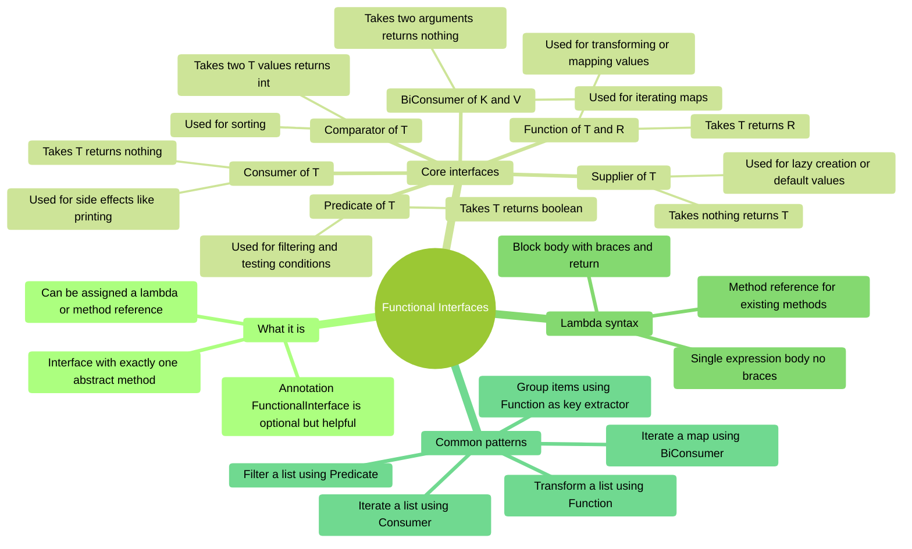

**Diagram description**
Mind map of **Functional Interfaces**, organised into 4 branches:

- **What it is** — Interface with exactly one abstract method; Can be assigned a lambda or
  method reference; Annotation FunctionalInterface is optional but helpful.
- **Core interfaces** — Predicate of T; Takes T returns boolean; Used for filtering and testing
  conditions; Function of T and R; Takes T returns R; Used for transforming or mapping values;
  Consumer of T; Takes T returns nothing; Used for side effects like printing; Supplier of T;
  Takes nothing returns T; Used for lazy creation or default values; BiConsumer of K and V;
  Takes two arguments returns nothing; Used for iterating maps; Comparator of T; Takes two T
  values returns int; Used for sorting.
- **Lambda syntax** — Single expression body no braces; Block body with braces and return;
  Method reference for existing methods.
- **Common patterns** — Filter a list using Predicate; Transform a list using Function; Iterate
  a list using Consumer; Group items using Function as key extractor; Iterate a map using
  BiConsumer.

### Code Snippets

```java
// Predicate<T> — test a condition
Predicate<String> isLong = s -> s.length() > 5;
System.out.println(isLong.test("Hello"));     // false
System.out.println(isLong.test("HelloWorld")); // true

// Function<T,R> — transform a value
Function<String, Integer> strLen = String::length;  // method reference
System.out.println(strLen.apply("Hello"));  // 5

// Consumer<T> — side effect, no return
Consumer<String> printer = System.out::println;
printer.accept("Printed!");

// Supplier<T> — produce a value
Supplier<List<String>> listMaker = ArrayList::new;
List<String> fresh = listMaker.get();

// BiConsumer<K,V> — iterate a map
Map<String, Integer> scores = Map.of("Alice", 90, "Bob", 85);
BiConsumer<String, Integer> printEntry = (k, v) ->
    System.out.println(k + " scored " + v);
scores.forEach(printEntry);

// Practical: filter + map pipeline
public static <T> List<T> filterItems(List<T> items, Predicate<T> predicate) {
    List<T> result = new ArrayList<>();
    for (T item : items) {
        if (predicate.test(item)) result.add(item);
    }
    return result;
}

public static <T, R> List<R> mapTo(List<T> items, Function<T, R> mapper) {
    List<R> result = new ArrayList<>();
    for (T item : items) result.add(mapper.apply(item));
    return result;
}

List<String> names = List.of("Alice", "Bob", "Charlotte");
List<String> long_ = filterItems(names, s -> s.length() > 4);
List<Integer> lens = mapTo(long_, String::length);
```

### Self-Assessment Prompts

1. **What is the difference between `Consumer<T>` and `Function<T,R>`?**
   *(When would you use one versus the other?)*

2. **Why is `Supplier<T>` useful for expensive or lazy operations?**
   *(When is the value produced relative to when `Supplier` is created?)*

3. **What does a method reference like `String::length` mean, and when can you use one?**
   *(What lambda expression is it equivalent to?)*

4. **How would you combine a `Predicate` and a `Function` to produce a filtered and transformed
   list?**
   *(Write out the two method signatures and show how they chain together)*

---

## t17 — Streams API

### Overview

A stream pipeline is **source then intermediate operations then one terminal operation**.
Intermediate operations are **lazy**: nothing runs until a terminal operation asks, and then
elements are pulled through the whole pipeline **one at a time**, not stage by stage over the
whole collection.
That laziness is what makes short-circuiting possible — `findFirst` can stop after a single element.

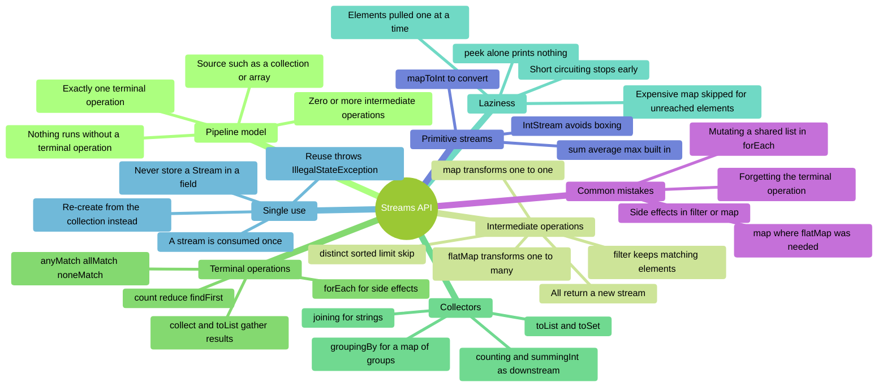

**Diagram description**
Mind map of **Streams API**, organised into 8 branches:

- **Pipeline model** — Source such as a collection or array; Zero or more intermediate
  operations; Exactly one terminal operation; Nothing runs without a terminal operation.
- **Intermediate operations** — filter keeps matching elements; map transforms one to one;
  flatMap transforms one to many; distinct sorted limit skip; All return a new stream.
- **Terminal operations** — collect and toList gather results; count reduce findFirst; anyMatch
  allMatch noneMatch; forEach for side effects.
- **Collectors** — toList and toSet; joining for strings; groupingBy for a map of groups;
  counting and summingInt as downstream.
- **Laziness** — Elements pulled one at a time; Short circuiting stops early; Expensive map
  skipped for unreached elements; peek alone prints nothing.
- **Single use** — A stream is consumed once; Reuse throws IllegalStateException; Re-create
  from the collection instead; Never store a Stream in a field.
- **Primitive streams** — IntStream avoids boxing; mapToInt to convert; sum average max built in.
- **Common mistakes** — Forgetting the terminal operation; map where flatMap was needed; Side
  effects in filter or map; Mutating a shared list in forEach.

### Code Snippets

```java
// Loop versus pipeline: what, not how
List<String> result = names.stream()
        .filter(s -> s.startsWith("A"))
        .map(String::toUpperCase)
        .toList();
```

```java
// map is one-to-one; flatMap is one-to-many
// WRONG - a stream of lists
Stream<List<String>> nested = players.stream().map(Player::getItems);

// RIGHT - one flat stream of every item
List<String> allItems = players.stream()
        .flatMap(p -> p.getItems().stream())
        .distinct()
        .toList();
```

```java
// groupingBy: the downstream collector replaces the default toList()
Map<String, List<Task>> byCategory = tasks.stream()
        .collect(Collectors.groupingBy(Task::getCategory));

Map<String, Long> countPerCategory = tasks.stream()
        .collect(Collectors.groupingBy(Task::getCategory, Collectors.counting()));

Map<String, Integer> pointsPerCategory = tasks.stream()
        .collect(Collectors.groupingBy(Task::getCategory,
                                       Collectors.summingInt(Task::getPoints)));
```

```java
// Laziness: if element 1 passes the filter, map runs ONCE and then it stops
Optional<String> first = tasks.stream()
        .filter(Task::isDone)
        .map(Task::getTitle)   // not applied to every task
        .findFirst();          // short-circuits
```

### Self-Assessment Prompts

1. **A pipeline has `filter` and `map` but no terminal operation. What happens when it runs?**
   *(Hint: what does "lazy" actually mean here?)*

2. **`filter`, then `map`, then `findFirst`, and the first element passes. How many elements
   does `map` process?**
   *(Most people guess wrong — think about the order elements travel)*

3. **Give an example where `map` is wrong and `flatMap` is right.**
   *(What does the result type look like when you get this wrong?)*

4. **How do you turn `Map<K, List<V>>` from `groupingBy` into `Map<K, Long>`?**
   *(There is a second argument — what goes there?)*

5. **Why does re-using a stream throw `IllegalStateException`, and what is the fix?**
   *(What would have to be true for re-iteration to work?)*

---

## t18 — Java I/O

### Overview

`Path` names a file; `Files` does things to it. This NIO.2 API replaces the older `File` class.
The key trade-off is **eager vs lazy**: `Files.readAllLines()` loads everything into memory,
while `Files.lines()` streams line by line so memory stays roughly constant — but it holds an
open file handle and **must** be closed.
`IOException` is checked because file operations fail for reasons entirely outside your
program's control.

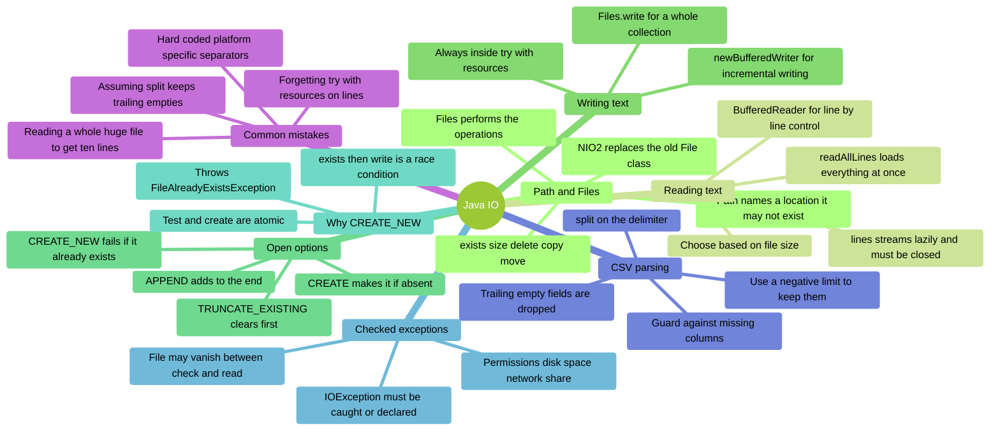

**Diagram description**
Mind map of **Java IO**, organised into 8 branches:

- **Path and Files** — Path names a location it may not exist; Files performs the operations;
  exists size delete copy move; NIO2 replaces the old File class.
- **Reading text** — readAllLines loads everything at once; lines streams lazily and must be
  closed; BufferedReader for line by line control; Choose based on file size.
- **Writing text** — Files.write for a whole collection; newBufferedWriter for incremental
  writing; Always inside try with resources.
- **Open options** — CREATE makes it if absent; CREATE_NEW fails if it already exists; APPEND
  adds to the end; TRUNCATE_EXISTING clears first.
- **Why CREATE_NEW** — Test and create are atomic; exists then write is a race condition;
  Throws FileAlreadyExistsException.
- **Checked exceptions** — IOException must be caught or declared; File may vanish between
  check and read; Permissions disk space network share.
- **CSV parsing** — split on the delimiter; Trailing empty fields are dropped; Use a negative
  limit to keep them; Guard against missing columns.
- **Common mistakes** — Forgetting try with resources on lines; Reading a whole huge file to
  get ten lines; Assuming split keeps trailing empties; Hard coded platform specific
  separators.

### Code Snippets

```java
// Lazy: constant memory, and limit() means we stop reading early
try (Stream<String> lines = Files.lines(path)) {
    List<String> firstTen = lines.limit(10).toList();
}
// Eager alternative reads the WHOLE file first - wrong for a large file:
// Files.readAllLines(path).subList(0, 10);
```

```java
// Write only if the file does not already exist - atomic, no race condition
try (BufferedWriter w = Files.newBufferedWriter(path, StandardOpenOption.CREATE_NEW)) {
    w.write("first run");
} catch (FileAlreadyExistsException e) {
    // already present - nothing written
}

// Append a line to a log
Files.writeString(log, entry + System.lineSeparator(),
                  StandardOpenOption.CREATE, StandardOpenOption.APPEND);
```

```java
// CSV: split keeps interior empty fields but DROPS trailing ones
String line = "Ann,,25";
String[] parts = line.split(",");        // ["Ann", "", "25"] length 3

String trailing = "Ann,25,";
System.out.println(trailing.split(",").length);      // 2 - trailing dropped
System.out.println(trailing.split(",", -1).length);  // 3 - negative limit keeps it
```

### Self-Assessment Prompts

1. **Why is `Files.lines()` preferred over `Files.readAllLines()` for a 2 GB log?**
   *(Two reasons — one about memory, one about stopping early)*

2. **What goes wrong if you forget try-with-resources around `Files.lines()`?**
   *(The symptom builds up over time — what is the eventual error?)*

3. **Why is `IOException` checked rather than unchecked?**
   *(Whose fault is a file that was deleted a millisecond ago?)*

4. **Why is `CREATE_NEW` better than `if (!Files.exists(path))` followed by a write?**
   *(What could happen between those two statements?)*

5. **`"Ann,25,".split(",")` returns an array of what length, and how do you keep the empty field?**
   *(This one catches people in CSV parsing)*

---

## t19 — Concurrency

### Overview

Concurrency lets multiple tasks run at the same time.
Java provides `Runnable`/`Thread` for basic threading, `ExecutorService` for managed thread
pools, `Callable`/`Future` for tasks that return results, and `synchronized` to protect shared
state.

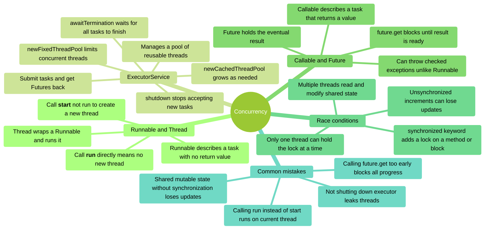

**Diagram description**
Mind map of **Concurrency**, organised into 5 branches:

- **Runnable and Thread** — Runnable describes a task with no return value; Thread wraps a
  Runnable and runs it; Call **start** not run to create a new thread; Call **run** directly
  means no new thread.
- **ExecutorService** — Manages a pool of reusable threads; Submit tasks and get Futures back;
  shutdown stops accepting new tasks; awaitTermination waits for all tasks to finish;
  newFixedThreadPool limits concurrent threads; newCachedThreadPool grows as needed.
- **Callable and Future** — Callable describes a task that returns a value; Can throw checked
  exceptions unlike Runnable; Future holds the eventual result; future.get blocks until result
  is ready.
- **Race conditions** — Multiple threads read and modify shared state; Unsynchronized
  increments can lose updates; synchronized keyword adds a lock on a method or block; Only one
  thread can hold the lock at a time.
- **Common mistakes** — Calling run instead of start runs on current thread; Not shutting down
  executor leaks threads; Shared mutable state without synchronization loses updates; Calling
  future.get too early blocks all progress.

### Code Snippets

```java
// Runnable — task with no return value
public class DeliveryTask implements Runnable {
    private String _orderId;

    public DeliveryTask(String orderId) { _orderId = orderId; }

    @Override
    public void run() {
        System.out.println(Thread.currentThread().getName() + " delivering " + _orderId);
    }
}

Thread t = new Thread(new DeliveryTask("ORD-001"));
t.start();  // Creates a new thread — do NOT call t.run()

// ExecutorService — managed thread pool
ExecutorService pool = Executors.newFixedThreadPool(3);
for (int i = 0; i < 6; i++) {
    pool.submit(new DeliveryTask("ORD-00" + i));
}
pool.shutdown();
pool.awaitTermination(10, TimeUnit.SECONDS);

// Callable + Future — task that returns a value
public class CostEstimate implements Callable<Double> {
    private String _orderId;

    public CostEstimate(String orderId) { _orderId = orderId; }

    @Override
    public Double call() throws InterruptedException {
        Thread.sleep(500);  // Simulate work
        return 42.50;
    }
}

ExecutorService pool2 = Executors.newCachedThreadPool();
Future<Double> future = pool2.submit(new CostEstimate("ORD-007"));
Double cost = future.get();  // Blocks until result is ready
pool2.shutdown();

// Race condition and fix with synchronized
public class Counter {
    private int _total = 0;

    public synchronized void increment() {  // Only one thread at a time
        _total++;
    }

    public synchronized int getTotal() { return _total; }
}
```

### Self-Assessment Prompts

1. **What is the difference between calling `thread.start()` and `thread.run()`?**
   *(In which thread does the task execute in each case?)*

2. **What is a race condition, and why does `_total++` have one?**
   *(How many operations does `++` actually involve?)*

3. **What does `synchronized` guarantee, and what is its cost?**
   *(What happens to other threads while one thread holds the lock?)*

4. **Why does `Future.get()` block, and when is this a problem?**
   *(What would happen if you called `get()` immediately after submitting 100 tasks?)*

---

## t20 — JSON I: Jackson Basics

### Overview

**Jackson** serialises Java objects to JSON and back, via a single `ObjectMapper`.
It works from your **getters and setters**, not your fields — which is why a field named
`_trackId` still serialises as `trackId`, and why a missing no-arg constructor breaks
deserialisation.
Generic types are the one real trap: type erasure means `List.class` loses its element type, so
you need `TypeReference`.

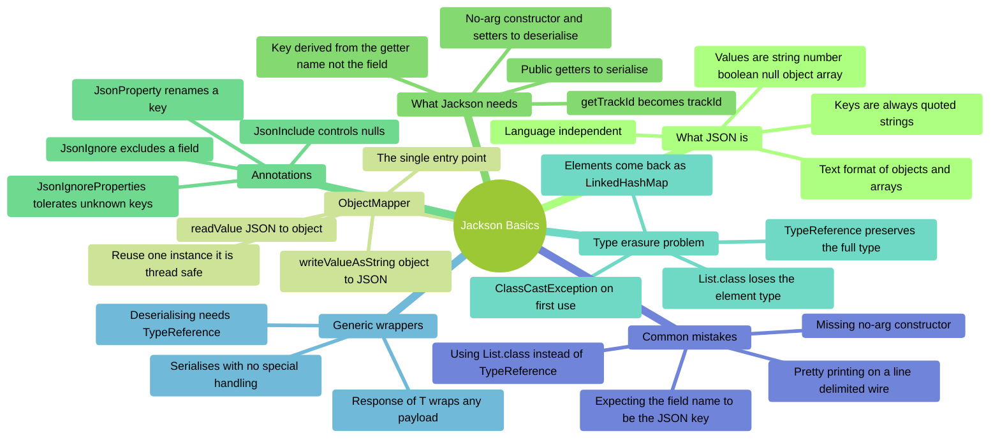

**Diagram description**
Mind map of **Jackson Basics**, organised into 7 branches:

- **What JSON is** — Text format of objects and arrays; Keys are always quoted strings; Values
  are string number boolean null object array; Language independent.
- **ObjectMapper** — The single entry point; writeValueAsString object to JSON; readValue JSON
  to object; Reuse one instance it is thread safe.
- **What Jackson needs** — Public getters to serialise; No-arg constructor and setters to
  deserialise; Key derived from the getter name not the field; getTrackId becomes trackId.
- **Annotations** — JsonProperty renames a key; JsonIgnore excludes a field; JsonInclude
  controls nulls; JsonIgnoreProperties tolerates unknown keys.
- **Type erasure problem** — List.class loses the element type; Elements come back as
  LinkedHashMap; ClassCastException on first use; TypeReference preserves the full type.
- **Generic wrappers** — Response of T wraps any payload; Serialises with no special handling;
  Deserialising needs TypeReference.
- **Common mistakes** — Missing no-arg constructor; Expecting the field name to be the JSON
  key; Using List.class instead of TypeReference; Pretty printing on a line delimited wire.

### Code Snippets

```java
// Basic Jackson serialisation / deserialisation
ObjectMapper mapper = new ObjectMapper();

// Object -> JSON string
Player player = new Player("Alice", 42);
String json = mapper.writeValueAsString(player);
System.out.println(json);  // {"name":"Alice","level":42}

// JSON string -> Object (class needs a no-arg constructor)
Player loaded = mapper.readValue(json, Player.class);
System.out.println(loaded.getName());  // Alice

// Jackson annotations
public class Player {
    @JsonProperty("name") private String _name;
    @JsonProperty("level") private int _level;
    @JsonIgnore private String _sessionToken;  // Not serialised

    public Player() {}  // Required by Jackson
    public Player(String name, int level) { _name = name; _level = level; }
    public String getName() { return _name; }
    public int getLevel() { return _level; }
}

// Type erasure: List.class loses the element type
List<Player> wrong = mapper.readValue(jsonArray, List.class);
// elements are actually LinkedHashMap -> ClassCastException on first use

// TypeReference preserves the full generic type
List<Player> right = mapper.readValue(jsonArray, new TypeReference<List<Player>>() {});

// Same problem, same fix, for a generic wrapper
Response<Player> res = mapper.readValue(json, new TypeReference<Response<Player>>() {});
```

### Self-Assessment Prompts

1. **Why does Jackson require a no-arg constructor, and what happens if it is missing?**
   *(What must Jackson do before it can set any field values?)*

2. **A field is named `_trackId` but the JSON key is `trackId`. Where does Jackson get the key
   from?**
   *(Hint: it is not reading the field name)*

3. **`readValue(json, List.class)` returns a list whose elements throw `ClassCastException`.
   Why, and what is the fix?**
   *(What information is lost at compile time, and what restores it?)*

4. **Why must pretty-printing be off when sending JSON over a line-delimited socket?**
   *(What does the receiver use to decide where a message ends?)*

---

## t21 — JSON II: Protocol, Base64 and BLOBs

### Overview

A **protocol** is the agreed shape of every message: a `type` naming the request, and a
`payload` carrying its data.
Route the `type` through a **handler map**, never by reflection — the string arrives from an
untrusted client.
Binary data cannot sit in a JSON string, so it is **Base64**-encoded (about 33% larger) for
transport, while the database stores the **raw bytes** in a BLOB column.

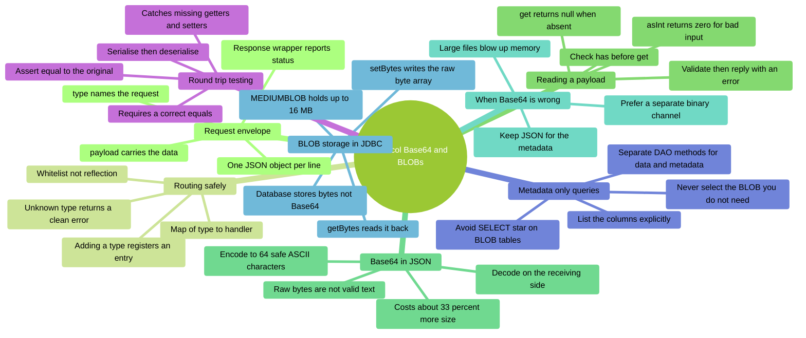

**Diagram description**
Mind map of **Protocol Base64 and BLOBs**, organised into 8 branches:

- **Request envelope** — type names the request; payload carries the data; One JSON object per
  line; Response wrapper reports status.
- **Routing safely** — Map of type to handler; Whitelist not reflection; Unknown type returns a
  clean error; Adding a type registers an entry.
- **Reading a payload** — Check has before get; get returns null when absent; asInt returns
  zero for bad input; Validate then reply with an error.
- **Base64 in JSON** — Raw bytes are not valid text; Encode to 64 safe ASCII characters; Costs
  about 33 percent more size; Decode on the receiving side.
- **When Base64 is wrong** — Large files blow up memory; Prefer a separate binary channel; Keep
  JSON for the metadata.
- **BLOB storage in JDBC** — MEDIUMBLOB holds up to 16 MB; setBytes writes the raw byte array;
  getBytes reads it back; Database stores bytes not Base64.
- **Metadata only queries** — Never select the BLOB you do not need; List the columns
  explicitly; Avoid SELECT star on BLOB tables; Separate DAO methods for data and metadata.
- **Round trip testing** — Serialise then deserialise; Assert equal to the original; Requires a
  correct equals; Catches missing getters and setters.

### Code Snippets

```java
// Routing: a whitelist map, not reflection on a client-supplied name
private final Map<String, Handler> _routes = Map.of(
        "GET_TRACK_BY_ID", this::getTrackById,
        "INSERT_TRACK", this::insertTrack
);

ServerResponse<?> dispatch(ClientRequest req) {
    Handler h = _routes.get(req.getType());
    if (h == null)
        return ServerResponse.error("unknown request type: " + req.getType());
    return h.handle(req);
}
```

```java
// Validate before reading: get() returns null, and asInt() silently returns 0
if (!payload.has("id") || !payload.get("id").isInt()) {
    return ServerResponse.error("missing or invalid 'id'");
}
int id = payload.get("id").asInt();
```

```java
// Base64 for TRANSPORT (text channel), raw bytes for STORAGE (BLOB column)
byte[] imageBytes = Files.readAllBytes(Path.of("photo.jpg"));
String encoded = Base64.getEncoder().encodeToString(imageBytes);  // to send
byte[] decoded = Base64.getDecoder().decode(encoded);             // on receipt
```

```java
// JDBC BLOB: store the raw bytes, never the Base64 string
try (PreparedStatement ps = conn.prepareStatement(
         "INSERT INTO files (name, mime_type, data) VALUES (?, ?, ?)")) {
    ps.setString(1, "photo.jpg");
    ps.setString(2, "image/jpeg");
    ps.setBytes(3, imageBytes);      // raw bytes, not encoded
    ps.executeUpdate();
}

// Metadata-only: name the columns so the BLOB is never fetched
String metaSql = "SELECT id, name, mime_type, created_at FROM files";  // no 'data'
```

```java
// Round-trip test: what actually proves the object survives the wire
@Test
void track_roundTrip_equalsOriginal() throws Exception {
    Track original = new Track(1, "Believe", 213);
    String json = MAPPER.writeValueAsString(original);
    Track restored = MAPPER.readValue(json, Track.class);
    assertEquals(original, restored);   // needs a correct equals()
}
```

### Self-Assessment Prompts

1. **Why route a request `type` through a map rather than invoking a method of that name?**
   *(Where does that string come from, and what could it reach?)*

2. **`payload.get("id").asInt()` on a payload with no `id`. What happens — and what happens if
   `id` is `"abc"`?**
   *(The two failures are very different; one is far more dangerous)*

3. **Base64 costs about 33% extra size. When is that worth paying, and when is it not?**
   *(What is the transport, and how big is the file?)*

4. **Should the database column hold the raw bytes or the Base64 string? Why?**
   *(Which one is a transport concern and which is a storage concern?)*

5. **Why must a metadata query name its columns instead of using `SELECT *`?**
   *(What gets pulled across the network when you list 200 rows?)*

6. **What exactly does a round-trip test verify, and what must the entity implement?**
   *(What would `assertEquals` do without it?)*

---

## t22 — Networking

### Overview

Java's `java.net` package provides `ServerSocket` and `Socket` for TCP communication.
A server listens for connections on a port; each accepted connection returns a `Socket` used
for reading and writing.
For multiple simultaneous clients, each connection is handled in its own thread.

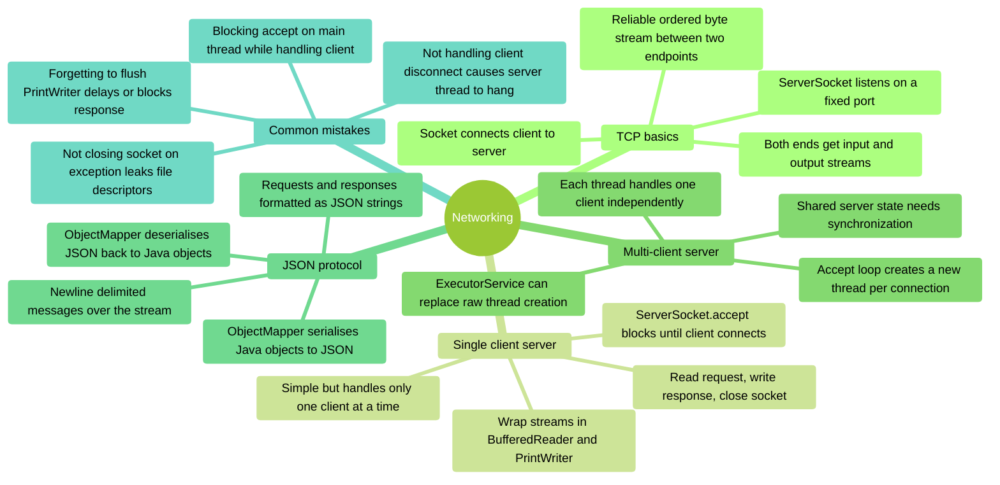

**Diagram description**
Mind map of **Networking**, organised into 5 branches:

- **TCP basics** — Reliable ordered byte stream between two endpoints; ServerSocket listens on
  a fixed port; Socket connects client to server; Both ends get input and output streams.
- **Single client server** — ServerSocket.accept blocks until client connects; Wrap streams in
  BufferedReader and PrintWriter; Read request, write response, close socket; Simple but
  handles only one client at a time.
- **Multi-client server** — Accept loop creates a new thread per connection; Each thread
  handles one client independently; Shared server state needs synchronization; ExecutorService
  can replace raw thread creation.
- **JSON protocol** — Requests and responses formatted as JSON strings; ObjectMapper serialises
  Java objects to JSON; ObjectMapper deserialises JSON back to Java objects; Newline delimited
  messages over the stream.
- **Common mistakes** — Forgetting to flush PrintWriter delays or blocks response; Not closing
  socket on exception leaks file descriptors; Blocking accept on main thread while handling
  client; Not handling client disconnect causes server thread to hang.

### Code Snippets

```java
// Server side — single client
try (ServerSocket server = new ServerSocket(9090)) {
    System.out.println("Waiting for connection...");
    try (Socket client = server.accept();  // Blocks until client connects
         BufferedReader in = new BufferedReader(new InputStreamReader(client.getInputStream()));
         PrintWriter out = new PrintWriter(client.getOutputStream(), true)) {

        String request = in.readLine();
        System.out.println("Received: " + request);
        out.println("Echo: " + request);  // true in PrintWriter = auto-flush
    }
}

// Client side
try (Socket socket = new Socket("localhost", 9090);
     PrintWriter out = new PrintWriter(socket.getOutputStream(), true);
     BufferedReader in = new BufferedReader(new InputStreamReader(socket.getInputStream()))) {

    out.println("Hello server");
    String response = in.readLine();
    System.out.println("Server said: " + response);
}

// Multi-client server — thread per connection
try (ServerSocket server = new ServerSocket(9090)) {
    while (true) {
        Socket client = server.accept();
        new Thread(() -> handleClient(client)).start();
    }
}

private static void handleClient(Socket socket) {
    try (socket;
         BufferedReader in = new BufferedReader(new InputStreamReader(socket.getInputStream()));
         PrintWriter out = new PrintWriter(socket.getOutputStream(), true)) {

        String line;
        while ((line = in.readLine()) != null) {
            out.println(processRequest(line));
        }
    } catch (IOException e) {
        System.out.println("Client disconnected: " + e.getMessage());
    }
}

// JSON over socket
ObjectMapper mapper = new ObjectMapper();
String json = mapper.writeValueAsString(myObject);  // Serialise
out.println(json);

String received = in.readLine();
MyObject obj = mapper.readValue(received, MyObject.class);  // Deserialise
```

### Self-Assessment Prompts

1. **Why does a multi-client server need a new thread for each accepted connection?**
   *(What happens to other clients if the server handles one client without a thread?)*

2. **Why must you flush `PrintWriter` after writing a response?**
   *(What happens to the data if you do not flush and close?)*

3. **Why does `ServerSocket.accept()` block?**
   *(What is the server waiting for, and how does it know when to proceed?)*

4. **What advantage does a JSON-based protocol give over sending raw text?**
   *(How does the receiver know what fields are in the message?)*

---

## Appendix — Glossary of Terms

## Type parameter

A placeholder (e.g. `T`, `E`, `K`) used in a generic class or method to represent any type the
caller chooses.

## Type erasure

The process by which the Java compiler removes all generic type information at runtime. All `T`
become `Object` in the compiled bytecode.

## Raw type

A generic class used without specifying a type parameter (e.g. `List` instead of
`List<String>`). Loses compile-time type safety.

## PECS

*Producer Extends, Consumer Super.* The rule for choosing between `? extends T` and `? super T`
in wildcard-bounded method signatures.

## Wildcard

The `?` symbol used in a generic type to represent an unknown type (e.g. `List<?>`, `List<?
extends Number>`).

## Strategy pattern

A behavioural pattern that extracts interchangeable algorithms behind a common interface so
they can be swapped at runtime.

## Command pattern

A behavioural pattern that wraps a request as an object, enabling queuing, logging, and undo/redo.

## Factory pattern

A creational pattern that centralises object creation in a single method, hiding which concrete
class is instantiated from the caller.

## Observer pattern

A behavioural pattern where a subject holds a list of listeners and notifies them automatically
when its state changes.

## Adapter pattern

A structural pattern that wraps an incompatible class so it matches an interface that existing
code expects.

## DAO (Data Access Object)

A pattern that separates all database access code behind an interface. The service layer
depends on the interface, not on the JDBC implementation.

## PreparedStatement

A pre-compiled SQL statement with `?` placeholders. Parameters are set explicitly, preventing
SQL injection.

## Functional interface

An interface with exactly one abstract method. Can be assigned a lambda expression or method
reference.

## Lambda expression

An anonymous function written inline (e.g. `x -> x * 2`). Used to implement functional
interfaces without a named class.

## Method reference

A shorthand for a lambda that delegates to an existing method (e.g. `String::length` instead of
`s -> s.length()`).

## Race condition

A bug where the outcome depends on the unpredictable ordering of operations across multiple
threads accessing shared state.

## synchronized

A Java keyword that adds a mutual-exclusion lock to a method or block, ensuring only one thread
can execute it at a time.

## Future

An object representing the eventual result of an asynchronous `Callable` task. Calling `get()`
blocks until the result is available.

## MEDIUMBLOB

A MySQL column type for storing up to 16 MB of binary data. Accessed via `setBytes()` and
`getBytes()` in JDBC.

## Base64

An encoding scheme that converts arbitrary binary data to a string of printable ASCII
characters, safe for inclusion in JSON or text protocols.

## ObjectMapper

The main Jackson class for converting Java objects to JSON strings (`writeValueAsString`) and
back (`readValue`).

## Checked exception

An exception the compiler forces you to catch or declare with `throws`. Extends `Exception` but
not `RuntimeException`. Models a failure outside the program's control, such as `IOException`.

## Unchecked exception

An exception carrying no compiler obligation. Extends `RuntimeException`. Signals a programming
error to be fixed rather than handled, such as `IllegalArgumentException`.

## AutoCloseable

The interface a resource must implement to be used in try-with-resources, so it is closed
automatically on every exit path.

## Suppressed exception

When a resource's `close()` throws while another exception is already propagating,
try-with-resources keeps the original and attaches the close failure as *suppressed* — so the
real cause is never lost.

## Stream

A one-pass, lazy pipeline over a source. It holds no elements itself and is consumed by its
single terminal operation.

## Intermediate vs terminal operation

Intermediate operations (`filter`, `map`, `sorted`) return a new stream and do no work. A
terminal operation (`collect`, `count`, `findFirst`) triggers execution — without one, nothing
runs.

## Short-circuiting

A terminal operation such as `findFirst` or `anyMatch` stopping as soon as it has an answer, so
the remaining elements are never processed.

## Collector

The recipe passed to `collect(...)` describing how to gather results — `toList()`, `joining()`,
`groupingBy()`. A second *downstream* collector replaces `groupingBy`'s default `toList()`.

## flatMap

An intermediate operation mapping each element to a stream and flattening the results into one
stream. Use it when `map` would leave you holding `Stream<List<T>>`.

## Path and Files

`Path` names a file location, which may not exist. `Files` is the utility class that acts on it
— reading, writing, copying, deleting.

## CREATE_NEW

A `StandardOpenOption` that creates a file only if it does not already exist, throwing
`FileAlreadyExistsException` otherwise. Atomic, unlike checking `exists()` and then writing.

## TypeReference

A Jackson helper that preserves a full generic type through erasure, so `readValue(json, new
TypeReference<List<Player>>() {})` yields real `Player` objects rather than `LinkedHashMap`s.

## Request envelope

The agreed outer shape of every protocol message — typically a `type` naming the request and a
`payload` carrying its data.

## Round-trip test

A test that serialises an object, deserialises the result, and asserts it equals the original —
proving nothing was lost in transit. Requires a correct `equals`.
