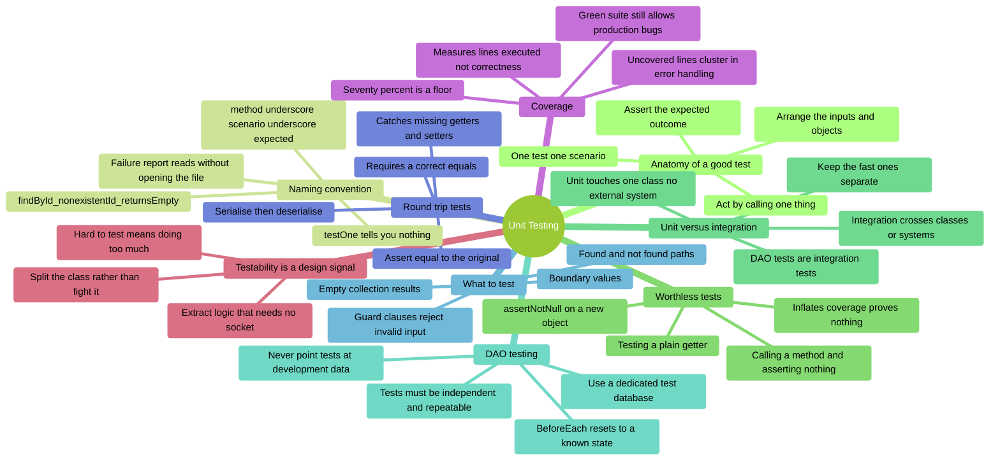
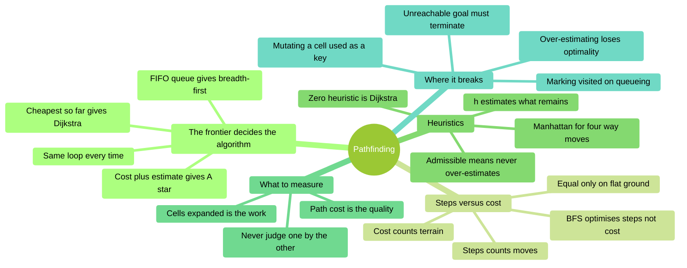
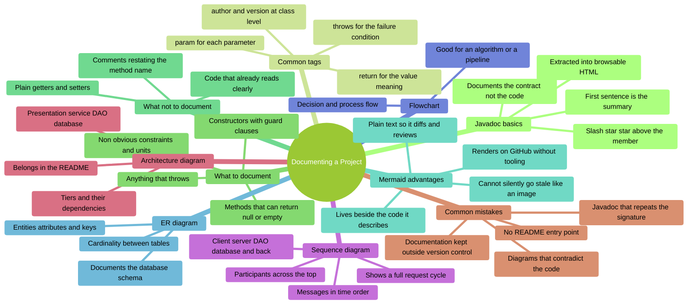
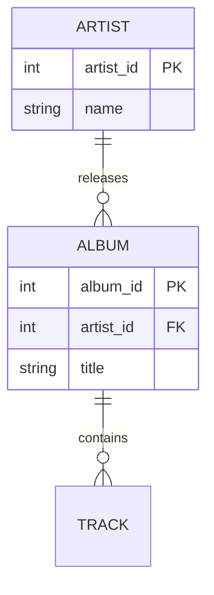
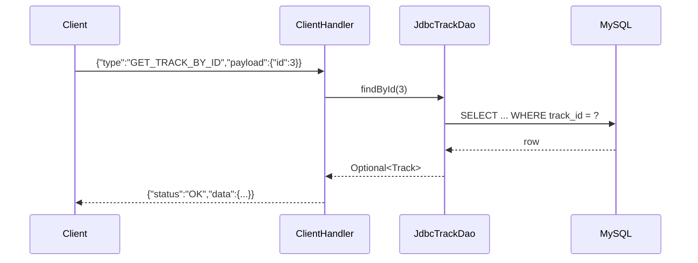

# COMP C8Z03 — Revision Mindmaps, Part 3 (t23–t25)

This document collects the mindmaps for **topics t23–t25** — proving a project works, an
algorithmic finale, and how the work is finally *judged*. Each section has:

- A short explanation of what the topic covers.
- A Mermaid **mindmap** you can use to review key ideas.
- **Code snippets** showing the syntax in use.
- **Self-assessment prompts** to test yourself before checking the notes.

> :warning: This revision document is not a substitute for reading, understanding, and learning
> the content covered in the related notes.

| Topic | Covers | Notes |
|:--|:--|:--|
| [t23](#t23--unit-testing) | JUnit 5, AAA, DAO integration tests, coverage | [Notes](../../topics/t23_unit_testing/t23_unit_testing_notes.md) |
| [t24](#t24--pathfinding) | BFS, Dijkstra, A\*, heuristics, the frontier | [Notes](../../topics/t24_pathfinding/t24_pathfinding_notes.md) |
| [t25](#t25--documenting-a-project) | Javadoc, ER/sequence/architecture diagrams | [Notes](../../topics/t25_documenting_a_project/t25_documenting_a_project_notes.md) |

Earlier topics are in [Part 1](revision_t00_t09.md) and [Part 2](revision_t10_t22.md).

---

## t23 — Unit Testing

### Overview

A good test states a **specific expectation** and fails loudly when it is broken. A test
that runs code without checking anything still counts towards coverage while proving nothing.
**Arrange–Act–Assert** keeps each test to one scenario, and the name
`method_scenario_expectedBehaviour` means a failure report tells you what broke without opening
the file.
Coverage is a **floor, not a goal**: it reliably shows what you have *not* tested, and says
very little about what you have.



**Diagram description**
Mind map of **Unit Testing**, organised into 9 branches:

- **Anatomy of a good test** — Arrange the inputs and objects; Act by calling one thing; Assert
  the expected outcome; One test one scenario.
- **Naming convention** — method underscore scenario underscore expected;
  findById_nonexistentId_returnsEmpty; Failure report reads without opening the file; testOne
  tells you nothing.
- **Worthless tests** — assertNotNull on a new object; Testing a plain getter; Calling a method
  and asserting nothing; Inflates coverage proves nothing.
- **Unit versus integration** — Unit touches one class no external system; Integration crosses
  classes or systems; DAO tests are integration tests; Keep the fast ones separate.
- **DAO testing** — Use a dedicated test database; BeforeEach resets to a known state; Never
  point tests at development data; Tests must be independent and repeatable.
- **What to test** — Guard clauses reject invalid input; Found and not found paths; Empty
  collection results; Boundary values.
- **Round trip tests** — Serialise then deserialise; Assert equal to the original; Requires a
  correct equals; Catches missing getters and setters.
- **Coverage** — Measures lines executed not correctness; Seventy percent is a floor; Uncovered
  lines cluster in error handling; Green suite still allows production bugs.
- **Testability is a design signal** — Hard to test means doing too much; Extract logic that
  needs no socket; Split the class rather than fight it.

### Code Snippets

```java
// AAA: three short, clearly separated sections
@Test
void insert_validPlayer_returnsPositiveId() throws Exception {
    // Arrange
    String name = "Alice";
    String position = "Striker";

    // Act
    int id = _playerDao.insert(name, position);

    // Assert
    assertTrue(id > 0, "generated id must be positive");
}
```

```java
// Worthless - passes even if the constructor body is deleted
@Test
void playerConstructorTest() {
    assertNotNull(new Player(1, "Alice"));   // `new` can never return null
}

// Worthwhile - asserts an observable consequence
@Test
void constructor_validArgs_setsName() {
    assertEquals("Alice", new Player(1, "Alice").getName());
}

@Test
void constructor_nullName_throwsIllegalArgument() {
    assertThrows(IllegalArgumentException.class, () -> new Player(1, null));
}
```

```java
// DAO integration test: dedicated test DB, reset before every test
class PlayerDaoTest {

    private PlayerDao _dao;

    @BeforeEach
    void setUp() throws Exception {
        _dao = new JdbcPlayerDao(TEST_DB_URL, TEST_USER, TEST_PASS);
        _dao.deleteAll();                 // known state - tests stay independent
    }

    @Test
    void findById_nonexistentId_returnsEmpty() throws Exception {
        assertTrue(_dao.findById(999_999).isEmpty());
    }

    @Test
    void findAll_emptyTable_returnsEmptyListNotNull() throws Exception {
        List<Player> all = _dao.findAll();
        assertNotNull(all);
        assertTrue(all.isEmpty());
    }
}
```

```java
// Round-trip test - only meaningful because Player overrides equals()
@Test
void player_roundTrip_equalsOriginal() throws Exception {
    Player original = new Player(1, "Alice");
    String json = MAPPER.writeValueAsString(original);
    Player restored = MAPPER.readValue(json, Player.class);
    assertEquals(original, restored);
}
```

### Self-Assessment Prompts

1. **Why is `assertNotNull(new Player(...))` worthless even though it executes the constructor?**
   *(Delete the constructor body — does the test still pass?)*

2. **Are your DAO tests unit tests or integration tests? Justify the answer.**
   *(What has to be running for them to pass?)*

3. **A team has 80% coverage and a green suite, yet a bug reaches production. Give three ways
   that can happen.**
   *(What does coverage actually measure?)*

4. **What happens if you point DAO tests at the development database?**
   *(Consider what `@BeforeEach` does, and whether it can be undone)*

5. **Why does a round-trip test fail on a correct class that has no `equals` override?**
   *(What does `assertEquals` call, and what does the default do?)*

6. **A class is hard to test because it reads a socket, parses JSON and calls a DAO. What is
   that telling you?**
   *(Is the fix a cleverer test, or a different design?)*

---

## t24 — Pathfinding

### Overview

Three searches share one loop and differ only in **how the frontier is ordered**. A FIFO queue
gives breadth-first search, which finds the route with the fewest steps. A priority queue
ordered by cost-so-far gives Dijkstra, which finds the cheapest route once terrain costs vary.
Adding an estimate of the cost remaining gives A\*, which finds the same cheapest route while
examining far fewer cells — provided the estimate never over-estimates.



**Diagram description**
Mind map of **Pathfinding**, organised into 5 branches:

- **The frontier decides the algorithm** — FIFO queue gives breadth-first; cheapest so far
  gives Dijkstra; cost plus estimate gives A star; same loop every time.
- **Steps versus cost** — steps counts moves; cost counts terrain; equal only on flat ground;
  BFS optimises steps not cost.
- **Heuristics** — h estimates what remains; Manhattan for four-way moves; zero heuristic is
  Dijkstra; admissible means never over-estimates.
- **What to measure** — cells expanded is the work; path cost is the quality; never judge one
  by the other.
- **Where it breaks** — over-estimating loses optimality; marking visited on queueing;
  mutating a cell used as a key; unreachable goal must terminate.

### Code Snippets

**The one line that changes the algorithm**

```java
// Breadth-first: first in, first out
Queue<Cell> frontier = new ArrayDeque<>();

// Dijkstra: cheapest cost so far
PriorityQueue<Cell> frontier = new PriorityQueue<>(
        Comparator.comparingInt(cell -> costSoFar.get(cell)));

// A*: cost so far plus estimated cost remaining
PriorityQueue<Cell> frontier = new PriorityQueue<>(
        Comparator.comparingInt(cell -> costSoFar.get(cell) + heuristic.estimate(cell, goal)));
```

**Improving a route (Dijkstra and A\*, never BFS)**

```java
int newCost = costSoFar.get(current) + grid.costToEnter(next);
if (newCost < costSoFar.getOrDefault(next, Integer.MAX_VALUE)) {
    costSoFar.put(next, newCost);
    cameFrom.put(next, current);
    frontier.add(next);          // stale copies are skipped when they surface
}
```

**Reporting instead of printing**

```java
public interface SearchListener {
    SearchListener NONE = new SearchListener() { };
    default void onExpand(Cell current, Set<Cell> frontier, Set<Cell> visited) { }
    default void onFound(List<Cell> path) { }
    default void onExhausted() { }
}
```

**Measured on the open-room map**

| Algorithm | Cost | Expanded |
|:--|--:|--:|
| Breadth-first | 34 | 212 |
| Dijkstra | 34 | 212 |
| A\* (Manhattan) | 34 | **35** |

### Self-Assessment Prompts

1. **A\* with a zero heuristic is which algorithm, and why?**
   *(Substitute h = 0 into f = g + h and read what is left)*

2. **On a map with rough ground, BFS returns 10 steps costing 46 while Dijkstra returns 14
   steps costing 14. Is BFS wrong?**
   *(Consider what each one was asked to optimise)*

3. **An over-estimating heuristic expanded fewer cells than an admissible one. Why is that
   bad news rather than good?**

4. **Why can BFS mark a cell as visited when it is queued, while Dijkstra cannot?**

5. **Which structure holds the frontier for each of the three algorithms, and what does that
   cost per expansion?**

6. **Name two things the listener seam makes possible that printing from inside the search
   would not.**

---

## t25 — Documenting a Project

### Overview

Documentation exists so that a reader — a marker, a teammate, or you in six months — can
understand the system without reading every line.
**Javadoc** documents the *contract*: what a method promises, what it rejects, what it returns.
**Mermaid diagrams** are plain text, so they live beside the code, get reviewed in pull
requests, and cannot silently drift out of date the way an exported image does.



**Diagram description**
Mind map of **Documenting a Project**, organised into 10 branches:

- **Javadoc basics** — Slash star star above the member; First sentence is the summary;
  Documents the contract not the code; Extracted into browsable HTML.
- **Common tags** — param for each parameter; return for the value meaning; throws for the
  failure condition; author and version at class level.
- **What to document** — Constructors with guard clauses; Methods that can return null or
  empty; Anything that throws; Non obvious constraints and units.
- **What not to document** — Plain getters and setters; Comments restating the method name;
  Code that already reads clearly.
- **Mermaid advantages** — Plain text so it diffs and reviews; Lives beside the code it
  describes; Renders on GitHub without tooling; Cannot silently go stale like an image.
- **ER diagram** — Entities attributes and keys; Cardinality between tables; Documents the
  database schema.
- **Flowchart** — Decision and process flow; Good for an algorithm or a pipeline.
- **Sequence diagram** — Participants across the top; Messages in time order; Shows a full
  request cycle; Client server DAO database and back.
- **Architecture diagram** — Tiers and their dependencies; Presentation service DAO database;
  Belongs in the README.
- **Common mistakes** — Javadoc that repeats the signature; Diagrams that contradict the code;
  Documentation kept outside version control; No README entry point.

### Code Snippets

````java
/**
 * Retrieves a single track by its primary key.
 *
 * <p>Absence is a normal outcome: an unknown id yields an empty
 * {@code Optional} rather than an exception.
 *
 * @param id the primary key to look up; must be positive
 * @return an {@code Optional} containing the track, or empty if no row matches
 * @throws IllegalArgumentException if {@code id} is zero or negative
 * @throws DataAccessException      if the query cannot be executed
 */
public Optional<Track> findById(int id) { ... }
````

```text
Document the contract, not the mechanics:

  BAD   // this method gets the name
        public String getName()

  GOOD  /** @return the display name, never null but possibly blank */
```

````markdown

````

````markdown

````

### Self-Assessment Prompts

1. **Which of your methods genuinely need Javadoc, and which do not?**
   *(What does a comment on a plain getter add?)*

2. **Write the `@throws` line for a constructor that rejects a blank name.**
   *(State the condition, not just the exception type)*

3. **Which diagram type answers "what tables exist and how do they relate?", and which answers
   "what happens when a client sends a request?"**
   *(Two different questions, two different diagram types)*

4. **Why is a Mermaid diagram in the repo better than a PNG exported from a drawing tool?**
   *(Think about what happens six months later when the schema changes)*

5. **Where should the whole-system architecture diagram live, and why there?**
   *(Where does a new reader — or a marker — look first?)*

---

## Appendix — Glossary of Terms

## AAA (Arrange–Act–Assert)

The three-part structure of a readable test: set up the inputs, call the one thing under test,
then check the result.

## Unit test

A test of a single class with no dependency on an external system. Fast, deterministic, and a
failure points at one place.

## Integration test

A test exercising several components together, often including a database or network. Slower,
and can fail for reasons outside the code under test.

## Test database

A separate database used only by tests, reset to a known state before each one so tests stay
independent and repeatable.

## Line coverage

The percentage of executable lines run during the test suite. It measures execution, not
correctness — a line can be covered by a test that asserts nothing.

## Trivial test

A test that cannot fail for any meaningful reason, such as `assertNotNull` on a freshly
constructed object. It raises coverage without adding safety.

## assertThrows

The JUnit 5 assertion that a given call throws a specified exception — the correct way to test
a guard clause.

## @BeforeEach

A JUnit 5 method run before every test, used to build fresh objects and reset shared state such
as a test table.

## Javadoc

Structured comments (`/** ... */`) placed above a class, method or field, extracted into
browsable HTML documentation.

## Javadoc tag

A marker inside a Javadoc comment describing one aspect of the contract — `@param`, `@return`,
`@throws`.

## Mermaid

A text-based diagram syntax rendered by GitHub and most Markdown viewers, so diagrams live in
version control beside the code.

## ER diagram

An entity-relationship diagram showing tables, their columns and keys, and the cardinality of
relationships between them.

## Sequence diagram

A diagram showing participants and the messages passed between them in time order — ideal for a
full client-to-server request cycle.

## Architecture diagram

A high-level view of a system's tiers and their dependencies, such as presentation then service
then DAO then database.
