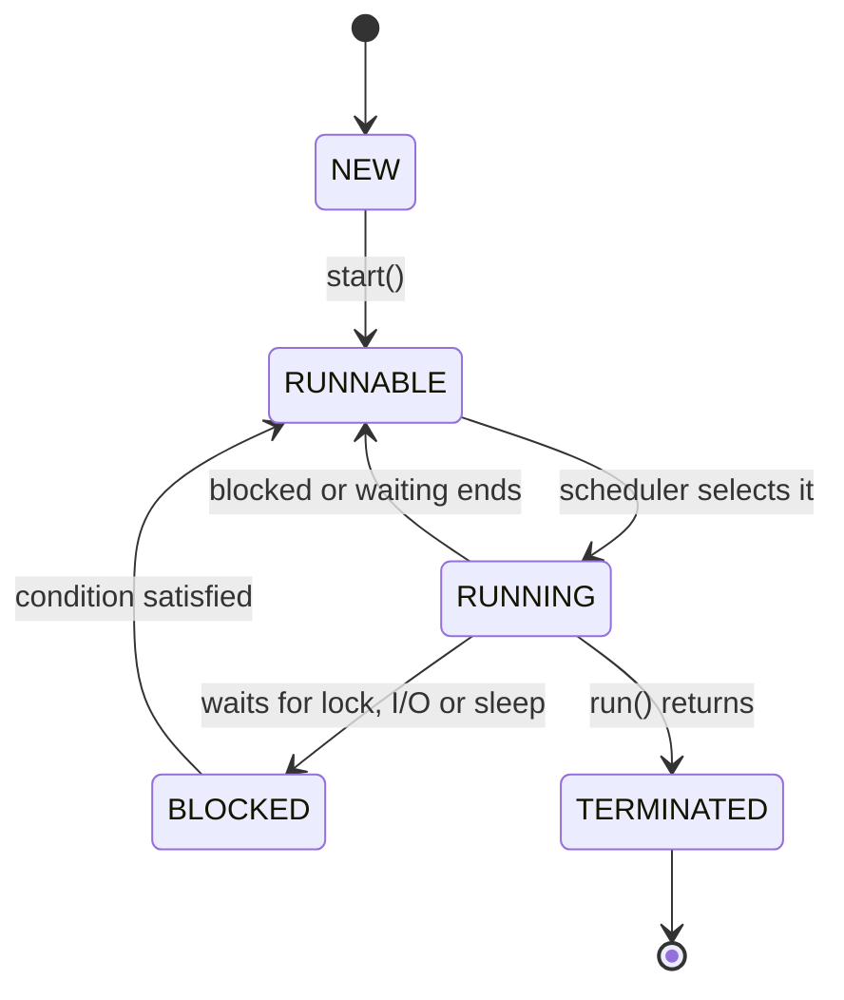

# Concurrency I — Threads and the ExecutorService

> **Prerequisites:**
> - You can write and use interfaces and lambdas
> - You are comfortable with `ArrayList` and basic collections
> - You have completed the DAO topic and understand the service layer

---

## In this topic

- [What you'll learn](#what-youll-learn)
- [Why this matters](#why-this-matters)
- [How this builds on previous content](#how-this-builds-on-previous-content)
- [Key terms](#key-terms)
- [Part 1: Threads](#part-1-threads)
- [Part 2: The ExecutorService](#part-2-the-executorservice)
- [Part 3: Callable and Future (brief)](#part-3-callable-and-future-brief)
- [Part 4: Race conditions and synchronisation](#part-4-race-conditions-and-synchronisation)
- [Common mistakes](#common-mistakes)
- [Practice tasks](#practice-tasks)
- [Patterns and concepts used here](#patterns-and-concepts-used-here)
- [Reflective questions](#reflective-questions)
- [Further reading](#further-reading)

---

## What you'll learn

| Skill Type | You will be able to... |
| :- | :- |
| Understand | Explain what a thread is and why programs need more than one. |
| Understand | Describe the thread lifecycle (new then runnable then running then blocked then terminated). |
| Apply | Create and start threads using `Runnable` and `Thread`. |
| Apply | Use `ExecutorService` and `Executors.newCachedThreadPool()` to manage a pool of threads. |
| Apply | Submit tasks to an `ExecutorService` and shut it down cleanly. |
| Analyse | Explain what a race condition is and how `synchronized` prevents it. |
| Debug | Identify common concurrency bugs: unsynchronised shared state, calling `run()` instead of `start()`. |

---

## Why this matters

Every program you have written so far has run on a **single thread**: one instruction at a
time, top to bottom.

That works fine for one user doing one thing. It breaks down the moment you want a server to
handle two clients simultaneously, or a game to process input while also updating physics.

**Concurrency** is the ability of a program to make progress on multiple tasks at the same time
(or appear to). In Java, the unit of concurrency is the **thread**.

This topic gives you exactly what you need to implement GCA2 Stage 2: a server that handles
each connected client on its own thread without blocking the rest.

---

## How this builds on previous content

You already know that an interface defines a contract — what a type can do — without specifying
how. `Runnable` is simply an interface with one method: `run()`. Submitting a `Runnable` to a
thread pool is just another example of programming to an interface.

You also know lambdas. Any place this topic uses `Runnable`, you can substitute a lambda.

---

## Key terms

### Thread

A **thread** is an independent sequence of instructions running inside the JVM. All threads in
a JVM share the same heap (objects in memory), but each thread has its own call stack (method
frames, local variables).

### Process vs thread

A **process** is an entire running program (its own memory space, managed by the OS). A
**thread** is a lightweight unit of execution *inside* a process. One process can have many
threads sharing its memory.

### Concurrency vs parallelism

**Concurrency** means multiple tasks can make progress — the CPU switches between them rapidly
(interleaving). **Parallelism** means tasks genuinely run at the same instant on separate CPU
cores. In Java you write concurrent code; whether it runs in parallel depends on the hardware
and JVM scheduler.

### Race condition

A **race condition** occurs when two threads read and write shared data without coordination,
and the outcome depends on which thread runs first. Race conditions produce inconsistent,
hard-to-reproduce bugs.

### Synchronisation

**Synchronisation** is a mechanism for ensuring only one thread executes a block of code at a
time, preventing race conditions on shared state.

### Thread pool

A **thread pool** is a set of pre-created threads that pick up submitted tasks from a queue.
Pools avoid the overhead of creating a new thread for every task.

---

## Part 1: Threads

### What a thread looks like in code

The simplest way to define work for a thread is to implement `Runnable`:

```java
public class PrintTask implements Runnable {

    // === Fields ===
    private String _message;
    private int _count;

    // === Constructors ===
    // Creates: a task that prints the message the given number of times
    public PrintTask(String message, int count) {
        if (message == null || message.isBlank())
            throw new IllegalArgumentException("message is required");
        if (count <= 0)
            throw new IllegalArgumentException("count must be positive");

        _message = message;
        _count = count;
    }

    // === Public API ===
    // Runs: the print loop — called by the thread when it starts
    @Override
    public void run() {
        for (int i = 0; i < _count; i++) {
            System.out.println(Thread.currentThread().getName() + " -> " + _message);
        }
    }
}
```

To run it on a new thread:

```java
Runnable task = new PrintTask("hello", 5);
Thread t = new Thread(task);
t.start();   // <--- correct: asks the JVM to schedule this thread
// t.run(); // WRONG: calls run() on the current thread — no new thread is created
```

> **Common mistake:** calling `t.run()` instead of `t.start()`. Both compile. Only `start()`
> creates a new thread.

---

### Using a lambda instead of a class

Because `Runnable` is a functional interface, you can use a lambda:

```java
Thread t = new Thread(() -> System.out.println("hello from " + Thread.currentThread().getName()));
t.start();
```

---

### The thread lifecycle



**Diagram description**
A thread begins in `NEW`, created but not yet started. Calling `start()` moves it to
`RUNNABLE`, where it is eligible to run and waiting for the JVM scheduler. When the
scheduler selects it, it becomes `RUNNING`.

From `RUNNING` there are two exits. If it waits for a lock, for I/O, or for a timed
sleep, it becomes `BLOCKED`; once that condition is satisfied it returns to `RUNNABLE`,
not to `NEW`, because a thread can only be started once. If instead `run()` returns
normally or an unhandled exception ends it, the thread becomes `TERMINATED` and is
finished for good.

A thread moves through these states:

- **NEW** — created but `start()` not called yet.
- **RUNNABLE** — eligible to run; the JVM scheduler decides when it actually gets CPU time.
- **RUNNING** — currently executing.
- **BLOCKED / WAITING** — waiting for a lock, I/O, or a timed sleep.
- **TERMINATED** — `run()` has returned or an unhandled exception ended it.

You do not control exactly when a thread runs. The JVM scheduler decides. This is what makes
concurrent code tricky.

---

### `Thread.sleep()` — pausing a thread

```java
Thread t = new Thread(() -> {
    try {
        System.out.println("starting work");
        Thread.sleep(2_000);   // pause 2 seconds
        System.out.println("work done");
    }
    catch (InterruptedException e) {
        Thread.currentThread().interrupt();  // restore the interrupted flag
        System.out.println("interrupted");
    }
});
t.start();
```

`sleep()` throws `InterruptedException`, which must be handled. The pattern above — catching it
and calling `interrupt()` again — is the correct response in most cases.

---

## Part 2: The ExecutorService

Creating a raw `Thread` for every task is wasteful and difficult to manage. For a server that
handles dozens of simultaneous clients, you need a **thread pool**.

### Why a thread pool?

Thread creation is expensive. A pool creates threads up front (or on demand) and reuses them.
When a task finishes, the thread returns to the pool and picks up the next task.

### Creating a pool with `Executors`

```java
import java.util.concurrent.ExecutorService;
import java.util.concurrent.Executors;

// A pool that creates new threads as needed and reuses idle ones.
// Good for handling an unknown number of short-lived tasks (like client connections).
ExecutorService pool = Executors.newCachedThreadPool();

// A pool with exactly 4 threads — at most 4 tasks run simultaneously.
ExecutorService fixed = Executors.newFixedThreadPool(4);
```

For a GCA2 server where each client is handled independently, `newCachedThreadPool()` is
appropriate: it grows when demand spikes and shrinks when clients disconnect.

---

### Submitting tasks

```java
ExecutorService pool = Executors.newCachedThreadPool();

pool.submit(() -> System.out.println("task 1 on " + Thread.currentThread().getName()));
pool.submit(() -> System.out.println("task 2 on " + Thread.currentThread().getName()));
pool.submit(() -> System.out.println("task 3 on " + Thread.currentThread().getName()));
```

You call `submit()` or `execute()`. The pool assigns a free thread to the task. Output order is
not guaranteed.

---

### Shutting down cleanly

An `ExecutorService` keeps running until you tell it to stop. If you omit the shutdown, your
JVM may hang after `main()` returns.

```java
pool.shutdown();          // no new tasks; wait for current tasks to finish
pool.shutdownNow();       // attempt to interrupt running tasks immediately (use with care)
```

The recommended shutdown pattern:

```java
pool.shutdown();
try {
    if (!pool.awaitTermination(5, java.util.concurrent.TimeUnit.SECONDS)) {
        pool.shutdownNow();
    }
}
catch (InterruptedException e) {
    pool.shutdownNow();
    Thread.currentThread().interrupt();
}
```

---

### Full example: simulated client connections

```java
import java.util.concurrent.ExecutorService;
import java.util.concurrent.Executors;

public class ServerSimulation {

    // === Fields ===
    private ExecutorService _pool;

    // === Constructors ===
    // Creates: a simulation with a cached thread pool
    public ServerSimulation() {
        _pool = Executors.newCachedThreadPool();
    }

    // === Public API ===
    // Submits: a simulated client handler task to the pool
    public void acceptClient(int clientId) {
        _pool.submit(new ClientHandler(clientId));
    }

    // Shuts: the pool down — no new clients accepted, existing handlers finish
    public void stop() {
        _pool.shutdown();
    }

    // === Helpers ===
    // Models: the work done per connected client
    private static class ClientHandler implements Runnable {

        private int _clientId;

        // Creates: a handler for the given client ID
        public ClientHandler(int clientId) {
            _clientId = clientId;
        }

        // Runs: the client session — reads requests and sends responses
        @Override
        public void run() {
            System.out.println("Client " + _clientId + " connected on " + Thread.currentThread().getName());

            try {
                Thread.sleep(500);  // simulate request processing
            }
            catch (InterruptedException e) {
                Thread.currentThread().interrupt();
            }

            System.out.println("Client " + _clientId + " done");
        }
    }

    public static void main(String[] args) throws InterruptedException {
        ServerSimulation server = new ServerSimulation();

        for (int i = 1; i <= 5; i++) {
            server.acceptClient(i);
        }

        Thread.sleep(2_000);
        server.stop();
    }
}
```

Notice:
- The main thread loops calling `acceptClient()`.
- Each client runs on its own thread from the pool.
- The main thread does not wait for each client to finish before accepting the next one.

---

## Part 3: Callable and Future (brief)

`Runnable` runs work but returns nothing. When you need a result back from a background thread,
use `Callable<T>`:

```java
import java.util.concurrent.*;

ExecutorService pool = Executors.newFixedThreadPool(2);

Callable<String> task = () -> {
    Thread.sleep(1_000);
    return "result from background thread";
};

Future<String> future = pool.submit(task);

// do other work here ...

String result = future.get();  // blocks until the result is ready
System.out.println(result);

pool.shutdown();
```

`Future.get()` blocks the calling thread until the task finishes. In GCA2 your server threads
will not typically need `Future` — you submit `Runnable` handlers — but `Callable` is useful
when you need to aggregate results.

---

## Part 4: Race conditions and synchronisation

### The problem: shared mutable state

```java
public class Counter {

    // === Fields ===
    private int _count = 0;

    // === Public API ===
    // Increments: the counter — NOT thread-safe
    public void increment() {
        _count++;     // read, add 1, write back — three operations, not one
    }

    // Gets: the current count
    public int getCount() {
        return _count;
    }
}
```

If two threads call `increment()` at the same moment, both may read the same value of `_count`,
both add 1, and both write back the same result — effectively losing one increment. This is a
**race condition**.

---

### Demonstrating the problem

```java
Counter counter = new Counter();
ExecutorService pool = Executors.newFixedThreadPool(4);

for (int i = 0; i < 10_000; i++) {
    pool.submit(counter::increment);
}

pool.shutdown();
pool.awaitTermination(10, java.util.concurrent.TimeUnit.SECONDS);

// Expected: 10000. Actual: something less (varies every run)
System.out.println("Count: " + counter.getCount());
```

---

### Fixing it: `synchronized`

```java
public class SafeCounter {

    // === Fields ===
    private int _count = 0;

    // === Public API ===
    // Increments: the counter — thread-safe via synchronized
    public synchronized void increment() {
        _count++;
    }

    // Gets: the current count — thread-safe
    public synchronized int getCount() {
        return _count;
    }
}
```

`synchronized` on an instance method means only one thread can execute that method on the same
object at a time. Others wait at the entrance until the lock is released.

---

### When do you need synchronisation in GCA2?

In the GCA2 server, each client handler runs on its own thread. The DAO accesses the database,
which handles its own concurrency. However, if your server maintains any **shared in-memory
state** (a cache, a session registry, a counter), that state must be synchronised.

If each handler only reads/writes the database (via its own connection) and has no shared
in-memory state, you may not need explicit synchronisation in your handlers at all. But you
must be able to reason about this at your demo.

---

## Common mistakes

| Mistake | What happens | Fix |
| :- | :- | :- |
| Calling `t.run()` instead of `t.start()` | `run()` executes on the current thread — no new thread is created | Always call `start()` |
| Not calling `pool.shutdown()` | The JVM stays alive after `main()` returns because pool threads are non-daemon | Always call `shutdown()` |
| Ignoring `InterruptedException` without restoring the interrupt flag | Interrupt signals get silently lost | Call `Thread.currentThread().interrupt()` inside the catch |
| Accessing shared mutable state without synchronisation | Race conditions — inconsistent results, varies per run | Synchronise shared writes, or avoid shared mutable state |
| Using a `newFixedThreadPool` too small | Clients queue up; server appears slow or hangs | Use `newCachedThreadPool` for dynamic workloads like client connections |

---

## Practice tasks

1. Create a `CountdownTask` that counts from 10 to 1, sleeping 100ms between each count. Run
   three instances simultaneously using an `ExecutorService`.
2. Extend `ServerSimulation` above so each client handler receives a simulated string request
   and prints a simulated response.
3. Reproduce the race condition with `Counter` above, then fix it with `synchronized` and
   verify the count is correct.
4. Modify `ServerSimulation` to use `newFixedThreadPool(2)` and observe what happens when 10
   clients connect simultaneously.

---

## Patterns and concepts used here

### Thread pool (Object Pool pattern)

Rather than creating an object (thread) for each task, a pool creates and reuses a set of
objects. `ExecutorService` is Java's implementation of this idea.

### Command pattern

`Runnable` and `Callable` are essentially the Command pattern: work is encapsulated as an
object and submitted to an executor. The executor decides when and how to run it.

---

## Reflective questions

1. Why does calling `run()` directly not create a new thread?
2. What is the difference between `execute()` and `submit()` on an `ExecutorService`?
3. Why is `newCachedThreadPool()` appropriate for handling client connections rather than
   `newFixedThreadPool(1)`?
4. Give an example of shared mutable state in a multi-client server. What goes wrong without
   synchronisation?
5. What would happen if you never called `pool.shutdown()` in a server that ran indefinitely?

<details style="background:#f5f7ff; border:1px solid rgba(0,0,0,0.15); border-radius:10px;
padding:0.9rem 1rem; margin:1rem 0;">
  <summary style="cursor:pointer; font-weight:800; margin:0;">
    Check your thinking
  </summary>

**1. Why calling `run()` directly creates no thread.**
`run()` is an ordinary method. Calling it executes the body **on the calling thread**,
synchronously, and the caller blocks until it returns — you have written a normal method call
that happens to live inside a `Runnable`.

`start()` is the method that asks the JVM to allocate a new OS thread and *then* invoke `run()`
on it, returning immediately to the caller. The give-away when debugging is printing
`Thread.currentThread().getName()`: with `run()` every task reports `main`; with `start()` you
see `Thread-0`, `Thread-1`. (Also: `start()` may be called only once per `Thread` — a second
call throws `IllegalThreadStateException`.)

**2. `execute()` vs `submit()`.**
`execute(Runnable)` returns `void`. `submit(...)` accepts a `Runnable` *or* a `Callable<T>` and
returns a **`Future<T>`** you can use to wait for completion (`get()`), check status, or
cancel.

The difference that matters most in practice is **error visibility**. If a task throws,
`execute` hands the exception to the thread's uncaught-exception handler and it usually prints
to stderr — noisy but visible. With `submit`, the exception is *captured inside the `Future`*
and is silent until someone calls `get()`, which then throws `ExecutionException`. Submit a
task, never call `get()`, and a failure disappears without trace — a genuinely nasty bug to
chase. Use `execute` for fire-and-forget work; use `submit` when you need the result or want to
handle failure, and then actually call `get()`.

**3. Why `newCachedThreadPool()` for client connections.**
Because client work is **bursty and mostly blocked on I/O**. A cached pool creates threads on
demand, reuses idle ones, and retires threads unused for 60 seconds — so it matches an
unpredictable connection count without you having to guess a number.

`newFixedThreadPool(1)` would serialise everything: one client at a time, with every other
client queued behind it. Since a handler spends nearly all its life blocked reading a socket, a
single thread leaves the CPU idle while clients wait — the server appears hung under trivial
load.

The honest caveat, worth stating: a cached pool is **unbounded**, so a flood of connections can
create a flood of threads and exhaust memory. Production servers usually prefer a bounded pool
with a queue; a cached pool is the right teaching default because it removes the "what number?"
question while the concept is being learned.

**4. Shared mutable state in a multi-client server.**
Anything reachable from more than one handler: a client registry (`List<ClientHandler>`), a
shared counter (`_requestCount++`), an in-memory cache or scoreboard, a shared
`SimpleDateFormat`, or a `DaoRegistry` holding stateful objects.

Without synchronisation you get **lost updates** and **corrupt structures**. `_requestCount++`
is not atomic — it is read, add, write, so two threads can both read 5, both write 6, and one
increment vanishes. Worse, an `ArrayList` mutated from two threads can be left internally
inconsistent: elements silently dropped, `ArrayIndexOutOfBoundsException` from within
`ArrayList` itself, or an infinite loop. These bugs are timing-dependent, so they pass every
test on your machine and appear in the demo.

Fixes: confine state to one thread where possible; otherwise use `synchronized` on a private
lock, or the concurrent types — `AtomicInteger` for counters, `ConcurrentHashMap`,
`CopyOnWriteArrayList` for a listener list.

**5. Never calling `pool.shutdown()` in a long-running server.**
For a server *designed* to run forever, this is largely fine while it is running — the pool is
meant to stay alive, and a cached pool retires idle threads by itself.

The real consequence is at **exit**. `Executors` threads are **non-daemon** by default, so the
JVM will not terminate while any of them exists — `main` returns and the process just hangs,
which looks like a crash-free freeze and is a common "why won't my program stop?" report. You
also lose orderly shutdown: in-flight requests are not given a chance to finish, and cleanup in
a `finally` may never run.

The correct pattern is a shutdown hook or an explicit stop path calling `shutdown()` (stop
accepting new tasks, let running ones finish), then `awaitTermination(...)`, then
`shutdownNow()` if the timeout expires. Note the distinction: `shutdown()` is graceful;
`shutdownNow()` interrupts running tasks and returns those never started.

</details>

---

## Further reading

- Java Concurrency in Practice — Goetz et al. (the definitive reference)
- Baeldung — Introduction to Thread Pools in Java
  <https://www.baeldung.com/thread-pool-java-and-guava>
- Oracle Docs — `ExecutorService`
  <https://docs.oracle.com/en/java/docs/api/java.base/java/util/concurrent/ExecutorService.html>

---

## Lesson Context

```yaml
previous_lesson:
  topic_code: t18_io
  domain_emphasis: Balanced

this_lesson:
  topic_code: t19_concurrency
  primary_domain_emphasis: Balanced
  difficulty_tier: Intermediate
mlos: [MLO1, MLO2]
```
