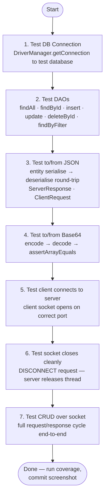

# Unit Testing — What Good Tests Look Like

> **Prerequisites:**
> - You have a working JDBC DAO layer (see [DAO](../t15_dao/t15_dao_notes.md))
> - You can serialise and deserialise Java objects to/from JSON (see [JSON
>   I](../t20_json_1_jackson_basics/t20_json_1_jackson_basics_notes.md), [JSON
>   II](../t21_json_2_jackson_advanced/t21_json_2_jackson_advanced_notes.md))
> - You have a running `ClientHandler` and `ServerResponse<T>` (see
>   [Networking](../t22_networking/t22_networking_notes.md))
> - JUnit 5 is already in your `pom.xml` (see the [JUnit setup
>   cheatsheet](../../shared/cheat%20sheets/cheatsheet_junit_in_intellij.md))

---

## In this topic

- [What you'll learn](#what-youll-learn)
- [Why this matters](#why-this-matters)
- [How this builds on previous content](#how-this-builds-on-previous-content)
- [Key terms](#key-terms)
- [Part 1 — Anatomy of a good test](#part-1--anatomy-of-a-good-test)
- [Part 2 — DTO / entity validation tests](#part-2--dto--entity-validation-tests)
- [Part 3 — DAO integration tests](#part-3--dao-integration-tests)
- [Part 4 — JSON round-trip tests](#part-4--json-round-trip-tests)
- [Part 5 — Binary handling tests](#part-5--binary-handling-tests)
- [Part 6 — What =70% coverage means](#part-6--what-70-coverage-means)
- [Part 7 — Project test checklist](#part-7--project-test-checklist)
- [Common mistakes](#common-mistakes)
- [Practice tasks](#practice-tasks)
- [Reflective questions](#reflective-questions)
- [Further reading](#further-reading)
- [Appendix A — In What Order Should I Write My
  Tests?](#appendix-a--in-what-order-should-i-write-my-tests)

---

## What you'll learn

| Skill Type | You will be able to... |
| :- | :- |
| Understand | Describe what makes a test meaningful versus trivial or misleading. |
| Understand | Explain the Arrange–Act–Assert pattern and why it matters. |
| Understand | Explain what =70% line coverage means and what it does **not** guarantee. |
| Apply | Name tests using the `method_scenario_expectedBehaviour` convention. |
| Apply | Write DTO/entity constructor validation tests that exercise guard clauses. |
| Apply | Write DAO integration tests against a dedicated test database. |
| Apply | Write JSON round-trip tests that verify serialise to deserialise produces an equal object. |
| Apply | Write `ServerResponse<T>` and `ClientRequest` unit tests. |
| Apply | Write binary encoding tests that verify Base64 round-trips and BLOB storage. |
| Apply | Run IntelliJ coverage and interpret the result. |
| Analyse | Identify which classes in a multi-tier project require the most thorough test coverage. |

---

## Why this matters

This module requires **=70% line coverage** across your project's DAO, JSON handling, and
binary handling classes, plus a test suite that demonstrates you understand what you built.

A passing coverage number is the floor, not the goal. A project with 70% coverage built from
trivial tests (tests that would pass even if your code was completely wrong) earns no credit
for test quality.

This note tells you:
1. what a good test actually tests,
2. what makes a test trivial or useless,
3. which scenarios to cover in each layer of a multi-tier OOP project.

---

## How this builds on previous content

| Previous concept | How it reappears here |
| :- | :- |
| DAO interface + JDBC implementation ([t15](../t15_dao/t15_dao_notes.md)) | DAO methods are what you call in integration tests |
| Jackson `ObjectMapper` ([t20](../t20_json_1_jackson_basics/t20_json_1_jackson_basics_notes.md), [t21](../t21_json_2_jackson_advanced/t21_json_2_jackson_advanced_notes.md)) | Round-trip tests serialise then deserialise to verify no data is lost |
| `ServerResponse<T>` ([t22](../t22_networking/t22_networking_notes.md)) | Tests verify `ok(...)` sets the right status and `error(...)` sets `null` data |
| Defensive coding (null/blank validation) | Constructor guard tests check that invalid inputs are rejected |
| `Optional<T>` ([t15](../t15_dao/t15_dao_notes.md)) | `findById` tests check both the present and empty paths |

---

## Key terms

### Unit test

A test that calls a **single method** on a **single class**, checks the result, and has no
dependencies on other classes or external systems.

### Integration test

A test that exercises **more than one class working together**, often including an external
system such as a database. DAO tests that connect to MySQL are integration tests, even though
we call the file `...Test.java`.

### AAA (Arrange–Act–Assert)

The three-section structure every test should have:
- **Arrange** — set up the inputs and objects needed
- **Act** — call the one thing being tested
- **Assert** — check the result

### Test method name

The full name of the test as shown in IntelliJ's test runner. Good names describe the scenario
at a glance.

### Line coverage

The percentage of executable source lines that were executed during the test run. A line counts
as covered if it ran at least once.

### Test database

A separate MySQL database used only during testing. It has the same schema as your main
database but is reset before each test run so tests are independent and repeatable.

---

## Part 1 — Anatomy of a good test

### AAA in practice

Every test you write should have exactly three clearly separated concerns.

```java
@Test
void insert_validPlayer_returnsPositiveId() throws Exception {

    // Arrange
    String name = "Alice";
    String position = "Striker";

    // Act
    int id = _playerDao.insert(name, position);

    // Assert
    assertTrue(id > 0, "generated id must be positive");
}
```

The three sections are short, direct, and obvious. If you find your Arrange growing to 20
lines, you are probably testing too many things at once.

---

### Test naming convention

Use the pattern: `methodName_scenario_expectedBehaviour`

| Good name | What it tells you immediately |
| :- | :- |
| `insert_validPlayer_returnsPositiveId` | `insert` with valid input to ID > 0 |
| `findById_existingId_returnsPresent` | `findById` for a known ID to `Optional` is present |
| `findById_nonexistentId_returnsEmpty` | `findById` for unknown ID to `Optional` is empty |
| `constructor_nullName_throwsIllegalArgument` | constructor with null name to exception |
| `toJson_validPlayer_roundTripEqualsOriginal` | JSON round-trip to deserialized object equals original |

When a test fails, its name should tell you exactly what broke without opening the test file.

---

### The single-purpose rule

One test, one scenario. If a test has five assertions that check unrelated things, you cannot
tell from the failure report which scenario broke.

This is fine — each test checks one specific outcome:

```java
@Test void findById_existingId_returnsPresent() throws Exception { ... }
@Test void findById_nonexistentId_returnsEmpty() throws Exception { ... }
@Test void findById_negativeId_returnsEmpty() throws Exception { ... }
```

This is not — one test name, three unrelated scenarios:

```java
@Test
void playerDaoTest() throws Exception {
    List<Player> all = _playerDao.findAll();
    assertFalse(all.isEmpty());
    Optional<Player> found = _playerDao.findById(1);
    assertTrue(found.isPresent());
    int id = _playerDao.insert("Bob", "Keeper");
    assertTrue(id > 0);
}
```

---

### What makes a test worthless

#### Anti-pattern 1 — Testing that an object was constructed

```java
// BAD: assertNotNull on a freshly-created object is always true
@Test
void playerConstructorTest() {
    Player p = new Player(1, "Alice", "Striker", 5);
    assertNotNull(p);
}
```

This test passes even if your constructor does nothing at all. It tests that Java's `new`
keyword works.

#### Anti-pattern 2 — Testing a getter

```java
// BAD: you are testing Java's field-read mechanism, not your code
@Test
void getNameReturnsName() {
    Player p = new Player(1, "Alice", "Striker", 5);
    assertEquals("Alice", p.getName());
}
```

If your constructor stores the value and your getter returns it, this test adds no protection.
Write a test that checks what your constructor **does** with the input (trim, validate,
reject).

#### Anti-pattern 3 — A test that always passes

```java
// BAD: this passes regardless of what your code does
@Test
void test1() {
    assertTrue(true);
}
```

#### Anti-pattern 4 — Testing DAO behaviour inside an entity test

```java
// BAD: entity tests and DAO tests are mixed — failure is ambiguous
@Test
void playerTest() throws Exception {
    Player p = new Player(1, "Alice", "Striker", 5);
    assertNotNull(p);
    List<Player> list = _playerDao.findAll();
    assertFalse(list.isEmpty());
    int id = _playerDao.insert("Bob", "Keeper");
    assertTrue(id > 0);
}
```

Entity tests go in `PlayerTest`. DAO tests go in `PlayerDaoTest`. Never both.

#### Anti-pattern 5 — No assertion

```java
// BAD: this just calls the method and hopes it doesn't throw
@Test
void insertPlayer() throws Exception {
    _playerDao.insert("Alice", "Striker");
}
```

A test with no assertion is not a test. It is noise that inflates your coverage number without
verifying anything.

---

## Part 2 — DTO / entity validation tests

Your entity constructors contain guard clauses: null checks, blank checks, range checks. These
are some of the easiest and most valuable tests to write.

The goal is to test **every guard** with the **exact input that triggers it**.

```java
public class PlayerTest {

    @Test
    void constructor_nullName_throwsIllegalArgument() {
        assertThrows(IllegalArgumentException.class,
            () -> new Player(1, null, "Striker", 5));
    }

    @Test
    void constructor_blankName_throwsIllegalArgument() {
        assertThrows(IllegalArgumentException.class,
            () -> new Player(1, "   ", "Striker", 5));
    }

    @Test
    void constructor_negativeGoals_throwsIllegalArgument() {
        assertThrows(IllegalArgumentException.class,
            () -> new Player(1, "Alice", "Striker", -1));
    }

    @Test
    void constructor_validInput_trimsName() {
        Player p = new Player(1, "  Alice  ", "Striker", 5);
        assertEquals("Alice", p.getName());
    }

    @Test
    void constructor_validInput_normalisesPosition() {
        Player p = new Player(1, "Alice", "  striker  ", 5);
        assertEquals("STRIKER", p.getPosition());
    }
}
```

One test per guard clause. If a constructor has four guards, you need at least four tests — one
that reaches each guard and confirms it fires.

---

## Part 3 — DAO integration tests

DAO tests connect to a real MySQL database.
They are integration tests, not unit tests, but that is the appropriate choice here: a DAO that
works only against a mock is not proven to work against a real database.

### Test database setup

Create a **separate database** for testing so you never corrupt your development data:

```sql
CREATE DATABASE IF NOT EXISTS gca2_test_db;
-- Run your same mysqlSetup.sql against this database
```

Your test class points its DAO at `gca2_test_db`, not `gca2_db`.

### `@BeforeEach` and `@AfterEach`

Every test needs a **known starting state** in the database.

```java
public class PlayerDaoTest {

    private static final String URL =
        "jdbc:mysql://localhost:3306/gca2_test_db?useSSL=false&serverTimezone=UTC&allowPublicKeyRetrieval=true";
    private static final String USER = "gca2_user";
    private static final String PASS = "your_password";

    private PlayerDao _dao;

    @BeforeEach
    void setUp() throws Exception {
        _dao = new JdbcPlayerDao(URL, USER, PASS);

        // Wipe all rows so every test starts clean
        try (Connection c = DriverManager.getConnection(URL, USER, PASS);
             PreparedStatement ps = c.prepareStatement("DELETE FROM players")) {
            ps.executeUpdate();
        }
    }
}
```

`DELETE FROM players` before each test means no test can be broken by left-over data from a
previous test.

---

### DAO test catalogue

The table below shows the scenarios you must cover. Each row is one test method.

| Method | Scenario | Assertion |
| :- | :- | :- |
| `insert` | Valid input | `assertTrue(id > 0)` |
| `insert` | Null required field | `assertThrows(IllegalArgumentException.class, ...)` |
| `findById` | ID that was just inserted | `assertTrue(result.isPresent())` |
| `findById` | ID that was never inserted | `assertTrue(result.isEmpty())` |
| `findById` | Negative ID | `assertTrue(result.isEmpty())` |
| `findAll` | Called after inserting 3 rows | `assertEquals(3, result.size())` |
| `findAll` | Called on empty table | `assertTrue(result.isEmpty())` |
| `update` | ID that exists | `assertTrue(updated)` |
| `update` | ID that does not exist | `assertFalse(updated)` |
| `deleteById` | ID that exists | `assertTrue(deleted)` — then `findById` returns empty |
| `deleteById` | ID that does not exist | `assertFalse(deleted)` |
| `findByFilter` | Filter matching 2 of 3 rows | `assertEquals(2, result.size())` |
| `findByFilter` | Filter matching nothing | `assertTrue(result.isEmpty())` |

```java
    @Test
    void insert_validPlayer_returnsPositiveId() throws Exception {
        int id = _dao.insert("Alice", "Striker");
        assertTrue(id > 0);
    }

    @Test
    void findById_insertedPlayer_returnsPresent() throws Exception {
        int id = _dao.insert("Bob", "Keeper");
        Optional<Player> result = _dao.findById(id);
        assertTrue(result.isPresent());
        assertEquals("Bob", result.get().getName());
    }

    @Test
    void findById_nonexistentId_returnsEmpty() throws Exception {
        Optional<Player> result = _dao.findById(99999);
        assertTrue(result.isEmpty());
    }

    @Test
    void findAll_afterInsertingThreePlayers_returnsThree() throws Exception {
        _dao.insert("Alice", "Striker");
        _dao.insert("Bob", "Keeper");
        _dao.insert("Charlie", "Midfielder");

        List<Player> all = _dao.findAll();
        assertEquals(3, all.size());
    }

    @Test
    void findAll_emptyTable_returnsEmptyList() throws Exception {
        List<Player> all = _dao.findAll();
        assertTrue(all.isEmpty());
    }

    @Test
    void deleteById_existingId_returnsTrueAndRemovesRow() throws Exception {
        int id = _dao.insert("Dave", "Defender");
        assertTrue(_dao.deleteById(id));
        assertTrue(_dao.findById(id).isEmpty());
    }

    @Test
    void deleteById_nonexistentId_returnsFalse() throws Exception {
        assertFalse(_dao.deleteById(99999));
    }

    @Test
    void findByFilter_positionMatch_returnsOnlyStrikers() throws Exception {
        _dao.insert("Alice", "Striker");
        _dao.insert("Bob", "Keeper");
        _dao.insert("Charlie", "Striker");

        List<Player> strikers = _dao.findByFilter(p -> "Striker".equals(p.getPosition()));
        assertEquals(2, strikers.size());
        assertTrue(strikers.stream().allMatch(p -> "Striker".equals(p.getPosition())));
    }
```

---

## Part 4 — JSON round-trip tests

A round-trip test verifies that serialise to deserialise produces an object **equal to the
original**. This requires a correct `equals` implementation on your entity.

```java
public class PlayerJsonTest {

    private final ObjectMapper _mapper = new ObjectMapper();

    @Test
    void toJson_validPlayer_roundTripEqualsOriginal() throws Exception {
        Player original = new Player(1, "Alice", "Striker", 5);

        // Arrange + Act
        String json = _mapper.writeValueAsString(original);
        Player deserialised = _mapper.readValue(json, Player.class);

        // Assert
        assertEquals(original, deserialised);
    }

    @Test
    void toJson_playerList_roundTripPreservesSize() throws Exception {
        List<Player> original = List.of(
            new Player(1, "Alice", "Striker", 5),
            new Player(2, "Bob", "Keeper", 0),
            new Player(3, "Charlie", "Midfielder", 2)
        );

        String json = _mapper.writeValueAsString(original);
        List<Player> deserialised = _mapper.readValue(json, new TypeReference<List<Player>>() {});

        assertEquals(original.size(), deserialised.size());
        assertEquals(original.get(0), deserialised.get(0));
    }
}
```

> **Prerequisite for round-trip equality:** Your entity class must have:
> - a public no-arg constructor (Jackson needs this to deserialise)
> - `equals` and `hashCode` implemented (so `assertEquals` compares field values, not references)

---

### `ServerResponse<T>` tests

Test both the `ok(...)` factory and the `error(...)` factory. These are pure unit tests — no
database required.

```java
public class ServerResponseTest {

    @Test
    void ok_setsStatusAndData() {
        ServerResponse<String> r = ServerResponse.ok("done", "hello");
        assertEquals("OK", r.getStatus());
        assertEquals("done", r.getMessage());
        assertEquals("hello", r.getData());
        assertTrue(r.isOk());
    }

    @Test
    void error_setsStatusAndNullData() {
        ServerResponse<String> r = ServerResponse.error("not found");
        assertEquals("ERROR", r.getStatus());
        assertEquals("not found", r.getMessage());
        assertNull(r.getData());
        assertFalse(r.isOk());
    }

    @Test
    void ok_serialisesToJson_containsStatusOk() throws Exception {
        ObjectMapper mapper = new ObjectMapper();
        ServerResponse<Integer> r = ServerResponse.ok("created", 42);
        String json = mapper.writeValueAsString(r);
        assertTrue(json.contains("\"status\":\"OK\""));
        assertTrue(json.contains("42"));
    }
}
```

---

### `ClientRequest` tests

Test that `getInt` and `getString` extract payload values correctly, including the fallback for
missing keys.

```java
public class ClientRequestTest {

    private ClientRequest buildRequest(String type, Map<String, Object> payload) throws Exception {
        ObjectMapper mapper = new ObjectMapper();
        Map<String, Object> raw = new HashMap<>();
        raw.put("requestType", type);
        raw.put("payload", payload);
        String json = mapper.writeValueAsString(raw);
        return mapper.readValue(json, ClientRequest.class);
    }

    @Test
    void getInt_presentKey_returnsValue() throws Exception {
        ClientRequest req = buildRequest("GET_BY_ID", Map.of("id", 7));
        assertEquals(7, req.getInt("id"));
    }

    @Test
    void getInt_missingKey_returnsMinusOne() throws Exception {
        ClientRequest req = buildRequest("GET_ALL", Map.of());
        assertEquals(-1, req.getInt("id"));
    }

    @Test
    void getString_presentKey_returnsValue() throws Exception {
        ClientRequest req = buildRequest("INSERT", Map.of("name", "Alice"));
        assertEquals("Alice", req.getString("name"));
    }

    @Test
    void getString_missingKey_returnsNull() throws Exception {
        ClientRequest req = buildRequest("GET_ALL", Map.of());
        assertNull(req.getString("name"));
    }
}
```

---

## Part 5 — Binary handling tests

### Base64 round-trip

The simplest binary test: encode bytes to Base64 then decode back — the result must be
byte-for-byte identical to the original.

```java
public class BinaryEncodingTest {

    @Test
    void base64_encodeDecodeRoundTrip_bytesMatch() {
        byte[] original = { 72, 101, 108, 108, 111 };  // "Hello" in ASCII

        String encoded = Base64.getEncoder().encodeToString(original);
        byte[] decoded = Base64.getDecoder().decode(encoded);

        assertArrayEquals(original, decoded);
    }

    @Test
    void base64_encodeDecodeRoundTrip_largerPayload() {
        byte[] original = new byte[1024];
        new java.util.Random(42).nextBytes(original);

        String encoded = Base64.getEncoder().encodeToString(original);
        byte[] decoded = Base64.getDecoder().decode(encoded);

        assertArrayEquals(original, decoded);
    }
}
```

### BLOB storage round-trip

Test that bytes stored into the database are retrieved unchanged.
Use your test database and clean up with `@BeforeEach`.

```java
public class PlayerBlobDaoTest {

    private PlayerDao _dao;

    @BeforeEach
    void setUp() throws Exception {
        // Create DAO pointed at gca2_test_db
        _dao = new JdbcPlayerDao(URL, USER, PASS);

        try (Connection c = DriverManager.getConnection(URL, USER, PASS);
             PreparedStatement ps = c.prepareStatement("DELETE FROM players")) {
            ps.executeUpdate();
        }
    }

    @Test
    void uploadAndRetrieve_smallImage_bytesMatch() throws Exception {
        byte[] imageBytes = { 10, 20, 30, 40, 50 };
        String fileName = "photo.png";
        String mimeType = "image/png";

        int id = _dao.insertWithBlob("Alice", "Striker", imageBytes, fileName, mimeType);

        byte[] retrieved = _dao.getBlobById(id);
        assertArrayEquals(imageBytes, retrieved,
            "retrieved bytes must be identical to uploaded bytes");
    }

    @Test
    void getMetadataOnly_doesNotReturnBlobBytes() throws Exception {
        byte[] imageBytes = new byte[5000];
        int id = _dao.insertWithBlob("Bob", "Keeper", imageBytes, "img.jpg", "image/jpeg");

        // Metadata-only method must not throw and must return a non-null result
        PlayerFileMetadata meta = _dao.getFileMetadata(id);
        assertNotNull(meta);
        assertEquals("img.jpg", meta.getFileName());
        assertEquals("image/jpeg", meta.getMimeType());
    }
}
```

---

## Part 6 — What =70% coverage means

### How to run coverage in IntelliJ

1. Right-click your test class or the `test/` folder in the Project view.
2. Select **Run 'XxxTest' with Coverage** (or use the gutter icon and choose **Run with Coverage**).
3. IntelliJ opens the **Coverage** tool window on the right.
4. Classes are listed with their line and branch percentages.

Commit a screenshot of this view to your project reports folder.

### What counts as a covered line

A line is covered if **at least one test executes it**.

```java
// These three lines each count separately:
if (title == null || title.isBlank())          // line 1
    throw new IllegalArgumentException("...");  // line 2 — only covered if the guard fires
_title = title.trim();                          // line 3 — only covered if input is valid
```

To reach 70% on your DAO classes, you need tests that exercise both branches of every `if` —
the path where the guard fires and the path where it doesn't.

### What 70% does NOT guarantee

| What coverage measures | What coverage does not tell you |
| :- | :- |
| Which lines were executed | Whether the result is correct |
| Whether your if-branches ran | Whether the right value was returned |
| That a method was called | That the method behaved as specified |

A test that calls `findAll()` and throws away the result covers those lines but asserts nothing
about correctness. Coverage is a measure of **what was exercised**, not **what was verified**.

**Rule:** every line that coverage shows as green should have at least one assertion depending
on what that line does.

### Which classes to prioritise

| Class category | Target coverage | Why |
| :- | :- | :- |
| JDBC DAO implementations | =70% | Most complex and most likely to contain bugs |
| Entity/DTO constructors | =70% | Guard clauses protect every other layer |
| JSON conversion helpers | =70% | Serialisation bugs are silent and hard to debug |
| `ServerResponse<T>` | =70% | Used in every response path |
| Binary handling methods | =70% | Byte corruption is the hardest class of bug to spot |
| `Server` / accept loop | Not required | Concurrency and socket lifecycle are hard to test in JUnit |
| `ClientHandler.run()` | Not required | Live socket I/O is not a JUnit target |

---

## Part 7 — Project test checklist

Use this checklist to verify you have written the right tests before submitting your project.

### DTO / entity tests

- [ ] Constructor rejects `null` for each required `String` field
- [ ] Constructor rejects blank/whitespace-only for each required `String` field
- [ ] Constructor rejects out-of-range values for each numeric field
- [ ] Constructor trims and/or normalises `String` fields correctly

### DAO tests (one `@BeforeEach` that cleans the test table)

- [ ] `insert` with valid input to returned ID is positive
- [ ] `insert` with invalid input to `IllegalArgumentException` is thrown before any DB call
- [ ] `findById` with the ID returned by a prior `insert` to `Optional` is present, name matches
- [ ] `findById` with an ID that was never inserted to `Optional` is empty
- [ ] `findAll` after inserting N rows to list size equals N
- [ ] `findAll` on an empty table to list is empty (not null)
- [ ] `update` with a valid existing ID to returns `true`
- [ ] `update` with an ID that does not exist to returns `false`
- [ ] `deleteById` with a valid existing ID to returns `true`, subsequent `findById` returns empty
- [ ] `deleteById` with an ID that does not exist to returns `false`
- [ ] `findByFilter(Predicate<T>)` with a filter matching a subset to correct count returned
- [ ] `findByFilter(Predicate<T>)` with a filter matching nothing to empty list returned

### JSON tests

- [ ] Serialise entity then deserialise then `assertEquals` to original (round-trip)
- [ ] Serialise a `List<Entity>` then deserialise then size and first element match
- [ ] `ServerResponse.ok(message, data)` returns status is `"OK"`, data is present, `isOk()` is true
- [ ] `ServerResponse.error(message)` returns status is `"ERROR"`, data is `null`, `isOk()` is false
- [ ] `ClientRequest.getInt("id")` returns correct value extracted from payload
- [ ] `ClientRequest.getInt("id")` for missing key to returns `-1`
- [ ] `ClientRequest.getString("name")` returns correct value extracted
- [ ] `ClientRequest.getString("name")` for missing key to returns `null`

### Binary handling tests

- [ ] Base64 encode then decode round-trip then `assertArrayEquals` original bytes
- [ ] Insert entity with BLOB bytes then retrieve BLOB bytes then `assertArrayEquals` original bytes
- [ ] Metadata-only query to `fileName` and `mimeType` correct, no exception thrown

---

## Common mistakes

| Mistake | What happens | Fix |
| :- | :- | :- |
| Using `assertNotNull(new Player(...))` as your only test | Coverage goes up; no behaviour is verified | Test what the constructor **does**: validation, trimming, normalisation |
| Pointing test DAO at production database | Tests delete or corrupt your development data | Always use a dedicated test database |
| Skipping `@BeforeEach` cleanup | Tests pass in isolation, fail in sequence because previous test left rows | Always reset the table to known state before each test |
| One test method with ten assertions | Hard to diagnose: you see one red, not which scenario failed | One test per scenario |
| Forgetting the no-arg constructor on your entity | `_mapper.readValue(...)` throws `InvalidDefinitionException` | Add `public Player() {}` for Jackson; your DAO constructor still validates |
| Comparing `Optional` with `assertEquals` | Compares the Optional wrapper, not the value inside | Use `assertTrue(result.isPresent())` then `assertEquals(expected, result.get())` |
| Running `mvn test` without a running MySQL instance | All DAO tests fail with connection errors | Start MySQL before running tests; document this in your README |
| Screenshot taken after only running one test class | Coverage shows 80% for one class; other classes show 0% | Run coverage on the **entire test folder** (right-click `src/test/java`) |

---

## Practice tasks

1. Write all DTO/entity tests for **your own domain entity** (at least 4 guard-clause tests).
2. Write a complete `@BeforeEach` that resets your test table and inserts exactly 3 known rows.
3. Write the full DAO test catalogue for your primary entity (all rows in the checklist above).
4. Write a JSON round-trip test for your entity. If it fails with `InvalidDefinitionException`,
   fix the no-arg constructor issue first.
5. Run IntelliJ coverage on all your test classes at once. Identify the two classes with the
   lowest coverage and write new tests to close the gap.

---

## Reflective questions

1. Why is `assertNotNull(new Player(...))` considered a trivial test even though it runs the
   constructor?
2. What is the difference between a unit test and an integration test? Which category do your
   DAO tests fall into and why?
3. A team has 80% coverage and all tests pass. A bug in production crops up. How is that possible?
4. What would happen if you pointed your DAO test at your development database instead of a
   test database?
5. Why does a round-trip test (serialise then deserialise) require `equals` to be implemented
   on the entity?
6. Which class in your project would take the most work to reach 70% coverage, and what tests
   would get you there?

<details style="background:#f5f7ff; border:1px solid rgba(0,0,0,0.15); border-radius:10px;
padding:0.9rem 1rem; margin:1rem 0;">
  <summary style="cursor:pointer; font-weight:800; margin:0;">
    Check your thinking
  </summary>

**1. Why `assertNotNull(new Player(...))` is trivial.**
Because it can never fail for any reason you care about. `new` either returns a reference or
throws — it cannot return `null`. So the assertion passes whatever the constructor body
contains: delete every field assignment, delete every guard clause, and the test still goes
green. It verifies that the JVM works.

It also *inflates coverage while proving nothing*, which is the specific danger — it marks the
constructor's lines as executed, so the number rises and the safety does not. A real
constructor test asserts an **observable consequence**: that the fields were set
(`assertEquals("Ana", p.getName())`), or that an invalid argument is rejected
(`assertThrows(IllegalArgumentException.class, () -> new Player(null))`).

**2. Unit vs integration, and which are DAO tests.**
A **unit test** exercises one class in isolation, with no external system — no database, no
network, no filesystem. It is fast (milliseconds), deterministic, and a failure points at one
class.

An **integration test** exercises several parts together, usually including something external.
It is slower, needs setup, and can fail for reasons unrelated to your code.

DAO tests are **integration tests**, despite the `...Test.java` name. They open a real
connection, run real SQL against a real schema, and will fail if MySQL is not running or the
table is missing. That is not a flaw — it is the point, since the thing being verified *is*
that your SQL and your row mapping are correct, and a mocked database would only prove your
mock matches your assumptions. Just be aware of the trade: keep them separate from fast unit
tests, and do not expect them to be quick.

**3. 80% coverage, all tests pass, bug in production.**
Coverage measures **which lines ran**, not **whether they were checked**. A test that calls a
method and asserts nothing gives full coverage of it. So a green suite at 80% is consistent
with:

- **the 20% not covered** containing the bug — and untested lines are disproportionately error
  handlers and edge cases, precisely where bugs live;
- **covered but unasserted** behaviour — lines executed, wrong output never compared;
- **the wrong inputs** — the happy path is covered, `null`/empty/boundary/duplicate are not;
- **integration gaps** — every class correct alone, wrong when wired together;
- **environment differences** — data volume, concurrency, locale, timezone, a schema that
  drifted from the test database.

Coverage is a **floor, not a goal**: it reliably tells you what you have *not* tested, and says
very little about what you have.

**4. Pointing DAO tests at the development database.**
Your tests destroy your data. `@BeforeEach` typically truncates the table to make tests
independent, so every run wipes whatever you were working with — and there is no undo. Beyond
data loss, the tests themselves become unreliable in both directions: pre-existing rows break
assertions like `assertEquals(3, findAll().size())`, and tests that pass only because of
leftover data fail on a clean machine. A dedicated test database, reset before each test, is
what makes tests **repeatable and independent**. (The same logic scales up: never point a test
suite at production.)

**5. Why round-trip tests need `equals`.**
`assertEquals(original, restored)` calls `original.equals(restored)`. Deserialisation always
produces a **new object**, so with the inherited `Object.equals` — reference identity — the
comparison is `false` no matter how perfectly the data was preserved. Without a value-based
`equals` the test fails on correct code, which usually leads someone to weaken it into a
field-by-field comparison and lose the point.

With a proper `equals` (or a `record`), the assertion means what it says: same type, same field
values, therefore nothing was lost in transit. Override `hashCode` alongside it — see
[t04](../t04_equality_hashing/t04_equality_hashing_notes.md).

**6. The hardest class to get to 70%.**
Usually `ClientHandler` or the request dispatcher, and the reason is instructive: it is hard to
test because it does several things at once — reads from a socket, parses JSON, routes, calls a
DAO, writes a response. Anything needing a live socket and database at the same time is awkward
to set up.

The tests that get you there, cheapest first:

- **dispatch routing** — call the dispatch method directly with a hand-built `ClientRequest`,
  no socket involved, asserting the returned `ServerResponse`. One test per request type, plus
  one for an unknown type.
- **error paths** — missing field, wrong type, unknown ID. These are usually uncovered and each
  is a couple of lines.
- **`ServerResponse` factories** — `ok(...)` and `error(...)` are trivial to test and appear in
  every response.

The real lesson is that **testability is a design signal**. If a class is hard to test, it is
usually doing too much. Extracting the routing logic out of `ClientHandler` into a
`RequestDispatcher` with no socket dependency makes both classes testable — so the coverage
target is best met by improving the design rather than by writing awkward tests against a bad
one.

</details>

---

## Further reading

- Tutorial: Get started with JUnit
  <https://junit.org/junit5/docs/current/user-guide/>
- JetBrains — Run tests with coverage in IntelliJ
  <https://www.jetbrains.com/help/idea/running-test-with-coverage.html>

---

---

## Appendix A — In What Order Should I Write My Tests?

### Recommended order

Start with the lowest layer and work up. Each step depends on the one before it being stable —
if a later test fails, you know the failure is in the current layer, not something below it.



**Diagram description**
Seven steps, in order. 1. Test the database connection. 2. Test the DAOs — `findAll`,
`findById`, `insert`, `update`, `deleteById`, `findByFilter`. 3. Test JSON round-trips for
your entity, `ServerResponse` and `ClientRequest`. 4. Test Base64 encode and decode.
5. Test that the client connects on the right port. 6. Test that the socket closes cleanly
on `DISCONNECT`. 7. Test full CRUD over the socket end to end. Then run coverage and
commit the screenshot.

---

## Lesson Context

```yaml
previous_lesson:
  topic_code: t22_networking
  domain_emphasis: Balanced

this_lesson:
  topic_code: t23_unit_testing
  primary_domain_emphasis: Balanced
  difficulty_tier: Intermediate
mlos: [MLO5]
```
