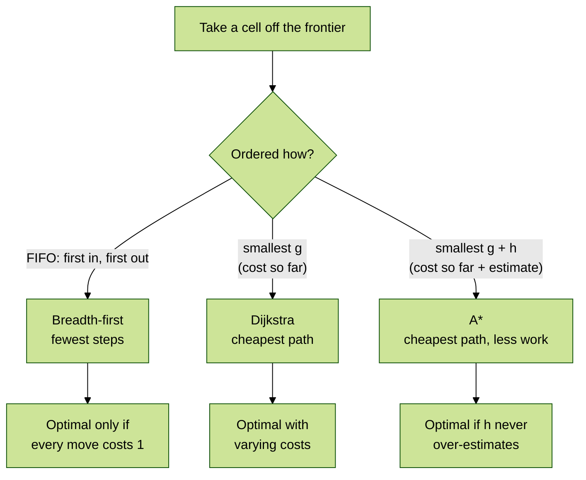

# Pathfinding — Search That Knows Where It Is Going

## In this topic

- [What you'll learn](#what-youll-learn)
- [Why this matters](#why-this-matters)
- [How this builds on previous content](#how-this-builds-on-previous-content)
- [Key terms](#key-terms)
- [Part 1 — The grid and the shape of a search](#part-1--the-grid-and-the-shape-of-a-search)
- [Part 2 — Breadth-first search](#part-2--breadth-first-search)
- [Part 3 — Dijkstra's algorithm](#part-3--dijkstras-algorithm)
- [Part 4 — A\* search](#part-4--a-search)
- [Part 5 — Watching a search work](#part-5--watching-a-search-work)
- [Part 6 — Measuring the difference](#part-6--measuring-the-difference)
- [Common mistakes](#common-mistakes)
- [Reflective questions](#reflective-questions)
- [Further reading](#further-reading)

---

## What you'll learn

| Level | Outcome |
|:--|:--|
| Understand | Explain why a frontier ordered differently produces a different algorithm. |
| Understand | Distinguish the *cost* of a path from the *number of steps* in it. |
| Apply | Implement breadth-first search, Dijkstra and A\* over a grid. |
| Apply | Report search progress through a listener rather than printing from the algorithm. |
| Analyse | Judge whether a heuristic is admissible, and predict what happens when it is not. |
| Evaluate | Choose an algorithm from the shape of the map and the cost model. |

---

## Why this matters

Every enemy that walks around a wall to reach you is running a search like this one. So is
every route your phone offers, every wire an auto-router lays out on a circuit board, and
every word-ladder puzzle solver.

More usefully for this module: pathfinding is where the collections you met in t05–t07 stop
being an exercise and start deciding whether a program is fast or slow. The only structural
difference between breadth-first search and A\* is **what kind of queue holds the frontier**.
Same loop, same grid, same neighbours — one line changes, and the number of cells examined
drops from 212 to 35.

That is a rare thing to be able to show rather than assert.

---

## How this builds on previous content

| From | What you already have | Used here for |
|:--|:--|:--|
| t01 | 2D arrays, bounds checking | the grid itself |
| t04 | `equals` / `hashCode` | `Cell` as a `HashMap` key |
| t07 | `PriorityQueue`, `Comparator` | ordering the frontier |
| t09/t13 | interfaces, Strategy | swapping the algorithm and the heuristic |
| t14 | Observer | reporting progress without printing |
| t23 | JUnit 5 | asserting on searches instead of eyeballing output |

If `Cell` did not implement `equals` and `hashCode` correctly, none of this would work — a
`HashSet<Cell>` would never recognise a cell it had already seen, and every search would run
forever. This topic is where the t04 contract stops being abstract.

---

## Key terms

### Frontier

The cells discovered but not yet examined. Its **ordering is the algorithm**: FIFO gives
breadth-first search, cheapest-first gives Dijkstra, cheapest-plus-estimate gives A\*.

### Expanded

A cell is *expanded* when it is taken off the frontier and its neighbours are examined. The
count of expansions is the honest measure of work done — not the length of the path found.

### Steps versus cost

**Steps** is how many moves a path contains. **Cost** is what those moves add up to when
terrain is not uniform. On flat ground they are the same number; on rough ground they are
not, and confusing them is the central mistake of this topic.

### Heuristic

A guess at the remaining cost from a cell to the goal, written `h`. It turns a blind search
into a directed one.

### Admissible

A heuristic is admissible if it **never over-estimates** the true remaining cost. This single
property is what makes A\* safe: with it, A\* returns the cheapest path; without it, A\* returns
*a* path, quickly, and you have no guarantee about which one.

---

## Part 1 — The grid and the shape of a search

### Representing the map

The map is text, which makes it easy to write, read in a test, and print back out:

```text
#############
#S~~~~~~~~~G#
#.#########.#
#...........#
#############
```

| Tile | Meaning | Cost to enter |
|:--|:--|--:|
| `#` | wall | impassable |
| `.` | open ground | 1 |
| `~` | rough ground | 5 |
| `S` / `G` | start / goal | 1 |

`Grid.parse` turns those rows into a structure and validates them, rejecting ragged rows, an
unknown tile, or a map without exactly one start and one goal.

```java
public int costToEnter(Cell cell) {
    char tile = tileAt(cell);
    if (tile == WALL) {
        throw new IllegalArgumentException("a wall cannot be entered: " + cell);
    }
    return tile == ROUGH ? ROUGH_COST : OPEN_COST;
}
```

#### Snippet explanation

Cost is a property of the **destination**, not the move — entering mud is expensive no matter
which side you come from. Making a wall throw rather than return a large number is deliberate:
a wall is not expensive, it is impossible, and a caller that asks has already made a mistake.

### The shape every search shares

All three algorithms are the same eight lines:

```text
put the start on the frontier
while the frontier is not empty:
    take a cell off the frontier          <-- the ONLY difference between the algorithms
    if it is the goal: rebuild the path and stop
    for each passable neighbour:
        if this route to it is better than any known route:
            record the route
            put the neighbour on the frontier
report that no path exists
```

Everything in Parts 2 to 4 is a variation on which cell "take a cell off the frontier"
returns.

### Reporting without printing

An algorithm that prints is an algorithm you cannot test without capturing output, and cannot
reuse anywhere that has no console. So the search reports instead:

```java
public interface SearchListener {

    SearchListener NONE = new SearchListener() { };

    default void onExpand(Cell current, Set<Cell> frontier, Set<Cell> visited) { }

    default void onFound(List<Cell> path) { }

    default void onExhausted() { }
}
```

#### Snippet explanation

This is Observer from t14, earning its place. `ConsoleRenderer` implements it and draws;
`CountingListener` implements it and tallies; a test attaches the latter and asserts on the
exact order cells were expanded. The search itself never knows which is attached, and the
`NONE` constant means "nobody is watching" costs nothing at the call site.

Every default method is empty, so an implementation overrides only the events it cares about.

---

## Part 2 — Breadth-first search

### A FIFO frontier

Use an `ArrayDeque` as a plain queue and the search explores in rings: every cell one step
from the start, then every cell two steps away, and so on.

```java
Queue<Cell> frontier = new ArrayDeque<>();
frontier.add(start);

while (!frontier.isEmpty()) {
    Cell current = frontier.poll();
    // ... expand
    for (Cell next : grid.neighbours(current)) {
        if (visited.contains(next) || queued.contains(next)) {
            continue;
        }
        cameFrom.put(next, current);
        frontier.add(next);
    }
}
```

#### Snippet explanation

Note what BFS does **not** do: it never reconsiders a cell. Because it explores in order of
step count, the first time it reaches a cell is always by the fewest steps, so a later arrival
cannot be an improvement. That is why a simple "have I seen this?" check is sufficient here
and is *not* sufficient for the next two algorithms.

### Where it goes wrong

BFS counts steps. It has no concept of cost. On the marsh map above, the straight line through
the mud is 10 steps; the detour along the bottom corridor is 14. BFS takes the straight line:

| Algorithm | Steps | Cost |
|:--|--:|--:|
| Breadth-first | **10** | **46** |
| Dijkstra | 14 | 14 |

Ten steps at a cost of 46, when a 14-step route costs 14. The path is legal, the code is
correct, and the answer is more than three times too expensive. **BFS is optimal only when
every move costs the same.**

---

## Part 3 — Dijkstra's algorithm

### Order by cost, not by steps

Swap the FIFO queue for a `PriorityQueue` ordered by cost-so-far and the problem disappears.
The mud is still reachable, but a route through it sinks down the queue behind cheaper
alternatives and is expanded last, or never.

```java
PriorityQueue<Cell> frontier = new PriorityQueue<>(
        Comparator.comparingInt(cell -> costSoFar.get(cell)));
```

#### Snippet explanation

This is the `Comparator` work from t03 and the `PriorityQueue` from t07 doing something
consequential. Change the comparator and you change the algorithm — not its output format,
its actual behaviour and its correctness guarantee.

### Re-finding a cheaper route

Unlike BFS, Dijkstra **must** allow a cell to be improved. A cell first reached by an
expensive route may later be reached by a cheap one:

```java
int newCost = costSoFar.get(current) + grid.costToEnter(next);
if (newCost < costSoFar.getOrDefault(next, Integer.MAX_VALUE)) {
    costSoFar.put(next, newCost);
    cameFrom.put(next, current);
    frontier.add(next);
}
```

#### Snippet explanation

`getOrDefault(next, Integer.MAX_VALUE)` means "any route is better than no route" without a
separate null check. The new entry is simply added to the queue rather than the old one being
removed — Java's `PriorityQueue` cannot cheaply update an element's priority, so the stale
copy is left to be skipped when it surfaces. That skip is why the loop starts with a check of
whether the cell has already been expanded.

---

## Part 4 — A\* search

### f = g + h

Dijkstra spreads out evenly in all directions, because cost-so-far is all it knows. A\* adds a
guess about what remains:

- `g` — the cost already paid to reach this cell
- `h` — the **estimated** cost still to pay
- `f = g + h` — the estimated total cost of a route through this cell

Order the frontier by `f` and the search leans toward the goal.



**Diagram description**
All three algorithms share one loop and differ only in how the frontier is ordered. A
first-in-first-out queue gives **breadth-first search**, which finds the fewest steps and is
optimal only when every move costs the same. A priority queue ordered by `g`, the cost so far,
gives **Dijkstra**, which is optimal when costs vary. A priority queue ordered by `g + h`,
cost so far plus estimated cost remaining, gives **A\***, which is optimal provided `h` never
over-estimates.

### Admissibility, and what breaking it costs

Manhattan distance — rows apart plus columns apart — is admissible on this grid, because the
cheapest possible move costs 1, so the true remaining cost is always at least the number of
remaining steps.

Multiply it by five and it over-estimates badly. A\* then believes distant cells are hopeless
and commits early to whatever looks closest:

| Heuristic on the marsh map | Cost found | Cells expanded |
|:--|--:|--:|
| Manhattan (admissible) | **14** | 16 |
| Manhattan × 5 (not admissible) | **46** | **11** |

Read that table twice. The broken heuristic is **faster** — it expanded 11 cells instead of
16 — and returns a path costing more than three times as much. It found the same bad route
through the mud that breadth-first search did.

This is why the bug survives code review. Nothing crashes, the path is legal, the search is
quicker, and the only symptom is a number nobody measured.

---

## Part 5 — Watching a search work

`ConsoleRenderer` is a `SearchListener` that draws a frame instead of counting:

| Glyph | Meaning |
|:--|:--|
| `@` | the cell being expanded right now |
| `?` | on the frontier, discovered but not yet examined |
| `o` | already expanded |
| `+` | the final path |

Mid-search, and then the result:

```text
####################          ####################
#Soooo#            #          #S    #            #
#o###o# ########## #          #+### # ########## #
#o#ooo#@#oooooo? # #          #+#   # #++++++++# #
#o#o###o#o###### # #          #+# ### #+######+# #
#o#ooooo#o#oooo# # #          #+#     #+#    #+# #
#o#######o#o##o# # #          #+#######+# ## #+# #
#ooooooooo#o#?o#  G#          #+++++++++# #  #++G#
#o#########o# #### #          # ######### # #### #
#ooooooooooo#      #          #           #      #
####################          ####################
```

The renderer offers two modes. `PLAIN` reprints each frame below the last — it scrolls, but it
works in every console including IntelliJ's **Run** window. `ANSI` repaints in place using
escape codes, which animates smoothly in a real terminal and prints visible gibberish in a
console that does not support them. `PLAIN` is the default for that reason; use the
**Terminal** tab for `ANSI`.

> :bulb: Building the frame and printing it are separate methods. `render(...)` returns a
> `String`, so the interesting half is tested with ordinary assertions and no output capture.

---

## Part 6 — Measuring the difference

Running all three over four maps, from `t24_pathfinding.demos.de02.Demo`:

**Open room with two obstacles**

| Algorithm | Steps | Cost | Expanded |
|:--|--:|--:|--:|
| Breadth-first | 34 | 34 | 212 |
| Dijkstra | 34 | 34 | 212 |
| A\* (Manhattan) | 34 | 34 | **35** |

**Corridor maze**

| Algorithm | Steps | Cost | Expanded |
|:--|--:|--:|--:|
| Breadth-first | 31 | 31 | 87 |
| Dijkstra | 31 | 31 | 87 |
| A\* (Manhattan) | 31 | 31 | **68** |

Two lessons sit in the gap between those tables.

**The map decides how much the heuristic is worth.** In the open room A\* examined 35 cells
where Dijkstra examined 212 — a sixth of the work. In the corridor maze the saving shrank to
about a fifth, because the walls were already doing the pruning. "A\* is faster" is a statement
about a map, not a law.

**Fewer cells, same answer.** In every row the cost column is identical. That is the whole
promise of an admissible heuristic: less work, no loss of quality. An algorithm that were
merely faster *and* worse would not be interesting.

---

## Common mistakes

- **Counting steps when you meant cost.** `path.size()` is not the cost of a path unless every
  move costs 1. Compute the cost from the terrain.
- **Using a `List` as the frontier and scanning it for the minimum.** It works and it is
  `O(n)` per expansion. `PriorityQueue` is `O(log n)`; on a 30×30 grid the difference is
  already visible.
- **Mutating a `Cell` after putting it in a `HashSet`.** Make it a record, as here, and the
  problem cannot arise. This is the t04 mutable-key hazard in a new costume.
- **Forgetting that a goal may be unreachable.** The frontier empties and the loop must end
  by reporting failure, not by throwing or looping.
- **Marking a cell visited when you queue it rather than when you expand it.** For BFS that is
  correct and necessary; for Dijkstra and A\* it silently prevents a cheaper route from ever
  replacing an expensive one.
- **Assuming a faster search is a better search.** Measure the cost of what it returned before
  celebrating the expansion count.

---

## Reflective questions

1. Breadth-first search and Dijkstra returned identical paths on the open room and the
   corridor maze. Why bother with Dijkstra at all?
2. A\* with a zero heuristic is Dijkstra. What does that tell you about the relationship
   between the two algorithms?
3. On the marsh map, the inadmissible heuristic expanded fewer cells than the admissible one.
   Explain how a wrong answer can be cheaper to compute, and why that makes the bug dangerous.
4. BFS marks a cell as seen the moment it is queued. Dijkstra cannot. What breaks if Dijkstra
   copies BFS here?
5. If diagonal moves were allowed at a cost of 1, would Manhattan distance still be
   admissible? What would you use instead?
6. The search reports progress through a listener rather than printing. Name two things that
   becomes possible which would not be otherwise.

<details style="background:#f5f7ff; border:1px solid rgba(0,0,0,0.15); border-radius:10px;
padding:0.9rem 1rem; margin:1rem 0;">
  <summary style="cursor:pointer; font-weight:800; margin:0;">
    Check your thinking
  </summary>

**1. Why bother with Dijkstra.**
Because those two maps have uniform cost, which is the one case where BFS happens to be
right. The agreement is a property of the map, not of the algorithms. Add a single `~` tile
and they part company immediately — on the marsh map BFS returns a path costing 46 where
Dijkstra returns one costing 14. Choosing BFS is choosing to assume every move costs the same,
and that assumption should be stated rather than inherited by accident.

**2. What `h = 0` tells you.**
That A\* is a generalisation and Dijkstra is the special case sitting at one end of it.
Substituting `h = 0` into `f = g + h` leaves `f = g`, which is exactly "expand the
cheapest-so-far cell". The implementation in `DijkstraPathfinder` makes this literal — it
delegates to `AStarPathfinder` with `Heuristic.zero()` rather than duplicating the loop, and
a test asserts both produce the *same expansion order*, not merely the same path.

The practical consequence: you only need to implement one algorithm well. The heuristic is
the dial, and Dijkstra is what you get with the dial at zero.

**3. How a wrong answer is cheaper.**
An over-estimating heuristic makes every cell that is not directly toward the goal look worse
than it is, so the frontier is pruned aggressively. Pruning is exactly what makes a search
fast — the fewer cells you examine, the sooner you finish. The trouble is that some of the
cells being pruned were on the cheapest route.

The danger is that every visible signal says success: no exception, a legal path, a *lower*
expansion count than the correct version. The only way to see the defect is to compare the
cost of the returned path against a known-optimal one — which is precisely what the test
`marsh_anOverEstimatingHeuristicReturnsAWorsePath` does. A bug whose symptom is "slightly
more expensive routes" can survive in a shipped game for years.

**4. What breaks if Dijkstra marks on queueing.**
The first route found to a cell gets locked in, and a cheaper one discovered later is
discarded. BFS can do this safely because its first arrival is provably via the fewest steps;
when all moves cost 1, first is also cheapest. Once costs vary, first is merely first. A cell
might be reached early across mud and later by a cheap detour, and marking on queueing throws
the detour away. The result is not a crash — it is quietly suboptimal paths, the same class
of failure as question 3.

**5. Diagonals and Manhattan.**
No. Manhattan would over-estimate. Moving diagonally from `(0,0)` to `(1,1)` costs 1, but
Manhattan reports 2 — an over-estimate, so admissibility is lost and the optimality guarantee
goes with it. The correct heuristic for eight-way movement at uniform cost is **Chebyshev
distance**, `max(|Δrow|, |Δcol|)`, which counts the moves a king would need on a chessboard.
This is why `Direction` deliberately contains only four values, with a comment saying so.

**6. What the listener makes possible.**
Two of several. **Testing without output capture** — `CountingListener` records the expansion
order, so a test asserts on a `List<Cell>` instead of parsing a captured string; that is
faster, and it does not break when a caption is reworded. **Instrumentation without
modification** — the renderer, the counter and a future step-through debugger all attach to a
search that was never changed to accommodate any of them.

A third, worth noticing: the same seam lets you prove the observer does not *steer*. The test
`renderer_canBeAttachedToARealSearchWithoutAffectingIt` runs one search watched and one
unwatched and asserts the results are identical.

</details>

---

## Further reading

- Amit Patel, *Introduction to A\**, Red Blob Games —
  [redblobgames.com/pathfinding/a-star/introduction.html](https://www.redblobgames.com/pathfinding/a-star/introduction.html).
  Interactive and the clearest explanation available anywhere.
- Russell & Norvig, *Artificial Intelligence: A Modern Approach*, chapter 3 — the formal
  treatment of admissibility and consistency.
- `java.util.PriorityQueue` API documentation — note the warning that iteration order is
  **not** sorted order, which catches people printing a queue to debug it.

---

## Lesson Context

```yaml
previous_lesson:
  topic_code: t23_unit_testing
  domain_emphasis: Balanced

this_lesson:
  topic_code: t24_pathfinding
  primary_domain_emphasis: Games
  difficulty_tier: Advanced
mlos: [MLO1, MLO3]
```
