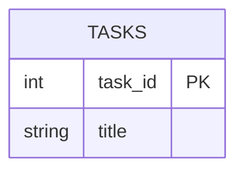

# Documenting a Project — Exercises

Like [t23](../../t23_unit_testing/exercises/t23_unit_testing_exercises.md), these
exercises are about work you do **to** existing code rather than new code you write.

Everything documented here already exists in the repository: the GCA2 N-tier reference in
[`code/src/assessments/gca/gca2/`](../../../../code/src/assessments/gca/gca2/) and its
schema in [`sql/mysqlSetup.sql`](../../../../code/src/assessments/gca/gca2/sql/mysqlSetup.sql).

Most deliverables are Markdown files containing Mermaid diagrams. Check they render
before submitting — GitHub renders Mermaid natively, and so does IntelliJ's Markdown
preview.

---

## Exercise 01 — Method-level Javadoc

Write full Javadoc for these three methods on `TaskDAO`, using `@param`, `@return` and
`@throws`:

```java
public int insert(Task task)
public Optional<Task> findById(int id)
public boolean deleteById(int id)
```

Document the **contract**, not the implementation. For `findById`, say explicitly that an
unknown id yields an empty `Optional` rather than an exception. For `insert`, say what the
returned `int` actually means.

**Deliverable:** the Javadoc comments, added to the source or pasted into a markdown file.

**Pitfall:** `@return the id` is not documentation — it restates the type. `@return the
generated primary key of the newly inserted task` tells a caller something they could not
have guessed.

---

## Exercise 02 — Class-level Javadoc

Write class-level Javadoc for `ClientHandler` and for `ServerResponse<T>`.

Each should say, in a short paragraph: what the class is **responsible for**, what it
**collaborates with**, and anything a user of it **must know** (threading, lifecycle, who
closes what, what `T` represents).

**Deliverable:** two Javadoc blocks.

**Discussion:** which of these two classes needs the longer comment, and why is length a
poor measure of documentation quality?

---

## Exercise 03 — Spot the useless comments (no coding)

For each of these, say what is wrong and rewrite it — or delete it and justify that:

```java
/** This class is a class that handles handling of tasks. */
public class TaskDAO { ... }

/**
 * Gets the title.
 * @return the title
 */
public String getTitle() { return _title; }

// increment i
i++;

/**
 * Sets the title.
 * @param title the title
 */
public void setTitle(String title) { ... }   // NOTE: this setter trims and rejects blanks
```

**Deliverable:** a short markdown answer.

**Hint:** exactly one of these is a case where the comment should be *expanded* rather
than deleted. Which, and why?

---

## Exercise 04 — ER diagram

Read `sql/mysqlSetup.sql` and produce a Mermaid `erDiagram` for the `tasks` table showing
every column, its type, and which is the primary key.

Then extend the design on paper: add a `users` table and make each task belong to one
user. Show the new table, the foreign key, and the correct cardinality.

**Deliverable:** `docs/er-diagram.md`



**Pitfall:** cardinality is the part people get wrong. One user has many tasks; each task
has exactly one user. Make sure your crow's feet point the right way.

---

## Exercise 05 — Sequence diagram

Draw a Mermaid `sequenceDiagram` for a full `GET_TASK_BY_ID` request cycle, with four
participants: Client, ClientHandler, TaskDAO, MySQL.

Show the JSON request going in, the DAO call, the SQL query, the row coming back, and the
`ServerResponse` JSON returning to the client.

Then draw a **second** diagram for the case where the id does not exist, showing where
`Optional.empty()` appears and what the client receives instead.

**Deliverable:** `docs/sequence-get-task.md`

**Discussion:** the two diagrams differ in only a few messages. What does that tell you
about where error handling actually lives in an N-tier design?

---

## Exercise 06 — Architecture diagram

Produce a Mermaid `flowchart` showing the tiers of the GCA2 reference — presentation,
server, service, DAO, database — with the concrete classes in each and arrows showing
which tier depends on which.

**Deliverable:** `docs/architecture.md`

**Check your work:** no arrow should skip a tier, and none should point backwards. If your
diagram shows the client talking directly to `TaskDAO`, either the diagram is wrong or the
design is — say which.

---

## Exercise 07 — Flowchart for a decision

Draw a Mermaid `flowchart` for what `ClientHandler` does when a request arrives:
read the line, parse the JSON, check the request type is known, dispatch it, catch
failures, and write a response.

Include the failure branches — unparseable JSON, unknown request type, DAO exception —
and show that **every** path ends in a response being sent to the client.

**Deliverable:** `docs/request-flow.md`

**Why this matters:** if a path on your diagram has no arrow to "send response", you have
found a path where a real client would hang waiting forever.

---

## Exercise 08 — Project README (extension)

Write a README for the GCA2 reference as if it were your own submission. Include:

- a one-paragraph overview of what the system does;
- setup steps: database creation, credentials, how to run the server and then the client;
- the protocol: each request type, its payload, and its response shape, in a table;
- your architecture diagram from Exercise 06;
- how to run the tests, including the database-tagged ones.

**Deliverable:** `docs/README-draft.md`

**Test it properly:** hand it to someone who has never seen the project and ask them to
get it running using only your README. Every question they have to ask you is a gap in it.
