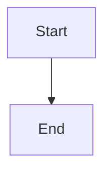
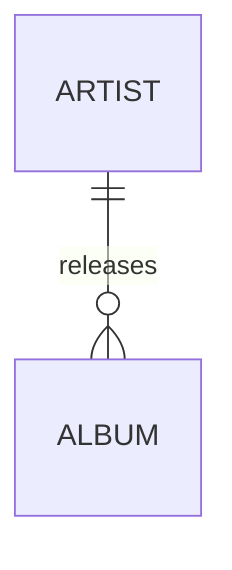
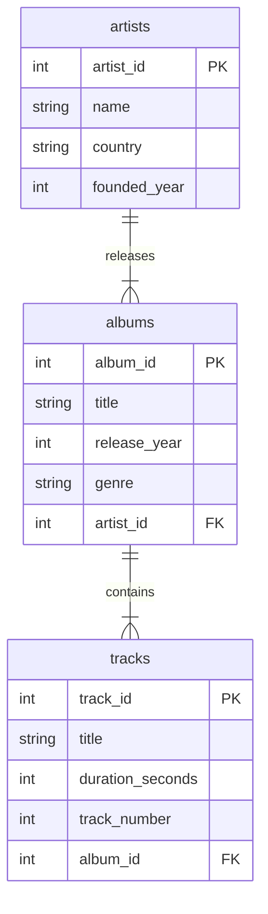
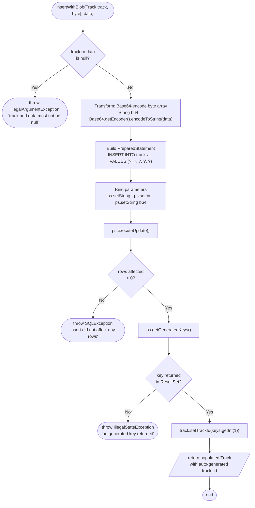
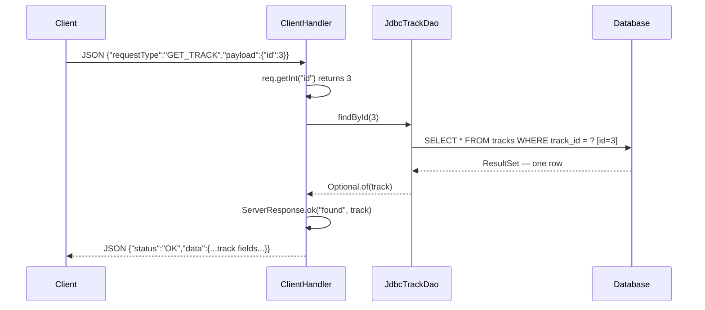
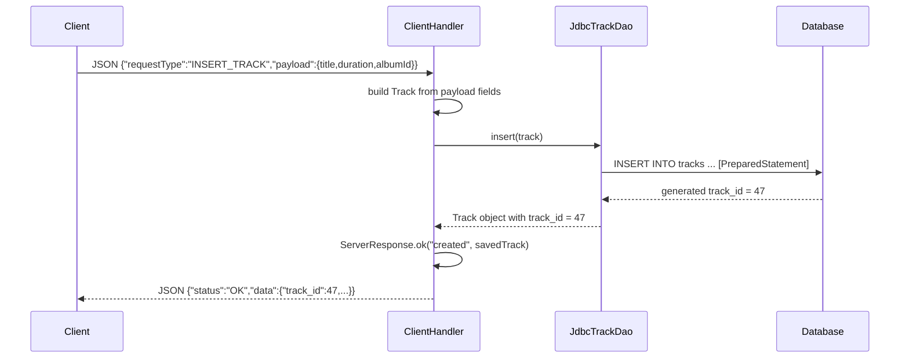
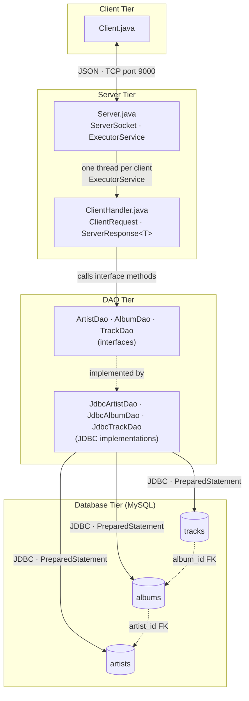
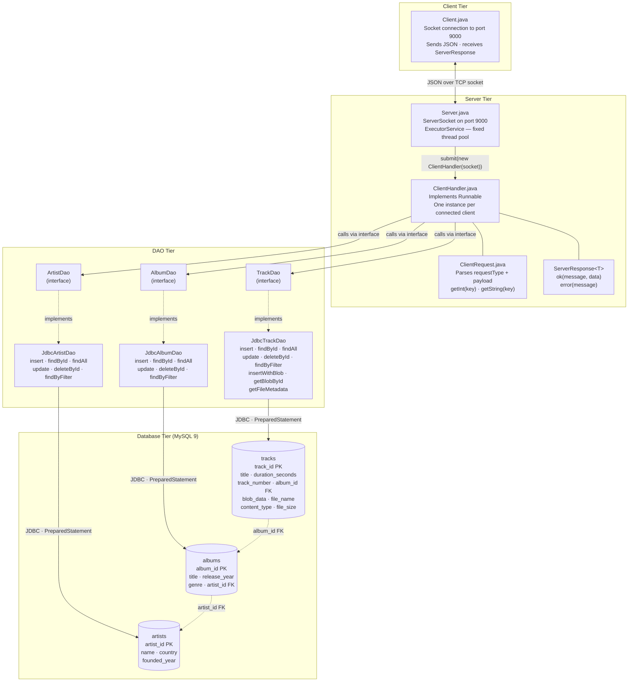

# Documenting a Project

> **Prerequisites:**
> - You have a working N-tier project with entities, DAO classes, a server, and at least one
>   client (or a project of equivalent structure)
> - You are familiar with the DAO interface / JDBC implementation pattern (see
>   [DAO](../t15_dao/t15_dao_notes.md))
> - You understand the `ClientHandler` / `ServerResponse<T>` pattern (see
>   [Networking](../t22_networking/t22_networking_notes.md))

---

## In this topic

- [What you'll learn](#what-youll-learn)
- [Why this matters](#why-this-matters)
- [How this builds on previous content](#how-this-builds-on-previous-content)
- [Key terms](#key-terms)
- [The running example](#the-running-example)
- [Part 1 — Javadoc Comments](#part-1--javadoc-comments)
- [Part 2 — Mermaid Diagrams](#part-2--mermaid-diagrams)
- [Part 3 — ER Diagrams](#part-3--er-diagrams)
- [Part 4 — Flowcharts](#part-4--flowcharts)
- [Part 5 — Sequence Diagrams](#part-5--sequence-diagrams)
- [Part 6 — Architecture Diagrams](#part-6--architecture-diagrams)
- [Common mistakes](#common-mistakes)
- [Further reading](#further-reading)
- [Reflective questions](#reflective-questions)

---

## What you'll learn

| Skill Type | You will be able to... |
| :- | :- |
| Understand | Explain what Javadoc is and when it is required versus optional. |
| Understand | Describe the purpose of each Javadoc tag (`@author`, `@param`, `@return`, `@throws`). |
| Understand | Distinguish between the four main Mermaid diagram types and when to use each. |
| Apply | Write correct class-level and method-level Javadoc for a multi-tier OOP project. |
| Apply | Produce a Mermaid ER diagram for a three-table relational schema. |
| Apply | Produce a Mermaid flowchart showing control flow through a method or handler. |
| Apply | Produce a Mermaid sequence diagram showing a client-server request/response. |
| Apply | Produce a Mermaid architecture diagram showing all tiers and communication paths of an N-tier system. |
| Analyse | Identify which classes and methods in a project require Javadoc and which do not. |

---

## Why this matters

Good documentation serves two audiences: your future self, and anyone who reads your code. An
architecture diagram communicates system structure at a glance; Javadoc communicates intent at
the method level. Both become essential when projects grow beyond what a single person can hold
in their head.

Documentation is not decoration. An architecture diagram that is missing a tier, or a Javadoc
comment that only restates the method name, adds no value and signals incomplete understanding
of the system.

This note gives you the tools and a complete worked example so that your documentation
accurately reflects the system you built.

---

## How this builds on previous content

| Previous concept | How it reappears here |
| :- | :- |
| DAO interface + JDBC implementation ([t15](../t15_dao/t15_dao_notes.md)) | The DAO tier and its interface/implementation split appear in every diagram |
| `ServerResponse<T>` and `ClientHandler` ([t22](../t22_networking/t22_networking_notes.md)) | The server tier in architecture and sequence diagrams |
| Entity constructors with guard clauses | Class-level and method-level Javadoc describes these guards |
| MySQL schema with FK relationships | ER diagrams formalise the schema you already wrote in `mysqlSetup.sql` |

---

## Key terms

### Javadoc

A documentation tool built into the Java compiler. It reads specially formatted block comments
(`/** ... */`) directly above classes, methods, and fields, and can generate HTML documentation
from them. IntelliJ renders Javadoc inline as you hover over identifiers.

### Javadoc tag

A keyword prefixed with `@` inside a Javadoc comment that carries structured metadata. Common
tags: `@author`, `@param`, `@return`, `@throws`.

### Mermaid

A plain-text diagramming language that is rendered into SVG by tools including GitHub, GitLab,
IntelliJ (with the Mermaid plugin), and most modern Markdown viewers. Diagrams live inside
fenced code blocks labelled ` ```mermaid `.

### ER diagram

An Entity-Relationship diagram. Shows the tables in a relational database, the columns in each
table, and the relationships (foreign key constraints) between tables.

### Sequence diagram

Shows a time-ordered series of messages exchanged between participants (objects, classes,
systems). Used to illustrate a single request/response cycle through a system.

### Architecture diagram

A high-level overview of all the components (tiers, classes, databases, external systems) that
make up a system, and how they communicate. It answers the question: *what are the parts, and
how do they connect?*

---

## The running example

All diagrams in this note use the same three-table music library system. This is a stand-in for
your project domain — replace `Artist`, `Album`, and `Track` with your own entity names.

### Schema

| Table | Columns | Notes |
| :- | :- | :- |
| `artists` | `artist_id` PK, `name`, `country`, `founded_year` | Root table — no FK |
| `albums` | `album_id` PK, `title`, `release_year`, `genre`, `artist_id` FK | Many albums to one artist |
| `tracks` | `track_id` PK, `title`, `duration_seconds`, `track_number`, `album_id` FK | Many tracks to one album |

### Java layer

| Tier | Key classes |
| :- | :- |
| Entity | `Artist`, `Album`, `Track` |
| DAO interface | `ArtistDao`, `AlbumDao`, `TrackDao` |
| DAO implementation | `JdbcArtistDao`, `JdbcAlbumDao`, `JdbcTrackDao` |
| Server | `Server`, `ClientHandler` |
| Protocol | `ServerResponse<T>`, `ClientRequest` |
| Client | `Client` |

---

## Part 1 — Javadoc Comments

### What Javadoc is

Javadoc comments use `/** */` — two asterisks to open, one to close. Everything between them is
documentation. Each `@tag` line carries structured information that tools and IDEs can parse.

```java
/**
 * One-sentence summary of what this class or method does.
 *
 * Optionally: a second paragraph with more detail.
 *
 * @tag value
 */
```

> Javadoc is **not** a block comment. A block comment uses `/* */`. Javadoc uses `/** */`. The
> extra `*` is what tells the Java compiler to treat it as documentation.

---

### Class-level Javadoc

Every class needs a Javadoc comment that states its purpose and identifies its authors.
Identifying authors on every class makes individual contributions traceable and is a
professional standard.

```java
/**
 * Handles all database operations for Artist entities.
 * Implements the ArtistDao interface using JDBC and PreparedStatement.
 * All SQL uses parameterised queries — no string concatenation.
 *
 * @author Aoife Burke (primary)
 * @author Ciarán Walsh (contributor — refactored connection handling)
 */
public class JdbcArtistDao implements ArtistDao {
    // ...
}
```

The summary sentence states **what the class does**, not what it is. "Handles all database
operations for Artist entities" is useful. "This is the JdbcArtistDao class" is not.

If only one person wrote the class, omit the contributor line:

```java
/**
 * Immutable data transfer object representing a music track.
 * Validates all fields in the constructor and trims String inputs.
 *
 * @author Aoife Burke
 */
public class Track {
    // ...
}
```

---

### Method-level Javadoc

Every non-trivial method needs a Javadoc comment. A method is non-trivial if it contains logic
— validation, SQL, JSON conversion, computation. The four tags you use most often are:

| Tag | Purpose | Example |
| :- | :- | :- |
| `@param name` | Describes one parameter | `@param id the track_id to look up` |
| `@return` | Describes the return value | `@return Optional containing the Track if found, empty if not` |
| `@throws ExceptionType` | Names a checked or documented unchecked exception | `@throws SQLException if the database cannot be reached` |
| `@author` | Secondary author credit on a method (use sparingly) | `@author Ciarán Walsh` |

```java
/**
 * Retrieves a track by its primary key.
 * Returns an empty Optional rather than null if the id does not exist.
 *
 * @param id the track_id to search for; must be positive
 * @return Optional containing the matching Track, or Optional.empty() if not found
 * @throws SQLException if a database access error occurs
 */
@Override
public Optional<Track> findById(int id) throws SQLException {
    if (id <= 0) return Optional.empty();
    // ...
}
```

```java
/**
 * Inserts a new track record and returns the saved entity with its generated id.
 *
 * @param track the Track to persist; title and albumId must be valid
 * @return the inserted Track with track_id populated from getGeneratedKeys()
 * @throws IllegalArgumentException if track is null or contains invalid fields
 * @throws SQLException if the insert fails at the database level
 */
@Override
public Track insert(Track track) throws SQLException {
    // ...
}
```

---

### What does NOT need Javadoc

As a rule, trivial methods may omit Javadoc.

| Method type | Javadoc required? | Reason |
| :- | :- | :- |
| `getTitle()`, `getArtistId()` | No | Name already states purpose completely |
| `setTitle(String title)` | No | Name already states purpose completely |
| `toString()` | No | Standard override — no additional intent to document |
| `equals(Object o)`, `hashCode()` | No | Standard overrides |
| Constructor with no logic (`this.title = title`) | No | Trivial assignment |
| Constructor with validation logic | **Yes** | Documents what inputs are rejected and why |
| Any method containing an `if`, loop, or SQL | **Yes** | Logic that a reader needs to understand |

---

### Javadoc for the ServerResponse factory methods

`ServerResponse<T>` is used in every response path. Document both factories:

```java
/**
 * Creates a successful response carrying data.
 *
 * @param <T>     the type of the data payload
 * @param message a short human-readable description of the outcome
 * @param data    the payload to include; must not be null for an OK response
 * @return a ServerResponse with status "OK", the given message, and data
 */
public static <T> ServerResponse<T> ok(String message, T data) {
    // ...
}

/**
 * Creates an error response with no data payload.
 *
 * @param <T>     the expected data type (data will be null)
 * @param message a description of the error condition
 * @return a ServerResponse with status "ERROR", the given message, and null data
 */
public static <T> ServerResponse<T> error(String message) {
    // ...
}
```

---

## Part 2 — Mermaid Diagrams

Mermaid diagrams live inside a fenced code block with the language label `mermaid`:

````markdown

````

GitHub, GitLab, and IntelliJ (with the Mermaid plugin) all render these to SVG automatically.
You do not need to install any tool to write them — just write the text and push to GitHub.

The four diagram types covered in this topic are:

| Diagram type | Mermaid keyword | Use for |
| :- | :- | :- |
| ER diagram | `erDiagram` | Database schema — tables, columns, FK relationships |
| Flowchart | `flowchart TD` / `flowchart LR` | Control flow through a method, handler, or process |
| Sequence diagram | `sequenceDiagram` | Time-ordered messages between classes or systems |
| Architecture diagram | `flowchart TD` with subgraphs | System overview — tiers, classes, communication paths |

### Every diagram needs a text equivalent

A rendered Mermaid diagram is an SVG with no accessible name. A screen reader announces
nothing at all, or at best "graphic" — so a reader using one gets **none** of the
information a sighted reader gets from the picture. This is not a minor omission: in a
document whose whole purpose is explaining a system, it is the explanation going missing.

Every diagram you submit must carry both of the following.

**1. `accTitle` and `accDescr` inside the diagram.** Mermaid emits these as `<title>` and
`<desc>` on the SVG, which is what assistive technology reads.



**2. A short prose paragraph immediately after the block**, labelled
**Diagram description**, saying the same thing as standalone text.

The prose is not redundant. It survives PDF export, a paste into Moodle, a renderer that
does not support Mermaid, and a reader who simply prefers prose. Write it so that someone
who never sees the picture misses nothing.

Two rules for writing the description:

- **State the relationships, not the picture.** "Each album belongs to one artist" — not
  "an arrow points from ALBUM up to ARTIST."
- **For a sequence diagram, describe it as numbered steps.** That is what the diagram
  actually encodes, and steps read far better aloud than "participant A sends to B".

> **One syntax caution.** `accTitle` and `accDescr` work inside `flowchart`,
> `sequenceDiagram`, `classDiagram`, `stateDiagram-v2` and `erDiagram`. They do **not**
> work inside `mindmap`, whose parser reads the indented lines as nodes and fails with
> "There can be only one root". For a mind map, put the title in YAML frontmatter above
> the diagram instead, and rely on the prose paragraph:
>
> ```text
> ---
> title: Collections overview
> accDescr: A mind map of the Java collection types and when to choose each.
> ---
> mindmap
>   root((Collections))
> ```

The full house rules are in the
[accessibility style guide](../../shared/general/accessibility-style-guide.md).

---

## Part 3 — ER Diagrams

An ER diagram documents the database schema. It shows every table, every column with its type
and any key annotation, and the FK relationships that link tables together.

### Syntax reference

```text
erDiagram
    TABLE_NAME {
        type  column_name  annotation
    }
    TABLE_A ||--o{ TABLE_B : "relationship label"
```

Relationship symbols:

| Symbol | Meaning |
| :- | :- |
| `\|\|` | Exactly one (mandatory) |
| `o\|` | Zero or one (optional) |
| `o{` | Zero or many |
| `\|{` | One or many (mandatory many) |

### Music library ER diagram



**Diagram description**
The schema has three tables. `artists` is the root table, keyed by `artist_id`, holding a
name, country and founded year. `albums` is keyed by `album_id` and holds a title, release
year and genre, plus an `artist_id` foreign key. `tracks` is keyed by `track_id` and holds
a title, duration in seconds and track number, plus an `album_id` foreign key.

Both relationships are one-to-many: one artist releases one or more albums, and one album
contains one or more tracks. Read the other way, every album belongs to exactly one artist
and every track belongs to exactly one album.

<details>
<summary>Source</summary>

```text
erDiagram
    artists {
        int    artist_id    PK
        string name
        string country
        int    founded_year
    }

    albums {
        int    album_id     PK
        string title
        int    release_year
        string genre
        int    artist_id    FK
    }

    tracks {
        int    track_id     PK
        string title
        int    duration_seconds
        int    track_number
        int    album_id     FK
    }

    artists ||--|{ albums : "releases"
    albums  ||--|{ tracks : "contains"
```

</details>

**Reading the relationships:**

- `artists ||--|{  albums` — one artist releases one or more albums; each album belongs to
  exactly one artist.
- `albums  ||--|{  tracks` — one album contains one or more tracks; each track belongs to
  exactly one album.

> The labels (`"releases"`, `"contains"`) describe the relationship from the perspective of the
> left-hand table. Choose a verb that makes the relationship readable in plain English.

---

## Part 4 — Flowcharts

A flowchart shows how execution moves through a piece of logic: decisions, branches, loops, and
exits. Use it to document a single method or handler whose flow is not obvious from the code
alone.

### Syntax reference

| Shape | Syntax | Use for |
| :- | :- | :- |
| Stadium / oval | `([Text])` | Start and end points |
| Rectangle | `[Text]` | A process step or transformation |
| Diamond | `{Text}` | A decision — always has two or more labelled outgoing arrows |
| Parallelogram | `[/Text/]` | Data received as input or produced as output |

| Arrow | Syntax | Use for |
| :- | :- | :- |
| Unlabelled | `A --> B` | Simple sequential flow |
| Labelled | `A -->\|label\| B` | Branch at a decision node |
| Dashed | `A -.-> B` | Optional or indirect flow |

Direction keywords: `flowchart TD` (top-down) or `flowchart LR` (left-right).

### Binary upload flow — `insertWithBlob`

The flowchart below documents `JdbcTrackDao.insertWithBlob()`. It shows a guard check, two
transformations, a DB operation, and three distinct exit paths — one success and two errors.



**Diagram description**
The method begins by checking whether `track` or `data` is null; if either is, it throws
`IllegalArgumentException` immediately and no database work happens. Otherwise it
Base64-encodes the byte array, opens a connection, prepares the INSERT, binds each
parameter including the encoded data, and executes the statement. It then reads the
generated key and returns it. Every exit path either returns an id or throws.

<details>
<summary>Source</summary>

```text
flowchart TD
    START(["insertWithBlob(Track track, byte[] data)"])

    START  --> GUARD{"track or data\nis null?"}
    GUARD  -->|Yes| ERR1(["throw IllegalArgumentException\n'track and data must not be null'"])
    GUARD  -->|No| ENC["Transform: Base64-encode byte array\nString b64 = Base64.getEncoder().encodeToString(data)"]

    ENC    --> BUILD["Build PreparedStatement\nINSERT INTO tracks ... VALUES (?, ?, ?, ?, ?)"]
    BUILD  --> BIND["Bind parameters\nps.setString · ps.setInt · ps.setString b64"]
    BIND   --> EXEC["ps.executeUpdate()"]

    EXEC   --> ROWS{"rows affected\n> 0?"}
    ROWS   -->|No| ERR2(["throw SQLException\n'insert did not affect any rows'"])
    ROWS   -->|Yes| KEYS["ps.getGeneratedKeys()"]

    KEYS   --> KEYCHK{"key returned\nin ResultSet?"}
    KEYCHK -->|No| ERR3(["throw IllegalStateException\n'no generated key returned'"])
    KEYCHK -->|Yes| SET["track.setTrackId(keys.getInt(1))"]

    SET    --> OUT[/"return populated Track\nwith auto-generated track_id"/]
    OUT    --> DONE(["end"])
```

</details>

> **TD vs LR:** Use `flowchart TD` for processes that read naturally top-to-bottom, such as a
> method body. Use `flowchart LR` when you have a wide fan-out of parallel branches that would
> be too tall in TD layout.

---

## Part 5 — Sequence Diagrams

A sequence diagram shows messages passing between participants in time order. Use it to
document a single end-to-end request/response cycle — from the client sending a request,
through the server, DAO, and database, to the response arriving back at the client.

### Syntax reference

```text
sequenceDiagram
    participant A
    participant B
    A->>B: message          solid arrow (method call / request)
    B-->>A: message         dashed arrow (return / response)
    Note over A,B: text     annotation spanning participants
```

### GET_TRACK_BY_ID request cycle



**Diagram description**
The cycle runs in five steps. First, the client sends a JSON request with request type
`GET_TRACK` and a payload containing the id. Second, `ClientHandler` parses that JSON and
calls `findById` on `JdbcTrackDao`. Third, the DAO runs a parameterised SELECT against the
database. Fourth, the database returns the matching row, which the DAO maps into a
`Track` wrapped in an `Optional`. Fifth, `ClientHandler` wraps that in a `ServerResponse`
and writes it back to the client as JSON.

<details>
<summary>Source</summary>

```text
sequenceDiagram
    participant Client
    participant ClientHandler
    participant JdbcTrackDao
    participant Database

    Client->>ClientHandler: JSON {"requestType":"GET_TRACK","payload":{"id":3}}

    ClientHandler->>ClientHandler: req.getInt("id") returns 3

    ClientHandler->>JdbcTrackDao: findById(3)

    JdbcTrackDao->>Database: SELECT * FROM tracks WHERE track_id = ?  [id=3]
    Database-->>JdbcTrackDao: ResultSet — one row

    JdbcTrackDao-->>ClientHandler: Optional.of(track)

    ClientHandler->>ClientHandler: ServerResponse.ok("found", track)

    ClientHandler-->>Client: JSON {"status":"OK","data":{...track fields...}}
```

</details>

### INSERT_TRACK request cycle

A second scenario shows the insert path, including the auto-generated key being returned:



**Diagram description**
The cycle runs in five steps. First, the client sends a JSON request with request type
`INSERT_TRACK` and a payload containing the title, duration and album id. Second,
`ClientHandler` parses it and calls `insert` on `JdbcTrackDao`. Third, the DAO executes a
parameterised INSERT. Fourth, the database returns the generated key, which the DAO reads
and returns as an `int`. Fifth, `ClientHandler` wraps the new id in a `ServerResponse` and
sends it back as JSON.

<details>
<summary>Source</summary>

```text
sequenceDiagram
    participant Client
    participant ClientHandler
    participant JdbcTrackDao
    participant Database

    Client->>ClientHandler: JSON {"requestType":"INSERT_TRACK","payload":{title,duration,albumId}}

    ClientHandler->>ClientHandler: build Track from payload fields

    ClientHandler->>JdbcTrackDao: insert(track)

    JdbcTrackDao->>Database: INSERT INTO tracks ... [PreparedStatement]
    Database-->>JdbcTrackDao: generated track_id = 47

    JdbcTrackDao-->>ClientHandler: Track object with track_id = 47

    ClientHandler->>ClientHandler: ServerResponse.ok("created", savedTrack)

    ClientHandler-->>Client: JSON {"status":"OK","data":{"track_id":47,...}}
```

</details>

> Sequence diagrams document **one scenario at a time** — not every possible path. Write one
> diagram per meaningful request type. The `GET_ALL_TRACKS` and `DELETE_TRACK` cycles follow
> the same structural pattern and do not need separate diagrams unless the routing is
> materially different.

---

## Part 6 — Architecture Diagrams

The architecture diagram is the hardest diagram to get right because it must show the system
**as a whole** — all tiers, all key classes, and all communication paths — without becoming an
unreadable wall of boxes.

The approach that works best for a multi-tier project is:

1. Use `flowchart TD` with **subgraphs** — one subgraph per tier.
2. Put key class names inside the nodes, not just tier labels.
3. Label every arrow with the **mechanism** of communication (JSON, JDBC, TCP socket).
4. Show the interface/implementation split in the DAO tier explicitly.

### Tier overview (simplified)

Start with a tier-level summary. This is the diagram you put at the top of your README.



**Diagram description**
Four tiers, each depending only on the one below it. The **client tier** holds
`Client.java`. The **server tier** holds `Server.java` and `ClientHandler.java`. The **DAO
tier** holds the DAO interfaces and their JDBC implementations. The **database tier** holds
MySQL. No arrow skips a tier, and none points back upwards — the client never talks to the
DAO or the database directly.

<details>
<summary>Source</summary>

```text
flowchart TD
    subgraph CLIENT ["Client Tier"]
        CLI["Client.java"]
    end

    subgraph SERVER ["Server Tier"]
        SRV["Server.java\nServerSocket · ExecutorService"]
        CH["ClientHandler.java\nClientRequest · ServerResponse<T>"]
    end

    subgraph DAO ["DAO Tier"]
        INTF["ArtistDao · AlbumDao · TrackDao\n(interfaces)"]
        IMPL["JdbcArtistDao · JdbcAlbumDao · JdbcTrackDao\n(JDBC implementations)"]
    end

    subgraph DB ["Database Tier  (MySQL)"]
        direction LR
        T1[(artists)]
        T2[(albums)]
        T3[(tracks)]
    end

    CLI     <-->|"JSON · TCP port 9000"| SRV
    SRV     -->|"one thread per client\nExecutorService"| CH
    CH      -->|"calls interface methods"| INTF
    INTF    -.->|"implemented by"| IMPL
    IMPL    -->|"JDBC · PreparedStatement"| T1
    IMPL    -->|"JDBC · PreparedStatement"| T2
    IMPL    -->|"JDBC · PreparedStatement"| T3
    T2      -.->|"artist_id FK"| T1
    T3      -.->|"album_id FK"| T2
```

</details>

**Reading the arrows:**

| Arrow style | Meaning |
| :- | :- |
| `<-->` solid bidirectional | Data flows both ways (request and response) |
| `-->` solid with label | A direct method call or network connection |
| `-.->` dashed | A structural relationship: implements, extends, or foreign key |

---

### Full class-level architecture diagram

This second version includes every significant class and is suitable for committing as the
project's architecture artefact. It shows all tiers and communication paths: Client then Server
(socket); Server then DAO then Database; JSON protocol layer; binary file upload/retrieval
flow.



**Diagram description**
The same four tiers as the overview, with every class named. The client tier connects to
port 9000, sends JSON and receives a `ServerResponse`. The server tier runs an accept loop
and a thread pool, handing each connection to a `ClientHandler`. The DAO tier separates the
interfaces (`ArtistDao`, `AlbumDao`, `TrackDao`) from their JDBC implementations. The
database tier holds the three MySQL tables. The protocol classes `ServerResponse` and
`ClientRequest` are shared by the client and server tiers rather than belonging to either.

<details>
<summary>Source</summary>

```text
flowchart TD
    subgraph CLIENT ["Client Tier"]
        CLI["Client.java\nSocket connection to port 9000\nSends JSON · receives ServerResponse"]
    end

    subgraph SERVER ["Server Tier"]
        direction TB
        SRV["Server.java\nServerSocket on port 9000\nExecutorService — fixed thread pool"]
        CH["ClientHandler.java\nImplements Runnable\nOne instance per connected client"]
        CR["ClientRequest.java\nParses requestType + payload\ngetInt(key) · getString(key)"]
        SR["ServerResponse<T>\nok(message, data)\nerror(message)"]
        SRV -->|"submit(new ClientHandler(socket))"| CH
        CH --- CR
        CH --- SR
    end

    subgraph DAO ["DAO Tier"]
        direction TB
        AI["ArtistDao\n(interface)"]
        ALI["AlbumDao\n(interface)"]
        TI["TrackDao\n(interface)"]
        AJ["JdbcArtistDao\ninsert · findById · findAll\nupdate · deleteById · findByFilter"]
        ALJ["JdbcAlbumDao\ninsert · findById · findAll\nupdate · deleteById · findByFilter"]
        TJ["JdbcTrackDao\ninsert · findById · findAll\nupdate · deleteById · findByFilter\ninsertWithBlob · getBlobById\ngetFileMetadata"]
        AI  -.->|implements| AJ
        ALI -.->|implements| ALJ
        TI  -.->|implements| TJ
    end

    subgraph DB ["Database Tier  (MySQL 9)"]
        direction LR
        T1[(artists\nartist_id PK\nname · country\nfounded_year)]
        T2[(albums\nalbum_id PK\ntitle · release_year\ngenre · artist_id FK)]
        T3[(tracks\ntrack_id PK\ntitle · duration_seconds\ntrack_number · album_id FK\nblob_data · file_name\ncontent_type · file_size)]
    end

    CLI  <-->|"JSON over TCP socket"| SRV
    CH   -->|"calls via interface"| AI
    CH   -->|"calls via interface"| ALI
    CH   -->|"calls via interface"| TI
    AJ   -->|"JDBC · PreparedStatement"| T1
    ALJ  -->|"JDBC · PreparedStatement"| T2
    TJ   -->|"JDBC · PreparedStatement"| T3
    T2   -.->|"artist_id FK"| T1
    T3   -.->|"album_id FK"| T2
```

</details>

> **Tip:** If your project has a BLOB column, show it in the relevant table node as above. The
> binary file upload/retrieval flow should be visible in the architecture diagram — a reviewer
> should be able to see at a glance which table stores the BLOB and which DAO class accesses
> it.

---

### Where each diagram goes in your repository

| Diagram | Where it lives | Format |
| :- | :- | :- |
| Architecture diagram (tier overview) | README — Architecture section | Mermaid code block |
| Architecture diagram (full class-level) | README — or committed as `/docs/architecture.md` | Mermaid code block |
| ER diagram | README — Database section | Mermaid code block |
| Sequence diagrams | README — Protocol section, one per request type | Mermaid code block |
| Flowcharts | Inline in the notes file that explains the relevant method | Mermaid code block |

---

## Common mistakes

| Mistake | What it looks like | Fix |
| :- | :- | :- |
| Javadoc that restates the method name | `/** Returns the title. */ public String getTitle()` | Remove it — getters do not need Javadoc |
| Missing `@author` on a class | Class-level comment has no `@author` tag | Add `@author Name (primary)` to every class |
| `@param` with no description | `@param id` | Always add what the parameter represents: `@param id the track_id to look up; must be positive` |
| Architecture diagram missing a tier | DAO tier shown but database tier absent | Every tier must appear: Client · Server · DAO · Database |
| Architecture diagram using only tier labels | Boxes say "Server", "Database" with no class names | Add key class names inside each node |
| ER diagram with no relationship labels | `artists \|\|--\|{ albums :` (blank label) | Always add a verb label: `"releases"` |
| Sequence diagram showing all scenarios at once | One diagram with 15 participants and branching arrows | One diagram per scenario; keep participants to 4–5 |
| Forgetting `<T>` escaping in Mermaid | Node text `ServerResponse<T>` breaks the diagram | Write `ServerResponse&lt;T&gt;` in Mermaid node labels |
| Dashed arrow `-.->` used for calls | Interface to implementation shown as a call | Dashed arrows mean structural relationships (implements, FK); solid arrows mean calls or data flow |

---

## Further reading

- Oracle — How to Write Doc Comments for the Javadoc Tool
  <https://www.oracle.com/technical-resources/articles/java/javadoc-tool.html>

- Mermaid — Official documentation and live editor
  <https://mermaid.js.org/intro/>

- Mermaid — ER diagram syntax
  <https://mermaid.js.org/syntax/entityRelationshipDiagram.html>

- Mermaid — Sequence diagram syntax
  <https://mermaid.js.org/syntax/sequenceDiagram.html>

- Mermaid — Flowchart syntax
  <https://mermaid.js.org/syntax/flowchart.html>

---

## Reflective questions

1. Which methods in your project genuinely need Javadoc, and which are better left alone? What
   is the test you apply?
2. A comment reads `/** Gets the title. @return the title */`. What has it added, and what
   would a useful version say instead?
3. Why is a Mermaid diagram in the repository better than a PNG exported from a drawing tool —
   and when would the PNG actually be the better choice?
4. You need to answer "what tables exist and how do they relate?" and "what happens when a
   client sends a request?". Which diagram type answers each, and why not use one for both?
5. Your sequence diagram shows a path where the DAO throws and nothing returns to the client.
   Is that a documentation bug or a code bug?
6. Where should the architecture diagram live, and what does putting it in the wrong place cost you?

<details style="background:#f5f7ff; border:1px solid rgba(0,0,0,0.15); border-radius:10px;
padding:0.9rem 1rem; margin:1rem 0;">
  <summary style="cursor:pointer; font-weight:800; margin:0;">
    Check your thinking
  </summary>

**1. Which methods need Javadoc.**
The test: **could a competent caller get this wrong without being told?** If yes, document it.

That means documenting anything with a **contract beyond its signature** — a constructor with
guard clauses (what is rejected), a method that can return `null` or an empty collection,
anything that throws, a parameter with a unit or range (`timeoutMs`, `0..100`), and any
non-obvious ordering or thread-safety guarantee.

It means *not* documenting a plain getter, a setter that only assigns, or anything where the
comment would restate the name. Those comments cost real effort to maintain and add nothing,
and — worse — a stale one actively misleads. Fewer, better comments beat blanket coverage.

**2. "Gets the title."**
It has added nothing. It is the method name with the words rearranged, so a reader who did not
understand `getTitle()` is no better off, and now there are two things to keep in step instead
of one.

A useful version documents what the signature cannot express: `@return the display title,
trimmed and never blank`. Note that this is only worth writing *because* `setTitle` enforces
it. If the getter really is a plain field read with no invariant, delete the comment — that is
the right answer, not a better sentence.

**3. Mermaid vs an exported image.**
Mermaid is **plain text**, and that buys three things a PNG cannot: it diffs, so a reviewer
sees a diagram change in the pull request; it lives beside the code and is edited in the same
commit as the change it describes; and anyone can update it without hunting for the original
`.drawio` file and the licence to open it. A binary image drifts out of date silently, because
updating it is just enough friction that nobody does.

The honest exception: Mermaid supports a fixed set of diagram types. For a genuinely bespoke
picture — a UI mockup, a network topology with icons, anything needing precise layout — an
image is the right tool. Commit the **source file** alongside it so the next person can edit
it.

**4. Matching diagram to question.**
"What tables exist and how do they relate?" is **structure**, and structure is an `erDiagram`:
entities, attributes, keys, cardinality. "What happens when a client sends a request?" is
**behaviour over time**, and that is a `sequenceDiagram`: participants across the top, messages
in order, the return path visible.

Using one for both fails in each direction. An ER diagram has no notion of ordering, so it
cannot show that the DAO is called *after* the JSON is parsed. A sequence diagram has no notion
of schema, so it cannot show a foreign key. They answer different questions, and a reader
looking for one in the other simply will not find it.

**5. A path with no return.**
Almost certainly a **code bug that the diagram just exposed** — and this is the strongest
argument for drawing these at all. Sketching the request cycle forces you to walk every branch,
and a branch with no arrow back to the client is a branch where a real client blocks on
`readLine()` forever.

The diagram made a *behavioural* gap visible as a *visual* gap. Fix the code so every path —
success, unknown request type, DAO exception, malformed JSON — ends in a response, then redraw.
If instead you conclude the code is fine and the diagram is incomplete, say so explicitly: an
incomplete diagram is also a defect, because the next reader will trust it.

**6. Where the architecture diagram lives.**
In the **repository README**, because that is the first and often only thing a new reader — or
a marker under time pressure — opens. Detailed per-area diagrams can sit in the relevant
package or module docs, linked from there.

Putting it elsewhere costs you the reader. In a Javadoc comment on `Main`, nobody browsing the
repo sees it. In a Word document on a shared drive, it is outside version control, so it cannot
be reviewed, will not be updated with the code, and may not survive the module at all.
Documentation nobody finds is documentation you did not write.

</details>

---

## Lesson Context

```yaml
previous_lesson:
  topic_code: t24_pathfinding
  domain_emphasis: Balanced

this_lesson:
  topic_code: t25_documenting_a_project
  primary_domain_emphasis: Balanced
  difficulty_tier: Intermediate
mlos: [MLO2, MLO5]
```
